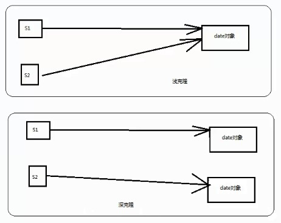
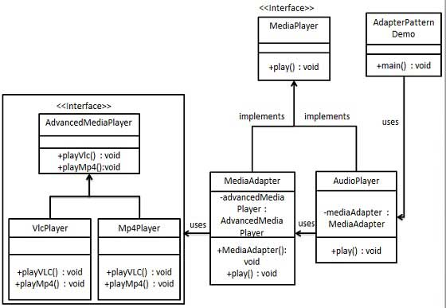

<table>

<tr>
	<td>分类</td>
	<td>模式</td>
	<td>意图</td>
</tr>

<tr>
	<td rowspan=5>创建型模式</td>
	<td><a href='#工厂模式'>工厂模式</a></td>
	<td>定义一个创建对象的接口，让其子类自己决定实例化哪一个工厂类，工厂模式使其创建过程延迟到子类进行。</td>
</tr>

<tr>
	<td><a href='#抽象工厂模式'>抽象工厂模式</a></td>
	<td>提供一个创建一系列相关或相互依赖对象的接口，而无需指定它们具体的类。</td>
</tr>

<tr>
	<td><a href='#单例模式'>单例模式</a></td>
	<td>保证一个类仅有一个实例，并提供一个访问它的全局访问点。</td>
</tr>

<tr>
	<td><a href='#建造者模式'>建造者模式</a></td>
	<td>将一个复杂的构建与其表示相分离，使得同样的构建过程可以创建不同的表示。</td>
</tr>

<tr>
	<td><a href='#原型模式'>原型模式</a></td>
	<td>用原型实例指定创建对象的种类，并且通过拷贝这些原型创建新的对象。</td>    
</tr>

<tr>
	<td rowspan=8>结构型模式</td>
	<td><a href='#适配器模式'>适配器模式</a></td>
	<td>将一个类的接口转换成客户希望的另外一个接口。适配器模式使得原本由于接口不兼容而不能一起工作的那些类可以一起工作。</td>
</tr>

<tr>
	<td><a href='#桥接模式'>桥接模式</a></td>
	<td>将抽象部分与实现部分分离，使它们都可以独立的变化。</td>
</tr>

<tr>
	<td><a href='#过滤器模式'>!过滤器模式</a></td>
	<td>允许开发人员使用不同的标准来过滤一组对象，通过逻辑运算以解耦的方式把它们连接起来。</td>
</tr>

<tr>
	<td><a href='#组合模式'>组合模式</a></td>
	<td>将对象组合成树形结构以表示"部分-整体"的层次结构。组合模式使得用户对单个对象和组合对象的使用具有一致性。</td>
</tr>

<tr>
	<td><a href='#装饰器模式'>装饰器模式</a></td>
	<td>动态地给一个对象添加一些额外的职责。就增加功能来说，装饰器模式相比生成子类更为灵活。</td>
</tr>

<tr>
	<td><a href='#外观模式'>外观模式</a></td>
	<td>为子系统中的一组接口提供一个一致的界面，外观模式定义了一个高层接口，这个接口使得这一子系统更加容易使用。</td>
</tr>

<tr>
	<td><a href='#享元模式'>享元模式</a></td>
	<td>运用共享技术有效地支持大量细粒度的对象。</td>
</tr>

<tr>
	<td><a href='#代理模式'>代理模式</a></td>
	<td>为其他对象提供一种代理以控制对这个对象的访问。</td>
</tr>

<tr>
	<td rowspan=12>行为型模式</td>
	<td><a href='#责任链模式'>责任链模式</a></td>
	<td>避免请求发送者与接收者耦合在一起，让多个对象都有可能接收请求，将这些对象连接成一条链，并且沿着这条链传递请求，直到有对象处理它为止。</td>
</tr>

<tr>
	<td><a href='#命令模式'>命令模式</a></td>
	<td>将一个请求封装成一个对象，从而使您可以用不同的请求对客户进行参数化。</td>
</tr>

<tr>
	<td><a href='#解释器模式'>解释器模式</a></td>
	<td>给定一个语言，定义它的文法表示，并定义一个解释器，这个解释器使用该标识来解释语言中的句子。</td>
</tr>

<tr>
	<td><a href='#迭代器模式'>迭代器模式</a></td>
	<td></td>
</tr>

<tr>
	<td><a href='#中介者模式'>中介者模式</a></td>
	<td></td>
</tr>

<tr>
	<td><a href='#备忘录模式'>备忘录模式</a></td>
	<td></td>
</tr>

<tr>
	<td><a href='#观察者模式'>观察者模式</a></td>
	<td></td>
</tr>

<tr>
	<td><a href='#状态模式'>状态模式</a></td>
	<td></td>
</tr>

<tr>
	<td><a href='#空对象模式'>空对象模式</a></td>
	<td></td>
</tr>

<tr>
	<td><a href='#策略模式'>策略模式</a></td>
	<td></td>
</tr>

<tr>
	<td><a href='#模板模式'>模板模式</a></td>
	<td></td>
</tr>

<tr>
	<td><a href='#访问者模式'>访问者模式</a></td>
	<td></td>
</tr>

<tr>
	<td rowspan=10>J2EE模式</td>
	<td><a href='#MVC模式'>MVC模式</a></td>
	<td></td>
</tr>

<tr>
	<td><a href='#业务代表模式'>业务代表模式</a></td>
	<td></td>
</tr>

<tr>
	<td><a href='#组合实体模式'>组合实体模式</a></td>
	<td></td>
</tr>

<tr>
	<td><a href='#数据访问对象模式'>数据访问对象模式</a></td>
	<td></td>
</tr>

<tr>
	<td><a href='#前端控制器模式'>前端控制器模式</a></td>
	<td></td>
</tr>

<tr>
	<td><a href='#拦截过滤器模式'>拦截过滤器模式</a></td>
	<td></td>
</tr>

<tr>
	<td><a href='#服务定位器模式'>服务定位器模式</a></td>
	<td></td>
</tr>

<tr>
	<td><a href='#传输对象模式'>传输对象模式</a></td>
	<td></td>
</tr>

</table>

设计模式简介
---

设计模式（Design pattern）代表了最佳的实践，通常被有经验的面向对象的软件开发人员所采用。设计模式是软件开发人员在软件开发过程中面临的一般问题的解决方案。这些解决方案是众多软件开发人员经过相当长的一段时间的试验和错误总结出来的。

设计模式是一套被反复使用的、多数人知晓的、经过分类编目的、代码设计经验的总结。使用设计模式是为了重用代码、让代码更容易被他人理解、保证代码可靠性。 毫无疑问，设计模式于己于他人于系统都是多赢的，设计模式使代码编制真正工程化，设计模式是软件工程的基石，如同大厦的一块块砖石一样。项目中合理地运用设计模式可以完美地解决很多问题，每种模式在现实中都有相应的原理来与之对应，每种模式都描述了一个在我们周围不断重复发生的问题，以及该问题的核心解决方案，这也是设计模式能被广泛应用的原因。

---

### 什么是 GOF（四人帮，全拼 Gang of Four）？ ###

在 1994 年，由 Erich Gamma、Richard Helm、Ralph Johnson 和 John Vlissides 四人合著出版了一本名为 **Design Patterns - Elements of Reusable Object-Oriented Software（中文译名：设计模式 - 可复用的面向对象软件元素）** 的书，该书首次提到了软件开发中设计模式的概念。

四位作者合称 **GOF（四人帮，全拼 Gang of Four）**。他们所提出的设计模式主要是基于以下的面向对象设计原则。

- 对接口编程而不是对实现编程。
- 优先使用对象组合而不是继承。

---
### 设计模式的使用 ###

设计模式在软件开发中的两个主要用途。

#### 开发人员的共同平台 ####

设计模式提供了一个标准的术语系统，且具体到特定的情景。例如，单例设计模式意味着使用单个对象，这样所有熟悉单例设计模式的开发人员都能使用单个对象，并且可以通过这种方式告诉对方，程序使用的是单例模式。

#### 最佳的实践 ####

设计模式已经经历了很长一段时间的发展，它们提供了软件开发过程中面临的一般问题的最佳解决方案。学习这些模式有助于经验不足的开发人员通过一种简单快捷的方式来学习软件设计。

---

### 设计模式的类型 ###

根据设计模式的参考书**Design Patterns - Elements of Reusable Object-Oriented Software（中文译名：设计模式 - 可复用的面向对象软件元素）** 中所提到的，总共有 23 种设计模式。这些模式可以分为三大类：创建型模式（Creational Patterns）、结构型模式（Structural Patterns）、行为型模式（Behavioral Patterns）。当然，我们还会讨论另一类设计模式：J2EE 设计模式。

<table>
<tr><th style="width:5%;">序号</th><th style="width:45%;">模式 &amp; 描述</th><th>包括</th></tr>
<tr><td>1</td><td><b>创建型模式</b> 这些设计模式提供了一种在创建对象的同时隐藏创建逻辑的方式，而不是使用 new 运算符直接实例化对象。这使得程序在判断针对某个给定实例需要创建哪些对象时更加灵活。</td>
<td>
<ul>
<li>工厂模式（Factory Pattern）</li>
<li>抽象工厂模式（Abstract Factory Pattern）</li>
<li>单例模式（Singleton Pattern）</li>
<li>建造者模式（Builder Pattern）</li>
<li>原型模式（Prototype Pattern）</li>
</ul>
</td>
</tr>
<tr><td>2</td><td><b>结构型模式</b> 这些设计模式关注类和对象的组合。继承的概念被用来组合接口和定义组合对象获得新功能的方式。</td>
<td>
<ul>
<li>适配器模式（Adapter Pattern）</li>
<li>桥接模式（Bridge Pattern）</li>
<li>过滤器模式（Filter、Criteria Pattern）</li>
<li>组合模式（Composite Pattern）</li>
<li>装饰器模式（Decorator Pattern）</li>
<li>外观模式（Facade Pattern）</li>
<li>享元模式（Flyweight Pattern）</li>
<li>代理模式（Proxy Pattern）</li>
</ul>
</td>
</tr>
<tr><td>3</td><td><b>行为型模式</b> 这些设计模式特别关注对象之间的通信。</td>
<td>
<ul>
<li>责任链模式（Chain of Responsibility Pattern）</li>
<li>命令模式（Command Pattern）</li>
<li>解释器模式（Interpreter Pattern）</li>
<li>迭代器模式（Iterator Pattern）</li>
<li>中介者模式（Mediator Pattern）</li>
<li>备忘录模式（Memento Pattern）</li>
<li>观察者模式（Observer Pattern）</li>
<li>状态模式（State Pattern）</li>
<li>空对象模式（Null Object Pattern）</li>
<li>策略模式（Strategy Pattern）</li>
<li>模板模式（Template Pattern）</li>
<li>访问者模式（Visitor Pattern）</li>
</ul>
</td>
</tr>
<tr><td>4</td><td><b>J2EE 模式</b> 这些设计模式特别关注表示层。这些模式是由 Sun Java Center 鉴定的。</td>
<td>
<ul>
<li>MVC 模式（MVC Pattern）</li>
<li>业务代表模式（Business Delegate Pattern）</li>
<li>组合实体模式（Composite Entity Pattern）</li>
<li>数据访问对象模式（Data Access Object Pattern）</li>
<li>前端控制器模式（Front Controller Pattern）</li>
<li>拦截过滤器模式（Intercepting Filter Pattern）</li>
<li>服务定位器模式（Service Locator Pattern）</li>
<li>传输对象模式（Transfer Object Pattern）</li>
</ul>
</td>
</tr>
</table>

---

### 设计模式的六大原则 ###
**1、开闭原则（Open Close Principle）**

开闭原则的意思是：对扩展开放，对修改关闭。在程序需要进行拓展的时候，不能去修改原有的代码，实现一个热插拔的效果。简言之，是为了使程序的扩展性好，易于维护和升级。想要达到这样的效果，我们需要使用接口和抽象类，后面的具体设计中我们会提到这点。

**2、里氏代换原则（Liskov Substitution Principle）**

里氏代换原则是面向对象设计的基本原则之一。 里氏代换原则中说，任何基类可以出现的地方，子类一定可以出现。LSP 是继承复用的基石，只有当派生类可以替换掉基类，且软件单位的功能不受到影响时，基类才能真正被复用，而派生类也能够在基类的基础上增加新的行为。里氏代换原则是对开闭原则的补充。实现开闭原则的关键步骤就是抽象化，而基类与子类的继承关系就是抽象化的具体实现，所以里氏代换原则是对实现抽象化的具体步骤的规范。

**3、依赖倒转原则（Dependence Inversion Principle）**

这个原则是开闭原则的基础，具体内容：针对接口编程，依赖于抽象而不依赖于具体。

**4、接口隔离原则（Interface Segregation Principle）**

这个原则的意思是：使用多个隔离的接口，比使用单个接口要好。它还有另外一个意思是：降低类之间的耦合度。由此可见，其实设计模式就是从大型软件架构出发、便于升级和维护的软件设计思想，它强调降低依赖，降低耦合。

**5、迪米特法则，又称最少知道原则（Demeter Principle）**

最少知道原则是指：一个实体应当尽量少地与其他实体之间发生相互作用，使得系统功能模块相对独立。

**6、合成复用原则（Composite Reuse Principle）**

合成复用原则是指：尽量使用合成/聚合的方式，而不是使用继承。

---

开闭原则：实现热插拔，提高扩展性。

里氏代换原则：实现抽象的规范，实现子父类互相替换；

依赖倒转原则：针对接口编程，实现开闭原则的基础；

接口隔离原则：降低耦合度，接口单独设计，互相隔离；

迪米特法则，又称不知道原则：功能模块尽量独立；

合成复用原则：尽量使用聚合，组合，而不是继承；

---

创建型模式-->对象怎么来

结构型模式-->对象和谁有关

行为型模式-->对象与对象在干嘛

J2EE 模式-->对象合起来要干嘛（表现层,文中表示层个人感觉用的不准确）

java是面向对象的语言,所以要搞好对象,模式（套路）就是用来更加好的搞对象滴。

工厂模式
---

工厂模式（Factory Pattern）是 Java 中最常用的设计模式之一。这种类型的设计模式属于创建型模式，它提供了一种创建对象的最佳方式。

在工厂模式中，我们在创建对象时不会对客户端暴露创建逻辑，并且是通过使用一个共同的接口来指向新创建的对象。

### 介绍 ###
**意图：**

定义一个创建对象的接口，让其子类自己决定实例化哪一个工厂类，工厂模式使其创建过程延迟到子类进行。

**主要解决：**

主要解决接口选择的问题。

**何时使用：**

我们明确地计划不同条件下创建不同实例时。

**如何解决：**

让其子类实现工厂接口，返回的也是一个抽象的产品。

**关键代码：**

创建过程在其子类执行。

**应用实例：** 

1、您需要一辆汽车，可以直接从工厂里面提货，而不用去管这辆汽车是怎么做出来的，以及这个汽车里面的具体实现。 

2、Hibernate 换数据库只需换方言和驱动就可以。

**优点：**

1、一个调用者想创建一个对象，只要知道其名称就可以了。 

2、扩展性高，如果想增加一个产品，只要扩展一个工厂类就可以。 

3、屏蔽产品的具体实现，调用者只关心产品的接口。

**缺点：**

每次增加一个产品时，都需要增加一个具体类和对象实现工厂，使得系统中类的个数成倍增加，在一定程度上增加了系统的复杂度，同时也增加了系统具体类的依赖。这并不是什么好事。

**使用场景：** 

1、日志记录器：记录可能记录到本地硬盘、系统事件、远程服务器等，用户可以选择记录日志到什么地方。 

2、数据库访问，当用户不知道最后系统采用哪一类数据库，以及数据库可能有变化时。 

3、设计一个连接服务器的框架，需要三个协议，"POP3"、"IMAP"、"HTTP"，可以把这三个作为产品类，共同实现一个接口。

**注意事项：**

作为一种创建类模式，在任何需要生成复杂对象的地方，都可以使用工厂方法模式。有一点需要注意的地方就是复杂对象适合使用工厂模式，而简单对象，特别是只需要通过 new 就可以完成创建的对象，无需使用工厂模式。如果使用工厂模式，就需要引入一个工厂类，会增加系统的复杂度。

---

### 实现 ###

我们将创建一个 Shape 接口和实现 Shape 接口的实体类。下一步是定义工厂类 ShapeFactory。

FactoryPatternDemo，我们的演示类使用 ShapeFactory 来获取 Shape 对象。它将向 ShapeFactory 传递信息（CIRCLE / RECTANGLE / SQUARE），以便获取它所需对象的类型。

#### 步骤 1 ####

创建一个接口。

Shape.java

	public interface Shape {
	   void draw();
	}

#### 步骤 2 ####

创建实现接口的实体类。

Rectangle.java

	public class Rectangle implements Shape {
	
	   @Override
	   public void draw() {
	      System.out.println("Inside Rectangle::draw() method.");
	   }
	}

Square.java

	public class Square implements Shape {
	
	   @Override
	   public void draw() {
	      System.out.println("Inside Square::draw() method.");
	   }
	}

Circle.java

	public class Circle implements Shape {
	
	   @Override
	   public void draw() {
	      System.out.println("Inside Circle::draw() method.");
	   }
	}

#### 步骤 3 ####

创建一个工厂，生成基于给定信息的实体类的对象。

ShapeFactory.java

	public class ShapeFactory {
	    
	   //使用 getShape 方法获取形状类型的对象
	   public Shape getShape(String shapeType){
	      if(shapeType == null){
	         return null;
	      }        
	      if(shapeType.equalsIgnoreCase("CIRCLE")){
	         return new Circle();
	      } else if(shapeType.equalsIgnoreCase("RECTANGLE")){
	         return new Rectangle();
	      } else if(shapeType.equalsIgnoreCase("SQUARE")){
	         return new Square();
	      }
	      return null;
	   }
	}
#### 步骤 4 ####

使用该工厂，通过传递类型信息来获取实体类的对象。

FactoryPatternDemo.java

	public class FactoryPatternDemo {
	
	   public static void main(String[] args) {
	      ShapeFactory shapeFactory = new ShapeFactory();
	
	      //获取 Circle 的对象，并调用它的 draw 方法
	      Shape shape1 = shapeFactory.getShape("CIRCLE");
	
	      //调用 Circle 的 draw 方法
	      shape1.draw();
	
	      //获取 Rectangle 的对象，并调用它的 draw 方法
	      Shape shape2 = shapeFactory.getShape("RECTANGLE");
	
	      //调用 Rectangle 的 draw 方法
	      shape2.draw();
	
	      //获取 Square 的对象，并调用它的 draw 方法
	      Shape shape3 = shapeFactory.getShape("SQUARE");
	
	      //调用 Square 的 draw 方法
	      shape3.draw();
	   }
	}
#### 步骤 5 ####

验证输出。

	Inside Circle::draw() method.
	Inside Rectangle::draw() method.
	Inside Square::draw() method.

---

使用反射机制可以解决每次增加一个产品时，都需要增加一个对象实现工厂的缺点

	public class ShapeFactory {
	    public static Object getClass(Class<?extends Shape> clazz) {
	        Object obj = null;
	
	        try {
	            obj = Class.forName(clazz.getName()).newInstance();
	        } catch (ClassNotFoundException e) {
	            e.printStackTrace();
	        } catch (InstantiationException e) {
	            e.printStackTrace();
	        } catch (IllegalAccessException e) {
	            e.printStackTrace();
	        }
	
	        return obj;
	    }
	}

使用的使用采用强制转换

	Rectangle rect = (Rectangle) ShapeFactory.getClass(Rectangle.class);
	rect.draw();
	Square square = (Square) ShapeFactory.getClass(Square.class);
	square.draw();

---

不用强制转换，利用泛型

	public class ShapeFactory {
	    public static <T> T getClass(Class<? extends T> clazz) {
	        T obj = null;
	
	        try {
	            obj = (T) Class.forName(clazz.getName()).newInstance();
	        } catch (ClassNotFoundException e) {
	            e.printStackTrace();
	        } catch (InstantiationException e) {
	            e.printStackTrace();
	        } catch (IllegalAccessException e) {
	            e.printStackTrace();
	        }
	
	        return obj;
	    }
	}

调用

	Rectangle rect = ShapeFactory.getClass(Rectangle.class);
	rect.draw();
	
	Shape square = ShapeFactory.getClass(Square.class);
	square.draw();

抽象工厂模式
---

抽象工厂模式（Abstract Factory Pattern）是围绕一个超级工厂创建其他工厂。**该超级工厂又称为其他工厂的工厂**。这种类型的设计模式属于创建型模式，它提供了一种创建对象的最佳方式。

在抽象工厂模式中，接口是负责创建一个相关对象的工厂，不需要显式指定它们的类。每个生成的工厂都能按照工厂模式提供对象。

### 介绍 ###

**意图：**

提供一个创建一系列相关或相互依赖对象的接口，而无需指定它们具体的类。

**主要解决：**

主要解决接口选择的问题。

**何时使用：**

系统的产品有多于一个的产品族，而系统只消费其中某一族的产品。

**如何解决：**

在一个产品族里面，定义多个产品。

**关键代码：**

在一个工厂里聚合多个同类产品。

**应用实例：**

工作了，为了参加一些聚会，肯定有两套或多套衣服吧，比如说有商务装（成套，一系列具体产品）、时尚装（成套，一系列具体产品），甚至对于一个家庭来说，可能有商务女装、商务男装、时尚女装、时尚男装，这些也都是成套的，即一系列具体产品。假设一种情况（现实中是不存在的，要不然，没法进入共产主义了，但有利于说明抽象工厂模式），在您的家中，某一个衣柜（具体工厂）只能存放某一种这样的衣服（成套，一系列具体产品），每次拿这种成套的衣服时也自然要从这个衣柜中取出了。用 OO 的思想去理解，所有的衣柜（具体工厂）都是衣柜类的（抽象工厂）某一个，而每一件成套的衣服又包括具体的上衣（某一具体产品），裤子（某一具体产品），这些具体的上衣其实也都是上衣（抽象产品），具体的裤子也都是裤子（另一个抽象产品）。

**优点：**

当一个产品族中的多个对象被设计成一起工作时，它能保证客户端始终只使用同一个产品族中的对象。

**缺点：**

产品族扩展非常困难，要增加一个系列的某一产品，既要在抽象的 Creator 里加代码，又要在具体的里面加代码。

**使用场景：** 

1、QQ 换皮肤，一整套一起换。 2、生成不同操作系统的程序。

**注意事项：**

产品族难扩展，产品等级易扩展。

### 实现 ###

我们将创建 Shape 和 Color 接口和实现这些接口的实体类。下一步是创建抽象工厂类 AbstractFactory。接着定义工厂类 ShapeFactory 和 ColorFactory，这两个工厂类都是扩展了 AbstractFactory。然后创建一个工厂创造器/生成器类 FactoryProducer。

AbstractFactoryPatternDemo，我们的演示类使用 FactoryProducer 来获取 AbstractFactory 对象。它将向 AbstractFactory 传递形状信息 Shape（CIRCLE / RECTANGLE / SQUARE），以便获取它所需对象的类型。同时它还向 AbstractFactory 传递颜色信息 Color（RED / GREEN / BLUE），以便获取它所需对象的类型。

#### 步骤 1 ####

为形状创建一个接口。(复用 工厂模式 的)

Shape.java

	public interface Shape {
	   void draw();
	}

#### 步骤 2 ####

创建实现接口的实体类。(复用 工厂模式 的)

Rectangle.java

	public class Rectangle implements Shape {
	
	   @Override
	   public void draw() {
	      System.out.println("Inside Rectangle::draw() method.");
	   }
	}

Square.java

	public class Square implements Shape {
	
	   @Override
	   public void draw() {
	      System.out.println("Inside Square::draw() method.");
	   }
	}

Circle.java

	public class Circle implements Shape {
	
	   @Override
	   public void draw() {
	      System.out.println("Inside Circle::draw() method.");
	   }
	}

#### 步骤 3 ####

为颜色创建一个接口。

Color.java

	public interface Color {
	   void fill();
	}

#### 步骤4 ####

创建实现接口的实体类。

Red.java

	public class Red implements Color {
	
	   @Override
	   public void fill() {
	      System.out.println("Inside Red::fill() method.");
	   }
	}

Green.java

	public class Green implements Color {
	
	   @Override
	   public void fill() {
	      System.out.println("Inside Green::fill() method.");
	   }
	}

Blue.java

	public class Blue implements Color {
	
	   @Override
	   public void fill() {
	      System.out.println("Inside Blue::fill() method.");
	   }
	}

#### 步骤 5 ####

为 Color 和 Shape 对象创建抽象类来获取工厂。

AbstractFactory.java

	public abstract class AbstractFactory {
	   abstract Color getColor(String color);
	   abstract Shape getShape(String shape) ;
	}

#### 步骤 6 ####

创建扩展了 AbstractFactory 的工厂类，基于给定的信息生成实体类的对象。

ShapeFactory.java

	public class ShapeFactory extends AbstractFactory {
	    
	   @Override
	   public Shape getShape(String shapeType){
	      if(shapeType == null){
	         return null;
	      }        
	      if(shapeType.equalsIgnoreCase("CIRCLE")){
	         return new Circle();
	      } else if(shapeType.equalsIgnoreCase("RECTANGLE")){
	         return new Rectangle();
	      } else if(shapeType.equalsIgnoreCase("SQUARE")){
	         return new Square();
	      }
	      return null;
	   }
	   
	   @Override
	   Color getColor(String color) {
	      return null;
	   }
	}

ColorFactory.java

	public class ColorFactory extends AbstractFactory {
	    
	   @Override
	   public Shape getShape(String shapeType){
	      return null;
	   }
	   
	   @Override
	   Color getColor(String color) {
	      if(color == null){
	         return null;
	      }        
	      if(color.equalsIgnoreCase("RED")){
	         return new Red();
	      } else if(color.equalsIgnoreCase("GREEN")){
	         return new Green();
	      } else if(color.equalsIgnoreCase("BLUE")){
	         return new Blue();
	      }
	      return null;
	   }
	}

#### 步骤 7 ####

创建一个工厂创造器/生成器类，通过传递形状或颜色信息来获取工厂。

FactoryProducer.java

	public class FactoryProducer {
	   public static AbstractFactory getFactory(String choice){
	      if(choice.equalsIgnoreCase("SHAPE")){
	         return new ShapeFactory();
	      } else if(choice.equalsIgnoreCase("COLOR")){
	         return new ColorFactory();
	      }
	      return null;
	   }
	}

#### 步骤 8 ####

使用 FactoryProducer 来获取 AbstractFactory，通过传递类型信息来获取实体类的对象。

AbstractFactoryPatternDemo.java

	public class AbstractFactoryPatternDemo {
	   public static void main(String[] args) {
	
	      //获取形状工厂
	      AbstractFactory shapeFactory = FactoryProducer.getFactory("SHAPE");
	
	      //获取形状为 Circle 的对象
	      Shape shape1 = shapeFactory.getShape("CIRCLE");
	
	      //调用 Circle 的 draw 方法
	      shape1.draw();
	
	      //获取形状为 Rectangle 的对象
	      Shape shape2 = shapeFactory.getShape("RECTANGLE");
	
	      //调用 Rectangle 的 draw 方法
	      shape2.draw();
	      
	      //获取形状为 Square 的对象
	      Shape shape3 = shapeFactory.getShape("SQUARE");
	
	      //调用 Square 的 draw 方法
	      shape3.draw();
	
	      //获取颜色工厂
	      AbstractFactory colorFactory = FactoryProducer.getFactory("COLOR");
	
	      //获取颜色为 Red 的对象
	      Color color1 = colorFactory.getColor("RED");
	
	      //调用 Red 的 fill 方法
	      color1.fill();
	
	      //获取颜色为 Green 的对象
	      Color color2 = colorFactory.getColor("Green");
	
	      //调用 Green 的 fill 方法
	      color2.fill();
	
	      //获取颜色为 Blue 的对象
	      Color color3 = colorFactory.getColor("BLUE");
	
	      //调用 Blue 的 fill 方法
	      color3.fill();
	   }
	}

#### 步骤 9 ####

验证输出。

	Inside Circle::draw() method.
	Inside Rectangle::draw() method.
	Inside Square::draw() method.
	Inside Red::fill() method.
	Inside Green::fill() method.
	Inside Blue::fill() method.

单例模式
---

单例模式（Singleton Pattern）是 Java 中最简单的设计模式之一。这种类型的设计模式属于创建型模式，它提供了一种创建对象的最佳方式。

这种模式涉及到一个单一的类，该类负责创建自己的对象，同时确保只有单个对象被创建。这个类提供了一种访问其唯一的对象的方式，可以直接访问，不需要实例化该类的对象。

注意：

- 单例类只能有一个实例。
- 单例类必须自己创建自己的唯一实例。
- 单例类必须给所有其他对象提供这一实例。

---

### 介绍 ###

**意图：**

保证一个类仅有一个实例，并提供一个访问它的全局访问点。

**主要解决：**

一个全局使用的类频繁地创建与销毁。

**何时使用：**

当您想控制实例数目，节省系统资源的时候。

**如何解决：**

判断系统是否已经有这个单例，如果有则返回，如果没有则创建。

**关键代码：**

构造函数是私有的。

**应用实例：** 

1、一个党只能有一个主席。 

2、Windows 是多进程多线程的，在操作一个文件的时候，就不可避免地出现多个进程或线程同时操作一个文件的现象，所以所有文件的处理必须通过唯一的实例来进行。 

3、一些设备管理器常常设计为单例模式，比如一个电脑有两台打印机，在输出的时候就要处理不能两台打印机打印同一个文件。

**优点：** 

1、在内存里只有一个实例，减少了内存的开销，尤其是频繁的创建和销毁实例（比如管理学院首页页面缓存）。 

2、避免对资源的多重占用（比如写文件操作）。

**缺点：**

没有接口，不能继承，与单一职责原则冲突，一个类应该只关心内部逻辑，而不关心外面怎么样来实例化。

**使用场景：** 

1、要求生产唯一序列号。 

2、WEB 中的计数器，不用每次刷新都在数据库里加一次，用单例先缓存起来。 

3、创建的一个对象需要消耗的资源过多，比如 I/O 与数据库的连接等。

**注意事项：**

getInstance() 方法中需要使用同步锁 synchronized (Singleton.class) 防止多线程同时进入造成 instance 被多次实例化。

### 实现 ###

我们将创建一个 SingleObject 类。SingleObject 类有它的私有构造函数和本身的一个静态实例。

SingleObject 类提供了一个静态方法，供外界获取它的静态实例。SingletonPatternDemo，我们的演示类使用 SingleObject 类来获取 SingleObject 对象。

#### 步骤 1 ####

创建一个 Singleton 类。

SingleObject.java

	public class SingleObject {
	
	   //创建 SingleObject 的一个对象
	   private static SingleObject instance = new SingleObject();
	
	   //让构造函数为 private，这样该类就不会被实例化
	   private SingleObject(){}
	
	   //获取唯一可用的对象
	   public static SingleObject getInstance(){
	      return instance;
	   }
	
	   public void showMessage(){
	      System.out.println("Hello World!");
	   }
	}

#### 步骤 2 ####

从 singleton 类获取唯一的对象。

SingletonPatternDemo.java

	public class SingletonPatternDemo {
	   public static void main(String[] args) {
	
	      //不合法的构造函数
	      //编译时错误：构造函数 SingleObject() 是不可见的
	      //SingleObject object = new SingleObject();
	
	      //获取唯一可用的对象
	      SingleObject object = SingleObject.getInstance();
	
	      //显示消息
	      object.showMessage();
	   }
	}

#### 步骤 3 ####

验证输出。

	Hello World!

---

### 单例模式的几种实现方式 ###

#### 1、懒汉式，线程不安全 ####

是否 Lazy 初始化：是

是否多线程安全：否

实现难度：易

描述：这种方式是最基本的实现方式，这种实现最大的问题就是不支持多线程。因为没有加锁 synchronized，所以严格意义上它并不算单例模式。

这种方式 lazy loading 很明显，不要求线程安全，在多线程不能正常工作。

	public class Singleton {  
	    private static Singleton instance;  
	    private Singleton (){}  
	  
	    public static Singleton getInstance() {  
	    if (instance == null) {  
	        instance = new Singleton();  
	    }  
	    return instance;  
	    }  
	}  

#### 2、懒汉式，线程安全 ####

是否 Lazy 初始化：是

是否多线程安全：是

实现难度：易

描述：这种方式具备很好的 lazy loading，能够在多线程中很好的工作，但是，效率很低，99% 情况下不需要同步。

优点：第一次调用才初始化，避免内存浪费。

缺点：必须加锁 synchronized 才能保证单例，但加锁会影响效率。
getInstance() 的性能对应用程序不是很关键（该方法使用不太频繁）。

	public class Singleton {  
	    private static Singleton instance;  
	    private Singleton (){}  
	    public static synchronized Singleton getInstance() {  
	    if (instance == null) {  
	        instance = new Singleton();  
	    }  
	    return instance;  
	    }  
	} 

#### 3、饿汉式 ####

是否 Lazy 初始化：否

是否多线程安全：是

实现难度：易

描述：这种方式比较常用，但容易产生垃圾对象。

优点：没有加锁，执行效率会提高。

缺点：类加载时就初始化，浪费内存。

它基于 classloder 机制避免了多线程的同步问题，不过，instance 在类装载时就实例化，虽然导致类装载的原因有很多种，在单例模式中大多数都是调用 getInstance 方法， 但是也不能确定有其他的方式（或者其他的静态方法）导致类装载，这时候初始化 instance 显然没有达到 lazy loading 的效果。

	public class Singleton {  
	    private static Singleton instance = new Singleton();  
	    private Singleton (){}  
	    public static Singleton getInstance() {  
	    return instance;  
	    }  
	}

#### 4、双检锁/双重校验锁（DCL，即 double-checked locking）   ####

JDK 版本：JDK1.5 起

是否 Lazy 初始化：是

是否多线程安全：是

实现难度：较复杂

描述：这种方式采用双锁机制，安全且在多线程情况下能保持高性能。
getInstance() 的性能对应用程序很关键。

	public class Singleton {  
	    private volatile static Singleton singleton;  
	    private Singleton (){}  
	    public static Singleton getSingleton() {  
	    if (singleton == null) {  
	        synchronized (Singleton.class) {  
	        if (singleton == null) {  
	            singleton = new Singleton();  
	        }  
	        }  
	    }  
	    return singleton;  
	    }  
	} 

#### 5、登记式/静态内部类  ####

是否 Lazy 初始化：是

是否多线程安全：是

实现难度：一般

描述：这种方式能达到双检锁方式一样的功效，但实现更简单。对静态域使用延迟初始化，应使用这种方式而不是双检锁方式。这种方式只适用于静态域的情况，双检锁方式可在实例域需要延迟初始化时使用。

这种方式同样利用了 classloder 机制来保证初始化 instance 时只有一个线程，它跟第 3 种方式不同的是：第 3 种方式只要 Singleton 类被装载了，那么 instance 就会被实例化（没有达到 lazy loading 效果），而这种方式是 Singleton 类被装载了，instance 不一定被初始化。因为 SingletonHolder 类没有被主动使用，只有通过显式调用 getInstance 方法时，才会显式装载 SingletonHolder 类，从而实例化 instance。想象一下，如果实例化 instance 很消耗资源，所以想让它延迟加载，另外一方面，又不希望在 Singleton 类加载时就实例化，因为不能确保 Singleton 类还可能在其他的地方被主动使用从而被加载，那么这个时候实例化 instance 显然是不合适的。这个时候，这种方式相比第 3 种方式就显得很合理。

	public class Singleton {  
	    private static class SingletonHolder {  
		    private static final Singleton INSTANCE = new Singleton();  
	    }  
	    private Singleton (){}  
	    public static final Singleton getInstance() {  
	    	return SingletonHolder.INSTANCE;  
	    }  
	}

#### 6、枚举  ####

JDK 版本：JDK1.5 起

是否 Lazy 初始化：否

是否多线程安全：是

实现难度：易

描述：这种实现方式还没有被广泛采用，但这是实现单例模式的最佳方法。它更简洁，自动支持序列化机制，绝对防止多次实例化。

这种方式是 Effective Java 作者 Josh Bloch 提倡的方式，它不仅能避免多线程同步问题，而且还自动支持序列化机制，防止反序列化重新创建新的对象，绝对防止多次实例化。不过，由于 JDK1.5 之后才加入 enum 特性，用这种方式写不免让人感觉生疏，在实际工作中，也很少用。

不能通过 reflection 反射 来调用私有构造方法。

	public enum Singleton {  
	    INSTANCE;  
	    public void whateverMethod() {  
	    }  
	} 

**经验之谈：**

一般情况下，不建议使用第 1 种和第 2 种懒汉方式，建议使用第 3 种饿汉方式。只有在要明确实现 lazy loading 效果时，才会使用第 5 种登记方式。如果涉及到反序列化创建对象时，可以尝试使用第 6 种枚举方式。如果有其他特殊的需求，可以考虑使用第 4 种双检锁方式。

建造者模式
---

建造者模式（Builder Pattern）使用多个简单的对象一步一步构建成一个复杂的对象。这种类型的设计模式属于创建型模式，它提供了一种创建对象的最佳方式。

一个 Builder 类会一步一步构造最终的对象。该 Builder 类是独立于其他对象的。

### 介绍 ###

**意图：**

将一个复杂的构建与其表示相分离，使得同样的构建过程可以创建不同的表示。

**主要解决：**

主要解决在软件系统中，有时候面临着"一个复杂对象"的创建工作，其通常由各个部分的子对象用一定的算法构成；由于需求的变化，这个复杂对象的各个部分经常面临着剧烈的变化，但是将它们组合在一起的算法却相对稳定。

**何时使用：**

一些基本部件不会变，而其组合经常变化的时候。

**如何解决：**

将变与不变分离开。

**关键代码：**

建造者：创建和提供实例，导演：管理建造出来的实例的依赖关系。

**应用实例：**

1、去肯德基，汉堡、可乐、薯条、炸鸡翅等是不变的，而其组合是经常变化的，生成出所谓的"套餐"。 

2、JAVA 中的 StringBuilder。

**优点：** 

1、建造者独立，易扩展。 

2、便于控制细节风险。

**缺点：** 

1、产品必须有共同点，范围有限制。 

2、如内部变化复杂，会有很多的建造类。

**使用场景：** 

1、需要生成的对象具有复杂的内部结构。 

2、需要生成的对象内部属性本身相互依赖。

**注意事项：**与工厂模式的区别是：建造者模式更加关注与零件装配的顺序。

### 实现 ###

我们假设一个快餐店的商业案例，其中，一个典型的套餐可以是一个汉堡（Burger）和一杯冷饮（Cold drink）。汉堡（Burger）可以是素食汉堡（Veg Burger）或鸡肉汉堡（Chicken Burger），它们是包在纸盒中。冷饮（Cold drink）可以是可口可乐（coke）或百事可乐（pepsi），它们是装在瓶子中。

我们将创建一个表示食物条目（比如汉堡和冷饮）的 Item 接口和实现 Item 接口的实体类，以及一个表示食物包装的 Packing 接口和实现 Packing 接口的实体类，汉堡是包在纸盒中，冷饮是装在瓶子中。

然后我们创建一个 Meal 类，带有 Item 的 ArrayList 和一个通过结合 Item 来创建不同类型的 Meal 对象的 MealBuilder。BuilderPatternDemo，我们的演示类使用 MealBuilder 来创建一个 Meal。

#### 步骤 1 ####

创建一个表示食物条目和食物包装的接口。

Item.java

	public interface Item {
	   public String name();
	   public Packing packing();
	   public float price();    
	}

Packing.java

	public interface Packing {
	   public String pack();
	}

#### 步骤 2 ####

创建实现 Packing 接口的实体类。

Wrapper.java

	public class Wrapper implements Packing {
	
	   @Override
	   public String pack() {
	      return "Wrapper";
	   }
	}

Bottle.java

	public class Bottle implements Packing {
	
	   @Override
	   public String pack() {
	      return "Bottle";
	   }
	}

#### 步骤 3 ####

创建实现 Item 接口的抽象类，该类提供了默认的功能。

Burger.java

	public abstract class Burger implements Item {
	
	   @Override
	   public Packing packing() {
	      return new Wrapper();
	   }
	
	   @Override
	   public abstract float price();
	}

ColdDrink.java

	public abstract class ColdDrink implements Item {
	
	    @Override
	    public Packing packing() {
	       return new Bottle();
	    }
	
	    @Override
	    public abstract float price();
	}

#### 步骤 4 ####

创建扩展了 Burger 和 ColdDrink 的实体类。

VegBurger.java

	public class VegBurger extends Burger {
	
	   @Override
	   public float price() {
	      return 25.0f;
	   }
	
	   @Override
	   public String name() {
	      return "Veg Burger";
	   }
	}

ChickenBurger.java

	public class ChickenBurger extends Burger {
	
	   @Override
	   public float price() {
	      return 50.5f;
	   }
	
	   @Override
	   public String name() {
	      return "Chicken Burger";
	   }
	}

Coke.java

	public class Coke extends ColdDrink {
	
	   @Override
	   public float price() {
	      return 30.0f;
	   }
	
	   @Override
	   public String name() {
	      return "Coke";
	   }
	}

Pepsi.java

	public class Pepsi extends ColdDrink {
	
	   @Override
	   public float price() {
	      return 35.0f;
	   }
	
	   @Override
	   public String name() {
	      return "Pepsi";
	   }
	}

#### 步骤 5 ####

创建一个 Meal 类，带有上面定义的 Item 对象。

Meal.java

	import java.util.ArrayList;
	import java.util.List;
	
	public class Meal {
	   private List<Item> items = new ArrayList<Item>();    
	
	   public void addItem(Item item){
	      items.add(item);
	   }
	
	   public float getCost(){
	      float cost = 0.0f;
	      for (Item item : items) {
	         cost += item.price();
	      }        
	      return cost;
	   }
	
	   public void showItems(){
	      for (Item item : items) {
	         System.out.print("Item : "+item.name());
	         System.out.print(", Packing : "+item.packing().pack());
	         System.out.println(", Price : "+item.price());
	      }        
	   }    
	}

#### 步骤 6 ####

创建一个 MealBuilder 类，实际的 builder 类负责创建 Meal 对象。

MealBuilder.java

	public class MealBuilder {
	
	   public Meal prepareVegMeal (){
	      Meal meal = new Meal();
	      meal.addItem(new VegBurger());
	      meal.addItem(new Coke());
	      return meal;
	   }   
	
	   public Meal prepareNonVegMeal (){
	      Meal meal = new Meal();
	      meal.addItem(new ChickenBurger());
	      meal.addItem(new Pepsi());
	      return meal;
	   }
	}

#### 步骤 7 ####

BuiderPatternDemo 使用 MealBuider 来演示建造者模式（Builder Pattern）。

BuilderPatternDemo.java

	public class BuilderPatternDemo {
	   public static void main(String[] args) {
	      MealBuilder mealBuilder = new MealBuilder();
	
	      Meal vegMeal = mealBuilder.prepareVegMeal();
	      System.out.println("Veg Meal");
	      vegMeal.showItems();
	      System.out.println("Total Cost: " +vegMeal.getCost());
	
	      Meal nonVegMeal = mealBuilder.prepareNonVegMeal();
	      System.out.println("\n\nNon-Veg Meal");
	      nonVegMeal.showItems();
	      System.out.println("Total Cost: " +nonVegMeal.getCost());
	   }
	}

#### 步骤 8 ####

验证输出。
	
	Veg Meal
	Item : Veg Burger, Packing : Wrapper, Price : 25.0
	Item : Coke, Packing : Bottle, Price : 30.0
	Total Cost: 55.0
	
	
	Non-Veg Meal
	Item : Chicken Burger, Packing : Wrapper, Price : 50.5
	Item : Pepsi, Packing : Bottle, Price : 35.0
	Total Cost: 85.5

另外例码：（来自Effective Java 2nd）

	public class NutritionFacts {
	
		private final int servingSize;
		private final int servings;
		private final int calories;
		private final int fat;
		private final int sodium;//钠
		private final int carbohydrate;//碳水化合物
		
		public static class Builder{
			private final int servingSize;
			private final int servings;
			
			private int calories = 0;
			private int fat = 0;
			private int carbohydrate = 0;
			private int sodium = 0;
			
			public Builder(int servingSize, int servings) {
				super();
				this.servingSize = servingSize;
				this.servings = servings;
			}
			
			public Builder calories(int val) {
				calories = val;
				return this;
			}
			public Builder fat(int val) {
				fat = val;
				return this;
			}
			public Builder carbohydrate(int val) {
				carbohydrate = val;
				return this;
			}
			public Builder sodium(int val) {
				sodium = val;
				return this;
			}
			
			public NutritionFacts build() {
				return new NutritionFacts(this);
			}
			
		}
		
		private NutritionFacts(Builder builder) {
			servingSize = builder.servingSize;
			servings = builder.servings;
			calories = builder.calories;
			fat = builder.fat;
			sodium = builder.sodium;
			carbohydrate = builder.carbohydrate;
		}
		
		/**
		 * 使用方法
		 * @param args
		 */
		public static void main(String[] args) {
			
			NutritionFacts cocaCola = new NutritionFacts.Builder(240, 8)
					.calories(100)
					.sodium(35)
					.carbohydrate(27)
					.build();
		}
	
	}

原型模式
---

原型模式（Prototype Pattern）是用于创建重复的对象，同时又能保证性能。这种类型的设计模式属于创建型模式，它提供了一种创建对象的最佳方式。

这种模式是实现了一个原型接口，该接口用于创建当前对象的克隆。当直接创建对象的代价比较大时，则采用这种模式。例如，一个对象需要在一个高代价的数据库操作之后被创建。我们可以缓存该对象，在下一个请求时返回它的克隆，在需要的时候更新数据库，以此来减少数据库调用。

---

### 介绍 ###

**意图：**

用原型实例指定创建对象的种类，并且通过拷贝这些原型创建新的对象。

**主要解决：**

在运行期建立和删除原型。

**何时使用：** 

1、当一个系统应该独立于它的产品创建，构成和表示时。 

2、当要实例化的类是在运行时刻指定时，例如，通过动态装载。 

3、为了避免创建一个与产品类层次平行的工厂类层次时。 

4、当一个类的实例只能有几个不同状态组合中的一种时。建立相应数目的原型并克隆它们可能比每次用合适的状态手工实例化该类更方便一些。

**如何解决：**

利用已有的一个原型对象，快速地生成和原型对象一样的实例。

**关键代码：** 

1、实现克隆操作，在 JAVA 继承 Cloneable，重写 clone()，在 .NET 中可以使用 Object 类的 MemberwiseClone() 方法来实现对象的浅拷贝或通过序列化的方式来实现深拷贝。 

2、原型模式同样用于隔离类对象的使用者和具体类型（易变类）之间的耦合关系，它同样要求这些"易变类"拥有稳定的接口。

**应用实例：** 

1、细胞分裂。 

2、JAVA 中的 Object clone() 方法。

**优点：** 

1、性能提高。 

2、逃避构造函数的约束。

**缺点：** 

1、配备克隆方法需要对类的功能进行通盘考虑，这对于全新的类不是很难，但对于已有的类不一定很容易，特别当一个类引用不支持串行化的间接对象，或者引用含有循环结构的时候。 

2、必须实现 Cloneable 接口。 

3、逃避构造函数的约束。

**使用场景：** 

1、资源优化场景。 

2、类初始化需要消化非常多的资源，这个资源包括数据、硬件资源等。 

3、性能和安全要求的场景。 

4、通过 new 产生一个对象需要非常繁琐的数据准备或访问权限，则可以使用原型模式。 

5、一个对象多个修改者的场景。 

6、一个对象需要提供给其他对象访问，而且各个调用者可能都需要修改其值时，可以考虑使用原型模式拷贝多个对象供调用者使用。 

7、在实际项目中，原型模式很少单独出现，一般是和工厂方法模式一起出现，通过 clone 的方法创建一个对象，然后由工厂方法提供给调用者。原型模式已经与 Java 融为浑然一体，大家可以随手拿来使用。

**注意事项：**

与通过对一个类进行实例化来构造新对象不同的是，原型模式是通过拷贝一个现有对象生成新对象的。浅拷贝实现 Cloneable，重写，深拷贝是通过实现 Serializable 读取二进制流。

---

**实现**

我们将创建一个抽象类 Shape 和扩展了 Shape 类的实体类。下一步是定义类 ShapeCache，该类把 shape 对象存储在一个 Hashtable 中，并在请求的时候返回它们的克隆。

PrototypPatternDemo，我们的演示类使用 ShapeCache 类来获取 Shape 对象。

#### 步骤 1 ####

创建一个实现了 Clonable 接口的抽象类。

Shape.java

	public abstract class Shape implements Cloneable {
	   
	   private String id;
	   protected String type;
	   
	   abstract void draw();
	   
	   public String getType(){
	      return type;
	   }
	   
	   public String getId() {
	      return id;
	   }
	   
	   public void setId(String id) {
	      this.id = id;
	   }
	   
	   public Object clone() {
	      Object clone = null;
	      try {
	         clone = super.clone();
	      } catch (CloneNotSupportedException e) {
	         e.printStackTrace();
	      }
	      return clone;
	   }
	}

#### 步骤 2 ####

创建扩展了上面抽象类的实体类。

Rectangle.java

	public class Rectangle extends Shape {
	
	   public Rectangle(){
	     type = "Rectangle";
	   }
	
	   @Override
	   public void draw() {
	      System.out.println("Inside Rectangle::draw() method.");
	   }
	}

Square.java

	public class Square extends Shape {
	
	   public Square(){
	     type = "Square";
	   }
	
	   @Override
	   public void draw() {
	      System.out.println("Inside Square::draw() method.");
	   }
	}

Circle.java

	public class Circle extends Shape {
	
	   public Circle(){
	     type = "Circle";
	   }
	
	   @Override
	   public void draw() {
	      System.out.println("Inside Circle::draw() method.");
	   }
	}

#### 步骤 3 ####

创建一个类，从数据库获取实体类，并把它们存储在一个 Hashtable 中。

ShapeCache.java

	import java.util.Hashtable;
	
	public class ShapeCache {
	    
	   private static Hashtable<String, Shape> shapeMap 
	      = new Hashtable<String, Shape>();
	
	   public static Shape getShape(String shapeId) {
	      Shape cachedShape = shapeMap.get(shapeId);
	      return (Shape) cachedShape.clone();
	   }
	
	   // 对每种形状都运行数据库查询，并创建该形状
	   // shapeMap.put(shapeKey, shape);
	   // 例如，我们要添加三种形状
	   public static void loadCache() {
	      Circle circle = new Circle();
	      circle.setId("1");
	      shapeMap.put(circle.getId(),circle);
	
	      Square square = new Square();
	      square.setId("2");
	      shapeMap.put(square.getId(),square);
	
	      Rectangle rectangle = new Rectangle();
	      rectangle.setId("3");
	      shapeMap.put(rectangle.getId(),rectangle);
	   }
	}

#### 步骤 4 ####

PrototypePatternDemo 使用 ShapeCache 类来获取存储在 Hashtable 中的形状的克隆。

PrototypePatternDemo.java

	public class PrototypePatternDemo {
	   public static void main(String[] args) {
	      ShapeCache.loadCache();
	
	      Shape clonedShape = (Shape) ShapeCache.getShape("1");
	      System.out.println("Shape : " + clonedShape.getType());        
	
	      Shape clonedShape2 = (Shape) ShapeCache.getShape("2");
	      System.out.println("Shape : " + clonedShape2.getType());        
	
	      Shape clonedShape3 = (Shape) ShapeCache.getShape("3");
	      System.out.println("Shape : " + clonedShape3.getType());        
	   }
	}

#### 步骤 5 ####

验证输出。

	Shape : Circle
	Shape : Square
	Shape : Rectangle

# 原型模型的另一介绍（有介绍深浅克隆） #

[https://www.cnblogs.com/cxxjohnson/p/6403949.html](https://www.cnblogs.com/cxxjohnson/p/6403949.html)

​**一、原型模式介绍**

原型模式：**原型模式就是从一个对象再创建另外一个可定制的对象，而且不需要知道任何创建的细节。**

所谓原型模式，就是java中的克隆技术，以某个对象为原型。复制出新的对象。显然新的对象具备原型对象的特点。**效率高（避免了重新执行构造过程步骤）**

克隆类似于new，但和new不同。new创建新的对象属性采用的是默认值。克隆出来的对象的属性值完全和原型对象相同。并且克隆出的新对象不会影响原型对象，克隆后。还可以再修改克隆对象的值。

要实现原型模式，必须实现Cloneable接口，而这个接口里面是空的。

**Cloneable接口是一个空接口，使用Cloneable接口都不用导入包。而clone方法是属于Object对象的。如果要克隆某个对象的话必须实现Cloneable接口**

	* @author  unascribed
	 * @see     java.lang.CloneNotSupportedException
	 * @see     java.lang.Object#clone()
	 * @since   JDK1.0
	 */
	public interface Cloneable {
	}

重写Object对象的clone方法，clone方法为本地方法。效率比较高

如果我们要克隆某个对象有浅克隆和深克隆

**浅克隆：**

copy该对象，然后保留该对象原有的引用。也就是说不克隆该对象的属性。

**深克隆：**

copy该对象，并且把该对象的所有属性也克隆出一份新的。

**二、代码实现**

1、浅克隆代码实现：

	/**
	 * 原型模式:浅克隆
	 * Cloneable是一个空接口（标记接口），是一个规范。但是如果要克隆这个类对象的话必须实现Cloneable接口
	 */
	public class Sheep implements Cloneable{
	    private String sname;
	    private Date birthday;
	     
	    /**
	     * 重写Object对象的clone方法
	     */
	    @Override
	    protected Object clone() throws CloneNotSupportedException {
	        //直接调用Object对象的clone方法
	        Object obj = super.clone();
	        return obj;
	    }
	    //省略get，set方法和构造方法
	     
	}
	 
	/**
	 * 测试原型模式（浅克隆）
	 */
	public class Test {
	    public static void main(String[] args) throws Exception {
	        Date date = new Date(1274397294739L);
	        Sheep s1 = new Sheep("原型羊",date);
	        Sheep s2 = (Sheep) s1.clone();//克隆一个羊
	        System.out.println(s1);
	        System.out.println(s1.getSname());
	        System.out.println("原日期："+s1.getBirthday());
	        date.setTime(34732834827389L);//改变原有date的值
	        System.out.println("改变后的日期："+date.toString());
	         
	        //克隆羊的信息
	        System.out.println("---------------------------------");
	        System.out.println(s2);
	        System.out.println(s2.getSname());
	        System.out.println(s2.getBirthday());//此时的birthday日期使用的是改变后的日期对象引用
	    }
	}

最后的结果为：克隆的对象仍然保留了原有对象的引用，值随着改变而改变

	com.fz.prototype.Sheep@153f67e
	原型羊
	原日期：Fri May 21 07:14:54 CST 2010
	改变后的日期：Mon Aug 22 17:40:27 CST 3070
	---------------------------------
	com.fz.prototype.Sheep@18f51f
	原型羊
	Mon Aug 22 17:40:27 CST 3070

2、深克隆代码实现：克隆对象的同时，把该对象的属性也连带着克隆出新的。

深克隆只需要在clone方法中将该对象的属性也克隆即可

	/**
	 * 重写Object对象的clone方法
	 */
	@Override
	protected Object clone() throws CloneNotSupportedException {
	    //直接调用Object对象的clone方法
	    Object obj = super.clone();
	    //深克隆：把对象下的所有属性也克隆出来
	    Sheep22 s = (Sheep22) obj;
	    s.birthday = (Date) this.birthday.clone();
	    return s;
	}

测试代码不变，结果则会变了。克隆了之后把原来的日期改变后，克隆的对象2的属性则不会被影响。

	com.fz.prototype.Sheep2@15bdc50
	原型羊
	原日期：Fri May 21 07:14:54 CST 2010
	改变后的日期：Mon Aug 22 17:40:27 CST 3070
	---------------------------------
	com.fz.prototype.Sheep2@18f51f
	原型羊
	Fri May 21 07:14:54 CST 2010

3、通过序列化和反序列化来实现深克隆对象：序列化需要原型对象实现Serializable接口

	import java.io.ByteArrayInputStream;
	import java.io.ByteArrayOutputStream;
	import java.io.ObjectInputStream;
	import java.io.ObjectOutputStream;
	import java.util.Date;

	/**
	 * 测试原型模式（利用序列化和反序列化实现深克隆）
	 */
	public class Test3 {
	    public static void main(String[] args) throws Exception {
	        Date date = new Date(1274397294739L);
	        Sheep s1 = new Sheep("原型羊",date);
	//      Sheep s2 = (Sheep) s1.clone();//克隆一个羊
	         
	        //使用序列化和反序列化实现深复制
	        //1、将s1对象序列化为一个数组
	        //通过ObjectOutputStream流将s1对象读出来给ByteArrayOutputStream流
	        ByteArrayOutputStream bos = new ByteArrayOutputStream();
	        ObjectOutputStream    oos = new ObjectOutputStream(bos);
	        oos.writeObject(s1);
	        //ByteArrayOutputStream流将对象信息转成byte数组，这样byte数组里就包含了对象的数据
	        byte[] bytes = bos.toByteArray();
	         
	        //2、将字节数组中的内容反序列化为一个Sheep对象
	        //通过ByteArrayInputStream流读入bytes字节数组中数据，然后传给ObjectInputStream对象输入流
	        ByteArrayInputStream bis = new ByteArrayInputStream(bytes);
	        ObjectInputStream    ois = new ObjectInputStream(bis);
	        //通过ObjectInputStream返回一个Sheep对象
	        Sheep s2 = (Sheep) ois.readObject();
	 
	        //原型羊的信息
	        System.out.println(s1);
	        System.out.println("原日期："+s1.getBirthday());
	        date.setTime(34732834827389L);//改变原有date的值
	        System.out.println("改变后的日期："+date.toString());
	        //克隆羊的信息
	        System.out.println("---------------------------------");
	        System.out.println(s2);
	        System.out.println(s2.getBirthday());
	    }
	}

**通过序列化和反序列化的结果，最终结果还是和深克隆一样。**

	com.fz.prototype.Sheep@1a116c9
	 
	原日期：Fri May 21 07:14:54 CST 2010
	 
	改变后的日期：Mon Aug 22 17:40:27 CST 3070
	 
	---------------------------------
	 
	com.fz.prototype.Sheep@7eb6e2
	 
	Fri May 21 07:14:54 CST 2010

**三、测试克隆对象的效率**

	/**
	 * 测试clone对象的效率
	 */
	public class TestClone {
	    //new 对象
	    public static void testNew(int size){
	        long start = System.currentTimeMillis();
	        for (int i = 0; i < size; i++) {
	            Laptop l = new Laptop();
	        }
	        long end = System.currentTimeMillis();
	        System.out.println("new 对象耗时："+(end-start));
	    }
	    //clone 对象
	    public static void testClone(int size){
	        long start = System.currentTimeMillis();
	        Laptop l = new Laptop();
	        for (int i = 0; i < size; i++) {
	            try {
	                Laptop temp = (Laptop) l.clone();
	            } catch (CloneNotSupportedException e) {
	                e.printStackTrace();
	            }
	        }
	        long end = System.currentTimeMillis();
	        System.out.println("clone 对象耗时："+(end-start));
	    }
	    public static void main(String[] args) {
	        testNew(1000);
	        testClone(1000);
	    }
	}
	 
	class Laptop implements Cloneable{
	    public Laptop() {
	        //模拟创建Laptop对象的时候比较耗时
	        try {
	            Thread.sleep(10);
	        } catch (InterruptedException e) {
	            e.printStackTrace();
	        }
	    }
	    @Override
	    protected Object clone() throws CloneNotSupportedException {
	        return super.clone();
	    }
	}

最后结果为：

	new 对象耗时：10063
	
	clone 对象耗时：10

**四、使用场景**

原型模式适用场景：如果某个对象new的过程中很耗时，则可以考虑使用原型模式。

适配器模式
---

适配器模式（Adapter Pattern）是作为两个不兼容的接口之间的桥梁。这种类型的设计模式属于结构型模式，它结合了两个独立接口的功能。

这种模式涉及到一个单一的类，该类负责加入独立的或不兼容的接口功能。举个真实的例子，读卡器是作为内存卡和笔记本之间的适配器。您将内存卡插入读卡器，再将读卡器插入笔记本，这样就可以通过笔记本来读取内存卡。
我们通过下面的实例来演示适配器模式的使用。其中，音频播放器设备只能播放 mp3 文件，通过使用一个更高级的音频播放器来播放 vlc 和 mp4 文件。

---

### 介绍 ###

**意图：**

将一个类的接口转换成客户希望的另外一个接口。适配器模式使得原本由于接口不兼容而不能一起工作的那些类可以一起工作。

**主要解决：**

主要解决在软件系统中，常常要将一些"现存的对象"放到新的环境中，而新环境要求的接口是现对象不能满足的。

**何时使用：** 

1、系统需要使用现有的类，而此类的接口不符合系统的需要。 
2、想要建立一个可以重复使用的类，用于与一些彼此之间没有太大关联的一些类，包括一些可能在将来引进的类一起工作，这些源类不一定有一致的接口。 

3、通过接口转换，将一个类插入另一个类系中。（比如老虎和飞禽，现在多了一个飞虎，在不增加实体的需求下，增加一个适配器，在里面包容一个虎对象，实现飞的接口。）

**如何解决：**

继承或依赖（推荐）。

**关键代码：**

适配器继承或依赖已有的对象，实现想要的目标接口。

**应用实例：** 

1、美国电器 110V，中国 220V，就要有一个适配器将 110V 转化为 220V。 

2、JAVA JDK 1.1 提供了 Enumeration 接口，而在 1.2 中提供了 Iterator 接口，想要使用 1.2 的 JDK，则要将以前系统的 Enumeration 接口转化为 Iterator 接口，这时就需要适配器模式。 

3、在 LINUX 上运行 WINDOWS 程序。 

4、JAVA 中的 jdbc。

**优点：** 

1、可以让任何两个没有关联的类一起运行。 

2、提高了类的复用。 

3、增加了类的透明度。 

4、灵活性好。

**缺点：** 

1、过多地使用适配器，会让系统非常零乱，不易整体进行把握。比如，明明看到调用的是 A 接口，其实内部被适配成了 B 接口的实现，一个系统如果太多出现这种情况，无异于一场灾难。因此如果不是很有必要，可以不使用适配器，而是直接对系统进行重构。 

2.由于 JAVA 至多继承一个类，所以至多只能适配一个适配者类，而且目标类必须是抽象类。

**使用场景：**

有动机地修改一个正常运行的系统的接口，这时应该考虑使用适配器模式。

**注意事项：**

适配器不是在详细设计时添加的，而是解决正在服役的项目的问题。

---

### 实现 ###

我们有一个 MediaPlayer 接口和一个实现了 MediaPlayer 接口的实体类 AudioPlayer。默认情况下，AudioPlayer 可以播放 mp3 格式的音频文件。

我们还有另一个接口 AdvancedMediaPlayer 和实现了 AdvancedMediaPlayer 接口的实体类。该类可以播放 vlc 和 mp4 格式的文件。

我们想要让 AudioPlayer 播放其他格式的音频文件。为了实现这个功能，我们需要创建一个实现了 MediaPlayer 接口的适配器类 MediaAdapter，并使用 AdvancedMediaPlayer 对象来播放所需的格式。

AudioPlayer 使用适配器类 MediaAdapter 传递所需的音频类型，不需要知道能播放所需格式音频的实际类。AdapterPatternDemo，我们的演示类使用 AudioPlayer 类来播放各种格式。

#### 步骤 1 ####

为媒体播放器和更高级的媒体播放器创建接口。

MediaPlayer.java

	public interface MediaPlayer {
	   public void play(String audioType, String fileName);
	}

AdvancedMediaPlayer.java

	public interface AdvancedMediaPlayer {    
	   public void playVlc(String fileName);
	   public void playMp4(String fileName);
	}

#### 步骤 2 ####

创建实现了 AdvancedMediaPlayer 接口的实体类。

VlcPlayer.java

	public class VlcPlayer implements AdvancedMediaPlayer{
	   @Override
	   public void playVlc(String fileName) {
	      System.out.println("Playing vlc file. Name: "+ fileName);        
	   }
	
	   @Override
	   public void playMp4(String fileName) {
	      //什么也不做
	   }
	}

Mp4Player.java

	public class Mp4Player implements AdvancedMediaPlayer{
	
	   @Override
	   public void playVlc(String fileName) {
	      //什么也不做
	   }
	
	   @Override
	   public void playMp4(String fileName) {
	      System.out.println("Playing mp4 file. Name: "+ fileName);        
	   }
	}

#### 步骤 3 ####

创建实现了 MediaPlayer 接口的适配器类。

MediaAdapter.java

	public class MediaAdapter implements MediaPlayer {
	
	   AdvancedMediaPlayer advancedMusicPlayer;
	
	   public MediaAdapter(String audioType){
	      if(audioType.equalsIgnoreCase("vlc") ){
	         advancedMusicPlayer = new VlcPlayer();            
	      } else if (audioType.equalsIgnoreCase("mp4")){
	         advancedMusicPlayer = new Mp4Player();
	      }    
	   }
	
	   @Override
	   public void play(String audioType, String fileName) {
	      if(audioType.equalsIgnoreCase("vlc")){
	         advancedMusicPlayer.playVlc(fileName);
	      }else if(audioType.equalsIgnoreCase("mp4")){
	         advancedMusicPlayer.playMp4(fileName);
	      }
	   }
	}

#### 步骤 4 ####

创建实现了 MediaPlayer 接口的实体类。

AudioPlayer.java

	public class AudioPlayer implements MediaPlayer {
	   MediaAdapter mediaAdapter; 
	
	   @Override
	   public void play(String audioType, String fileName) {        
	
	      //播放 mp3 音乐文件的内置支持
	      if(audioType.equalsIgnoreCase("mp3")){
	         System.out.println("Playing mp3 file. Name: "+ fileName);            
	      } 
	      //mediaAdapter 提供了播放其他文件格式的支持
	      else if(audioType.equalsIgnoreCase("vlc") 
	         || audioType.equalsIgnoreCase("mp4")){
	         mediaAdapter = new MediaAdapter(audioType);
	         mediaAdapter.play(audioType, fileName);
	      }
	      else{
	         System.out.println("Invalid media. "+
	            audioType + " format not supported");
	      }
	   }   
	}

#### 步骤 5 ####

使用 AudioPlayer 来播放不同类型的音频格式。

AdapterPatternDemo.java

	public class AdapterPatternDemo {
	   public static void main(String[] args) {
	      AudioPlayer audioPlayer = new AudioPlayer();
	
	      audioPlayer.play("mp3", "beyond the horizon.mp3");
	      audioPlayer.play("mp4", "alone.mp4");
	      audioPlayer.play("vlc", "far far away.vlc");
	      audioPlayer.play("avi", "mind me.avi");
	   }
	}

#### 步骤 6 ####

验证输出。

	Playing mp3 file. Name: beyond the horizon.mp3
	Playing mp4 file. Name: alone.mp4
	Playing vlc file. Name: far far away.vlc
	Invalid media. avi format not supported

桥接模式
---

桥接（Bridge）是用于把抽象化与实现化解耦，使得二者可以独立变化。这种类型的设计模式属于结构型模式，它通过提供抽象化和实现化之间的桥接结构，来实现二者的解耦。

这种模式涉及到一个作为桥接的接口，使得实体类的功能独立于接口实现类。这两种类型的类可被结构化改变而互不影响。

我们通过下面的实例来演示桥接模式（Bridge Pattern）的用法。其中，可以使用相同的抽象类方法但是不同的桥接实现类，来画出不同颜色的圆。

---
### 介绍 ###

**意图：**

将抽象部分与实现部分分离，使它们都可以独立的变化。

**主要解决：**

在有多种可能会变化的情况下，用继承会造成类爆炸问题，扩展起来不灵活。

**何时使用：**

实现系统可能有多个角度分类，每一种角度都可能变化。

**如何解决：**

把这种多角度分类分离出来，让它们独立变化，减少它们之间耦合。

**关键代码：**

抽象类依赖实现类。

**应用实例：** 

1、猪八戒从天蓬元帅转世投胎到猪，转世投胎的机制将尘世划分为两个等级，即：灵魂和肉体，前者相当于抽象化，后者相当于实现化。生灵通过功能的委派，调用肉体对象的功能，使得生灵可以动态地选择。 

2、墙上的开关，可以看到的开关是抽象的，不用管里面具体怎么实现的。

**优点：** 

1、抽象和实现的分离。 

2、优秀的扩展能力。 

3、实现细节对客户透明。

**缺点：**

桥接模式的引入会增加系统的理解与设计难度，由于聚合关联关系建立在抽象层，要求开发者针对抽象进行设计与编程。

**使用场景：** 

1、如果一个系统需要在构件的抽象化角色和具体化角色之间增加更多的灵活性，避免在两个层次之间建立静态的继承联系，通过桥接模式可以使它们在抽象层建立一个关联关系。 

2、对于那些不希望使用继承或因为多层次继承导致系统类的个数急剧增加的系统，桥接模式尤为适用。 

3、一个类存在两个独立变化的维度，且这两个维度都需要进行扩展。

**注意事项：**

对于两个独立变化的维度，使用桥接模式再适合不过了。

---

### 实现 ###

我们有一个作为桥接实现的 DrawAPI 接口和实现了 DrawAPI 接口的实体类 RedCircle、GreenCircle。Shape 是一个抽象类，将使用 DrawAPI 的对象。BridgePatternDemo，我们的演示类使用 Shape 类来画出不同颜色的圆。

#### 步骤 1 ####

创建桥接实现接口。

DrawAPI.java

	public interface DrawAPI {
	   public void drawCircle(int radius, int x, int y);
	}

#### 步骤 2 ####

创建实现了 DrawAPI 接口的实体桥接实现类。

RedCircle.java

	public class RedCircle implements DrawAPI {
	   @Override
	   public void drawCircle(int radius, int x, int y) {
	      System.out.println("Drawing Circle[ color: red, radius: "
	         + radius +", x: " +x+", "+ y +"]");
	   }
	}

GreenCircle.java

	public class GreenCircle implements DrawAPI {
	   @Override
	   public void drawCircle(int radius, int x, int y) {
	      System.out.println("Drawing Circle[ color: green, radius: "
	         + radius +", x: " +x+", "+ y +"]");
	   }
	}

#### 步骤 3 ####

使用 DrawAPI 接口创建抽象类 Shape。

Shape.java

	public abstract class Shape {
	   protected DrawAPI drawAPI;
	   protected Shape(DrawAPI drawAPI){
	      this.drawAPI = drawAPI;
	   }
	   public abstract void draw();    
	}

#### 步骤 4 ####

创建实现了 Shape 接口的实体类。

Circle.java

	public class Circle extends Shape {
	   private int x, y, radius;
	
	   public Circle(int x, int y, int radius, DrawAPI drawAPI) {
	      super(drawAPI);
	      this.x = x;  
	      this.y = y;  
	      this.radius = radius;
	   }
	
	   public void draw() {
	      drawAPI.drawCircle(radius,x,y);
	   }
	}

#### 步骤 5 ####

使用 Shape 和 DrawAPI 类画出不同颜色的圆。

BridgePatternDemo.java

	public class BridgePatternDemo {
	   public static void main(String[] args) {
	      Shape redCircle = new Circle(100,100, 10, new RedCircle());
	      Shape greenCircle = new Circle(100,100, 10, new GreenCircle());
	
	      redCircle.draw();
	      greenCircle.draw();
	   }
	}

#### 步骤 6 ####

验证输出。

	Drawing Circle[ color: red, radius: 10, x: 100, 100]
	Drawing Circle[  color: green, radius: 10, x: 100, 100]

过滤器模式
---

过滤器模式（Filter Pattern）或标准模式（Criteria Pattern）是一种设计模式，这种模式允许开发人员使用不同的标准来过滤一组对象，通过逻辑运算以解耦的方式把它们连接起来。这种类型的设计模式属于结构型模式，它结合多个标准来获得单一标准。

---

### 实现 ###

我们将创建一个 Person 对象、Criteria 接口和实现了该接口的实体类，来过滤 Person 对象的列表。CriteriaPatternDemo，我们的演示类使用 Criteria 对象，基于各种标准和它们的结合来过滤 Person 对象的列表。

#### 步骤 1 ####

创建一个类，在该类上应用标准。

Person.java

	public class Person {
	    
	   private String name;
	   private String gender;
	   private String maritalStatus;
	
	   public Person(String name,String gender,String maritalStatus){
	      this.name = name;
	      this.gender = gender;
	      this.maritalStatus = maritalStatus;        
	   }
	
	   public String getName() {
	      return name;
	   }
	   public String getGender() {
	      return gender;
	   }
	   public String getMaritalStatus() {
	      return maritalStatus;
	   }    
	}

#### 步骤 2 ####

为标准（Criteria）创建一个接口。

Criteria.java

	import java.util.List;
	
	public interface Criteria {
	   public List<Person> meetCriteria(List<Person> persons);
	}

#### 步骤 3 ####

创建实现了 Criteria 接口的实体类。

CriteriaMale.java

	import java.util.ArrayList;
	import java.util.List;
	
	public class CriteriaMale implements Criteria {
	
	   @Override
	   public List<Person> meetCriteria(List<Person> persons) {
	      List<Person> malePersons = new ArrayList<Person>(); 
	      for (Person person : persons) {
	         if(person.getGender().equalsIgnoreCase("MALE")){
	            malePersons.add(person);
	         }
	      }
	      return malePersons;
	   }
	}

CriteriaFemale.java

	import java.util.ArrayList;
	import java.util.List;
	
	public class CriteriaFemale implements Criteria {
	
	   @Override
	   public List<Person> meetCriteria(List<Person> persons) {
	      List<Person> femalePersons = new ArrayList<Person>(); 
	      for (Person person : persons) {
	         if(person.getGender().equalsIgnoreCase("FEMALE")){
	            femalePersons.add(person);
	         }
	      }
	      return femalePersons;
	   }
	}

CriteriaSingle.java

	import java.util.ArrayList;
	import java.util.List;
	
	public class CriteriaSingle implements Criteria {
	
	   @Override
	   public List<Person> meetCriteria(List<Person> persons) {
	      List<Person> singlePersons = new ArrayList<Person>(); 
	      for (Person person : persons) {
	         if(person.getMaritalStatus().equalsIgnoreCase("SINGLE")){
	            singlePersons.add(person);
	         }
	      }
	      return singlePersons;
	   }
	}

AndCriteria.java

	import java.util.List;
	
	public class AndCriteria implements Criteria {
	
	   private Criteria criteria;
	   private Criteria otherCriteria;
	
	   public AndCriteria(Criteria criteria, Criteria otherCriteria) {
	      this.criteria = criteria;
	      this.otherCriteria = otherCriteria; 
	   }
	
	   @Override
	   public List<Person> meetCriteria(List<Person> persons) {
	      List<Person> firstCriteriaPersons = criteria.meetCriteria(persons);        
	      return otherCriteria.meetCriteria(firstCriteriaPersons);
	   }
	}

OrCriteria.java

	import java.util.List;
	
	public class OrCriteria implements Criteria {
	
	   private Criteria criteria;
	   private Criteria otherCriteria;
	
	   public OrCriteria(Criteria criteria, Criteria otherCriteria) {
	      this.criteria = criteria;
	      this.otherCriteria = otherCriteria; 
	   }
	
	   @Override
	   public List<Person> meetCriteria(List<Person> persons) {
	      List<Person> firstCriteriaItems = criteria.meetCriteria(persons);
	      List<Person> otherCriteriaItems = otherCriteria.meetCriteria(persons);
	
	      for (Person person : otherCriteriaItems) {
	         if(!firstCriteriaItems.contains(person)){
	            firstCriteriaItems.add(person);
	         }
	      }    
	      return firstCriteriaItems;
	   }
	}

#### 步骤4 ####

使用不同的标准（Criteria）和它们的结合来过滤 Person 对象的列表。

CriteriaPatternDemo.java

	import java.util.ArrayList; 
	import java.util.List;
	
	public class CriteriaPatternDemo {
	   public static void main(String[] args) {
	      List<Person> persons = new ArrayList<Person>();
	
	      persons.add(new Person("Robert","Male", "Single"));
	      persons.add(new Person("John","Male", "Married"));
	      persons.add(new Person("Laura","Female", "Married"));
	      persons.add(new Person("Diana","Female", "Single"));
	      persons.add(new Person("Mike","Male", "Single"));
	      persons.add(new Person("Bobby","Male", "Single"));
	
	      Criteria male = new CriteriaMale();
	      Criteria female = new CriteriaFemale();
	      Criteria single = new CriteriaSingle();
	      Criteria singleMale = new AndCriteria(single, male);
	      Criteria singleOrFemale = new OrCriteria(single, female);
	
	      System.out.println("Males: ");
	      printPersons(male.meetCriteria(persons));
	
	      System.out.println("\nFemales: ");
	      printPersons(female.meetCriteria(persons));
	
	      System.out.println("\nSingle Males: ");
	      printPersons(singleMale.meetCriteria(persons));
	
	      System.out.println("\nSingle Or Females: ");
	      printPersons(singleOrFemale.meetCriteria(persons));
	   }
	
	   public static void printPersons(List<Person> persons){
	      for (Person person : persons) {
	         System.out.println("Person : [ Name : " + person.getName() 
	            +", Gender : " + person.getGender() 
	            +", Marital Status : " + person.getMaritalStatus()
	            +" ]");
	      }
	   }      
	}

#### 步骤 5 ####

验证输出。

	Males: 
	Person : [ Name : Robert, Gender : Male, Marital Status : Single ]
	Person : [ Name : John, Gender : Male, Marital Status : Married ]
	Person : [ Name : Mike, Gender : Male, Marital Status : Single ]
	Person : [ Name : Bobby, Gender : Male, Marital Status : Single ]
	
	Females: 
	Person : [ Name : Laura, Gender : Female, Marital Status : Married ]
	Person : [ Name : Diana, Gender : Female, Marital Status : Single ]
	
	Single Males: 
	Person : [ Name : Robert, Gender : Male, Marital Status : Single ]
	Person : [ Name : Mike, Gender : Male, Marital Status : Single ]
	Person : [ Name : Bobby, Gender : Male, Marital Status : Single ]
	
	Single Or Females: 
	Person : [ Name : Robert, Gender : Male, Marital Status : Single ]
	Person : [ Name : Diana, Gender : Female, Marital Status : Single ]
	Person : [ Name : Mike, Gender : Male, Marital Status : Single ]
	Person : [ Name : Bobby, Gender : Male, Marital Status : Single ]
	Person : [ Name : Laura, Gender : Female, Marital Status : Married ]

组合模式
--

组合模式（Composite Pattern），又叫部分整体模式，是用于把一组相似的对象当作一个单一的对象。组合模式依据树形结构来组合对象，用来表示部分以及整体层次。这种类型的设计模式属于结构型模式，它创建了对象组的树形结构。

这种模式创建了一个包含自己对象组的类。该类提供了修改相同对象组的方式。

我们通过下面的实例来演示组合模式的用法。实例演示了一个组织中员工的层次结构。

---

### 介绍 ###

**意图：**

将对象组合成树形结构以表示"部分-整体"的层次结构。组合模式使得用户对单个对象和组合对象的使用具有一致性。

**主要解决：**

它在我们树型结构的问题中，模糊了简单元素和复杂元素的概念，客户程序可以向处理简单元素一样来处理复杂元素，从而使得客户程序与复杂元素的内部结构解耦。

**何时使用：**

1、您想表示对象的部分-整体层次结构（树形结构）。 

2、您希望用户忽略组合对象与单个对象的不同，用户将统一地使用组合结构中的所有对象。

**如何解决：**

树枝和叶子实现统一接口，树枝内部组合该接口。

**关键代码：**

树枝内部组合该接口，并且含有内部属性 List，里面放 Component。

**应用实例：** 

1、算术表达式包括操作数、操作符和另一个操作数，其中，另一个操作符也可以是操作树、操作符和另一个操作数。 

2、在 JAVA AWT 和 SWING 中，对于 Button 和 Checkbox 是树叶，Container 是树枝。

**优点：** 

1、高层模块调用简单。 

2、节点自由增加。

**缺点：**

在使用组合模式时，其叶子和树枝的声明都是实现类，而不是接口，违反了依赖倒置原则。

**使用场景：**

部分、整体场景，如树形菜单，文件、文件夹的管理。

**注意事项：**

定义时为具体类。

### 实现 ###

我们有一个类 Employee，该类被当作组合模型类。CompositePatternDemo，我们的演示类使用 Employee 类来添加部门层次结构，并打印所有员工。

#### 步骤 1 ####

创建 Employee 类，该类带有 Employee 对象的列表。

Employee.java

	import java.util.ArrayList;
	import java.util.List;
	
	public class Employee {
	   private String name;
	   private String dept;
	   private int salary;
	   private List<Employee> subordinates;
	
	   //构造函数
	   public Employee(String name,String dept, int sal) {
	      this.name = name;
	      this.dept = dept;
	      this.salary = sal;
	      subordinates = new ArrayList<Employee>();
	   }
	
	   public void add(Employee e) {
	      subordinates.add(e);
	   }
	
	   public void remove(Employee e) {
	      subordinates.remove(e);
	   }
	
	   public List<Employee> getSubordinates(){
	     return subordinates;
	   }
	
	   public String toString(){
	      return ("Employee :[ Name : "+ name 
	      +", dept : "+ dept + ", salary :"
	      + salary+" ]");
	   }   
	}

#### 步骤 2 ####

使用 Employee 类来创建和打印员工的层次结构。

CompositePatternDemo.java

	public class CompositePatternDemo {
	   public static void main(String[] args) {
	      Employee CEO = new Employee("John","CEO", 30000);
	
	      Employee headSales = new Employee("Robert","Head Sales", 20000);
	
	      Employee headMarketing = new Employee("Michel","Head Marketing", 20000);
	
	      Employee clerk1 = new Employee("Laura","Marketing", 10000);
	      Employee clerk2 = new Employee("Bob","Marketing", 10000);
	
	      Employee salesExecutive1 = new Employee("Richard","Sales", 10000);
	      Employee salesExecutive2 = new Employee("Rob","Sales", 10000);
	
	      CEO.add(headSales);
	      CEO.add(headMarketing);
	
	      headSales.add(salesExecutive1);
	      headSales.add(salesExecutive2);
	
	      headMarketing.add(clerk1);
	      headMarketing.add(clerk2);
	
	      //打印该组织的所有员工
	      System.out.println(CEO); 
	      for (Employee headEmployee : CEO.getSubordinates()) {
	         System.out.println(headEmployee);
	         for (Employee employee : headEmployee.getSubordinates()) {
	            System.out.println(employee);
	         }
	      }        
	   }
	}

#### 步骤 3 ####

验证输出。

	Employee :[ Name : John, dept : CEO, salary :30000 ]
	Employee :[ Name : Robert, dept : Head Sales, salary :20000 ]
	Employee :[ Name : Richard, dept : Sales, salary :10000 ]
	Employee :[ Name : Rob, dept : Sales, salary :10000 ]
	Employee :[ Name : Michel, dept : Head Marketing, salary :20000 ]
	Employee :[ Name : Laura, dept : Marketing, salary :10000 ]
	Employee :[ Name : Bob, dept : Marketing, salary :10000 ]

装饰器模式
---

装饰器模式（Decorator Pattern）允许向一个现有的对象添加新的功能，同时又不改变其结构。这种类型的设计模式属于结构型模式，它是作为现有的类的一个包装。

这种模式创建了一个装饰类，用来包装原有的类，并在保持类方法签名完整性的前提下，提供了额外的功能。

我们通过下面的实例来演示装饰器模式的用法。其中，我们将把一个形状装饰上不同的颜色，同时又不改变形状类。

### 介绍 ###

**意图：**

动态地给一个对象添加一些额外的职责。就增加功能来说，装饰器模式相比生成子类更为灵活。

**主要解决：**

一般的，我们为了扩展一个类经常使用继承方式实现，由于继承为类引入静态特征，并且随着扩展功能的增多，子类会很膨胀。

**何时使用：**

在不想增加很多子类的情况下扩展类。

**如何解决：**

将具体功能职责划分，同时继承装饰者模式。
关键代码： 

1、Component 类充当抽象角色，不应该具体实现。 

2、修饰类引用和继承 Component 类，具体扩展类重写父类方法。

**应用实例：** 

1、孙悟空有 72 变，当他变成"庙宇"后，他的根本还是一只猴子，但是他又有了庙宇的功能。 

2、不论一幅画有没有画框都可以挂在墙上，但是通常都是有画框的，并且实际上是画框被挂在墙上。在挂在墙上之前，画可以被蒙上玻璃，装到框子里；这时画、玻璃和画框形成了一个物体。

3.Java IO

**优点：**

装饰类和被装饰类可以独立发展，不会相互耦合，装饰模式是继承的一个替代模式，装饰模式可以动态扩展一个实现类的功能。

**缺点：**

多层装饰比较复杂。

**使用场景：** 

1、扩展一个类的功能。 

2、动态增加功能，动态撤销。

**注意事项：**

可代替继承。（例如太监类想继承可以用这解决解决）

#### 实现 ####

我们将创建一个 Shape 接口和实现了 Shape 接口的实体类。然后我们创建一个实现了 Shape 接口的抽象装饰类 ShapeDecorator，并把 Shape 对象作为它的实例变量。

RedShapeDecorator 是实现了 ShapeDecorator 的实体类。

DecoratorPatternDemo，我们的演示类使用 RedShapeDecorator 来装饰 Shape 对象。

#### 步骤 1 ####

创建一个接口。

Shape.java

public interface Shape {
   void draw();
}

#### 步骤 2 ####

创建实现接口的实体类。

Rectangle.java

	public class Rectangle implements Shape {
	
	   @Override
	   public void draw() {
	      System.out.println("Shape: Rectangle");
	   }
	}

Circle.java

	public class Circle implements Shape {
	
	   @Override
	   public void draw() {
	      System.out.println("Shape: Circle");
	   }
	}

#### 步骤 3 ####

创建实现了 Shape 接口的抽象装饰类。

ShapeDecorator.java

public abstract class ShapeDecorator implements Shape {
   protected Shape decoratedShape;

   public ShapeDecorator(Shape decoratedShape){
      this.decoratedShape = decoratedShape;
   }

   public void draw(){
      decoratedShape.draw();
   }    
}

#### 步骤 4 ####

创建扩展了 ShapeDecorator 类的实体装饰类。

RedShapeDecorator.java

	public class RedShapeDecorator extends ShapeDecorator {
	
	   public RedShapeDecorator(Shape decoratedShape) {
	      super(decoratedShape);        
	   }
	
	   @Override
	   public void draw() {
	      decoratedShape.draw();           
	      setRedBorder(decoratedShape);
	   }
	
	   private void setRedBorder(Shape decoratedShape){
	      System.out.println("Border Color: Red");
	   }
	}

#### 步骤 5 ####

使用 RedShapeDecorator 来装饰 Shape 对象。

DecoratorPatternDemo.java

	public class DecoratorPatternDemo {
	   public static void main(String[] args) {
	
	      Shape circle = new Circle();
	
	      Shape redCircle = new RedShapeDecorator(new Circle());
	
	      Shape redRectangle = new RedShapeDecorator(new Rectangle());
	      System.out.println("Circle with normal border");
	      circle.draw();
	
	      System.out.println("\nCircle of red border");
	      redCircle.draw();
	
	      System.out.println("\nRectangle of red border");
	      redRectangle.draw();
	   }
	}

#### 步骤 6 ####

验证输出。

	Circle with normal border
	Shape: Circle
	
	Circle of red border
	Shape: Circle
	Border Color: Red
	
	Rectangle of red border
	Shape: Rectangle
	Border Color: Red

另一个装饰者模式

	//Component 英雄接口 
	interface Hero {
		// 学习技能
		void learnSkills();
	}
	
	// ConcreteComponent 具体英雄盲僧
	class BlindMonk implements Hero {
	
		private String name;
	
		public BlindMonk(String name) {
			this.name = name;
		}
	
		@Override
		public void learnSkills() {
			System.out.println(name + "学习了以上技能！");
		}
	}
	
	// Decorator 技能栏
	class Skills implements Hero {
	
		// 持有一个英雄对象接口
		private Hero hero;
	
		public Skills(Hero hero) {
			this.hero = hero;
		}
	
		@Override
		public void learnSkills() {
			if (hero != null)
				hero.learnSkills();
		}
	}
	
	// ConreteDecorator 技能：Q
	class Skill_Q extends Skills {
	
		private String skillName;
	
		public Skill_Q(Hero hero, String skillName) {
			super(hero);
			this.skillName = skillName;
		}
	
		@Override
		public void learnSkills() {
			System.out.println("学习了技能Q:" + skillName);
			super.learnSkills();
		}
	}
	
	// ConreteDecorator 技能：W
	class Skill_W extends Skills {
	
		private String skillName;
	
		public Skill_W(Hero hero, String skillName) {
			super(hero);
			this.skillName = skillName;
		}
	
		@Override
		public void learnSkills() {
			System.out.println("学习了技能W:" + skillName);
			super.learnSkills();
		}
	}
	
	// ConreteDecorator 技能：E
	class Skill_E extends Skills {
	
		private String skillName;
	
		public Skill_E(Hero hero, String skillName) {
			super(hero);
			this.skillName = skillName;
		}
	
		@Override
		public void learnSkills() {
			System.out.println("学习了技能E:" + skillName);
			super.learnSkills();
		}
	}
	
	// ConreteDecorator 技能：R
	class Skill_R extends Skills {
	
		private String skillName;
	
		public Skill_R(Hero hero, String skillName) {
			super(hero);
			this.skillName = skillName;
		}
	
		@Override
		public void learnSkills() {
			System.out.println("学习了技能R:" + skillName);
			super.learnSkills();
		}
	}
	
	// 客户端：召唤师
	public class Player {
		public static void main(String[] args) {
			// 选择英雄
			Hero hero = new BlindMonk("李青");
	
			Skills skills = new Skills(hero);
			Skills r = new Skill_R(skills, "猛龙摆尾");
			Skills e = new Skill_E(r, "天雷破/摧筋断骨");
			Skills w = new Skill_W(e, "金钟罩/铁布衫");
			Skills q = new Skill_Q(w, "天音波/回音击");
			// 学习技能
			q.learnSkills();
		}
	}

---

	学习了技能Q:天音波/回音击
	学习了技能W:金钟罩/铁布衫
	学习了技能E:天雷破/摧筋断骨
	学习了技能R:猛龙摆尾
	李青学习了以上技能！

外观模式
---

外观模式（Facade Pattern）隐藏系统的复杂性，并向客户端提供了一个客户端可以访问系统的接口。这种类型的设计模式属于结构型模式，它向现有的系统添加一个接口，来隐藏系统的复杂性。

这种模式涉及到一个单一的类，该类提供了客户端请求的简化方法和对现有系统类方法的委托调用。

### 介绍 ###

**意图：**

为子系统中的一组接口提供一个一致的界面，外观模式定义了一个高层接口，这个接口使得这一子系统更加容易使用。

**主要解决：**

降低访问复杂系统的内部子系统时的复杂度，简化客户端与之的接口。

**何时使用：**

1、客户端不需要知道系统内部的复杂联系，整个系统只需提供一个"接待员"即可。 

2、定义系统的入口。

**如何解决：**

客户端不与系统耦合，外观类与系统耦合。

**关键代码：**

在客户端和复杂系统之间再加一层，这一层将调用顺序、依赖关系等处理好。

**应用实例：** 

1、去医院看病，可能要去挂号、门诊、划价、取药，让患者或患者家属觉得很复杂，如果有提供接待人员，只让接待人员来处理，就很方便。 

2、JAVA 的三层开发模式。

**优点：** 

1、减少系统相互依赖。 

2、提高灵活性。 

3、提高了安全性。

**缺点：**

不符合开闭原则，如果要改东西很麻烦，继承重写都不合适。

**使用场景：** 

1、为复杂的模块或子系统提供外界访问的模块。

2、子系统相对独立。

3、预防低水平人员带来的风险。

**注意事项：**

在层次化结构中，可以使用外观模式定义系统中每一层的入口。

### 实现 ###

我们将创建一个 Shape 接口和实现了 Shape 接口的实体类。下一步是定义一个外观类 ShapeMaker。

ShapeMaker 类使用实体类来代表用户对这些类的调用。FacadePatternDemo，我们的演示类使用 ShapeMaker 类来显示结果。

#### 步骤 1 ####

创建一个接口。

Shape.java

	public interface Shape {
	   void draw();
	}

#### 步骤 2 ####

创建实现接口的实体类。

Rectangle.java

	public class Rectangle implements Shape {
	
	   @Override
	   public void draw() {
	      System.out.println("Rectangle::draw()");
	   }
	}

Square.java

	public class Square implements Shape {
	
	   @Override
	   public void draw() {
	      System.out.println("Square::draw()");
	   }
	}

Circle.java

	public class Circle implements Shape {
	
	   @Override
	   public void draw() {
	      System.out.println("Circle::draw()");
	   }
	}

#### 步骤 3 ####

创建一个外观类。

ShapeMaker.java

	public class ShapeMaker {
	   private Shape circle;
	   private Shape rectangle;
	   private Shape square;
	
	   public ShapeMaker() {
	      circle = new Circle();
	      rectangle = new Rectangle();
	      square = new Square();
	   }
	
	   public void drawCircle(){
	      circle.draw();
	   }
	   public void drawRectangle(){
	      rectangle.draw();
	   }
	   public void drawSquare(){
	      square.draw();
	   }
	}

#### 步骤 4 ####

使用该外观类画出各种类型的形状。

FacadePatternDemo.java

	public class FacadePatternDemo {
	   public static void main(String[] args) {
	      ShapeMaker shapeMaker = new ShapeMaker();
	
	      shapeMaker.drawCircle();
	      shapeMaker.drawRectangle();
	      shapeMaker.drawSquare();        
	   }
	}

#### 步骤 5 ####

验证输出。

	Circle::draw()
	Rectangle::draw()
	Square::draw()

享元模式
---

享元模式（Flyweight Pattern）主要用于减少创建对象的数量，以减少内存占用和提高性能。这种类型的设计模式属于结构型模式，它提供了减少对象数量从而改善应用所需的对象结构的方式。

享元模式尝试重用现有的同类对象，如果未找到匹配的对象，则创建新对象。我们将通过创建 5 个对象来画出 20 个分布于不同位置的圆来演示这种模式。由于只有 5 种可用的颜色，所以 color 属性被用来检查现有的 Circle 对象。

### 介绍 ###

**意图：**

运用共享技术有效地支持大量细粒度的对象。

**主要解决：**

在有大量对象时，有可能会造成内存溢出，我们把其中共同的部分抽象出来，如果有相同的业务请求，直接返回在内存中已有的对象，避免重新创建。

**何时使用：** 

1、系统中有大量对象。 

2、这些对象消耗大量内存。 

3、这些对象的状态大部分可以外部化。 

4、这些对象可以按照内蕴状态分为很多组，当把外蕴对象从对象中剔除出来时，每一组对象都可以用一个对象来代替。 

5、系统不依赖于这些对象身份，这些对象是不可分辨的。

**如何解决：**

用唯一标识码判断，如果在内存中有，则返回这个唯一标识码所标识的对象。

**关键代码：**

用 HashMap 存储这些对象。

**应用实例：** 

1、JAVA 中的 String，如果有则返回，如果没有则创建一个字符串保存在字符串缓存池里面。 

2、数据库的数据池。

**优点：**

大大减少对象的创建，降低系统的内存，使效率提高。

**缺点：**

提高了系统的复杂度，需要分离出外部状态和内部状态，而且外部状态具有固有化的性质，不应该随着内部状态的变化而变化，否则会造成系统的混乱。

**使用场景：** 

1、系统有大量相似对象。 

2、需要缓冲池的场景。

**注意事项：** 

1、注意划分外部状态和内部状态，否则可能会引起线程安全问题。 

2、这些类必须有一个工厂对象加以控制。

### 实现 ###

我们将创建一个 Shape 接口和实现了 Shape 接口的实体类 Circle。下一步是定义工厂类 ShapeFactory。

ShapeFactory 有一个 Circle 的 HashMap，其中键名为 Circle 对象的颜色。无论何时接收到请求，都会创建一个特定颜色的圆。ShapeFactory 检查它的 HashMap 中的 circle 对象，如果找到 Circle 对象，则返回该对象，否则将创建一个存储在 hashmap 中以备后续使用的新对象，并把该对象返回到客户端。

FlyWeightPatternDemo，我们的演示类使用 ShapeFactory 来获取 Shape 对象。它将向 ShapeFactory 传递信息（red / green / blue/ black / white），以便获取它所需对象的颜色。

#### 步骤 1 ####

创建一个接口。

Shape.java

	public interface Shape {
	   void draw();
	}

#### 步骤 2 ####

创建实现接口的实体类。

Circle.java

	public class Circle implements Shape {
	   private String color;
	   private int x;
	   private int y;
	   private int radius;
	
	   public Circle(String color){
	      this.color = color;        
	   }
	
	   public void setX(int x) {
	      this.x = x;
	   }
	
	   public void setY(int y) {
	      this.y = y;
	   }
	
	   public void setRadius(int radius) {
	      this.radius = radius;
	   }
	
	   @Override
	   public void draw() {
	      System.out.println("Circle: Draw() [Color : " + color 
	         +", x : " + x +", y :" + y +", radius :" + radius);
	   }
	}

#### 步骤 3 ####

创建一个工厂，生成基于给定信息的实体类的对象。(主要用到HashMap进行缓存)

ShapeFactory.java

	import java.util.HashMap;
	
	public class ShapeFactory {
	   private static final HashMap<String, Shape> circleMap = new HashMap<>();
	
	   public static Shape getCircle(String color) {
	      Circle circle = (Circle)circleMap.get(color);
	
	      if(circle == null) {
	         circle = new Circle(color);
	         circleMap.put(color, circle);
	         System.out.println("Creating circle of color : " + color);
	      }
	      return circle;
	   }
	}

#### 步骤 4 ####

使用该工厂，通过传递颜色信息来获取实体类的对象。

FlyweightPatternDemo.java

	public class FlyweightPatternDemo {
	   private static final String colors[] = 
	      { "Red", "Green", "Blue", "White", "Black" };
	   public static void main(String[] args) {
	
	      for(int i=0; i < 20; ++i) {
	         Circle circle = 
	            (Circle)ShapeFactory.getCircle(getRandomColor());
	         circle.setX(getRandomX());
	         circle.setY(getRandomY());
	         circle.setRadius(100);
	         circle.draw();
	      }
	   }
	   private static String getRandomColor() {
	      return colors[(int)(Math.random()*colors.length)];
	   }
	   private static int getRandomX() {
	      return (int)(Math.random()*100 );
	   }
	   private static int getRandomY() {
	      return (int)(Math.random()*100);
	   }
	}

#### 步骤 5 ####

验证输出。

	Creating circle of color : Black
	Circle: Draw() [Color : Black, x : 36, y :71, radius :100
	Creating circle of color : Green
	Circle: Draw() [Color : Green, x : 27, y :27, radius :100
	Creating circle of color : White
	Circle: Draw() [Color : White, x : 64, y :10, radius :100
	Creating circle of color : Red
	Circle: Draw() [Color : Red, x : 15, y :44, radius :100
	Circle: Draw() [Color : Green, x : 19, y :10, radius :100
	Circle: Draw() [Color : Green, x : 94, y :32, radius :100
	Circle: Draw() [Color : White, x : 69, y :98, radius :100
	Creating circle of color : Blue
	Circle: Draw() [Color : Blue, x : 13, y :4, radius :100
	Circle: Draw() [Color : Green, x : 21, y :21, radius :100
	Circle: Draw() [Color : Blue, x : 55, y :86, radius :100
	Circle: Draw() [Color : White, x : 90, y :70, radius :100
	Circle: Draw() [Color : Green, x : 78, y :3, radius :100
	Circle: Draw() [Color : Green, x : 64, y :89, radius :100
	Circle: Draw() [Color : Blue, x : 3, y :91, radius :100
	Circle: Draw() [Color : Blue, x : 62, y :82, radius :100
	Circle: Draw() [Color : Green, x : 97, y :61, radius :100
	Circle: Draw() [Color : Green, x : 86, y :12, radius :100
	Circle: Draw() [Color : Green, x : 38, y :93, radius :100
	Circle: Draw() [Color : Red, x : 76, y :82, radius :100
	Circle: Draw() [Color : Blue, x : 95, y :82, radius :100

代理模式
---

在代理模式（Proxy Pattern）中，一个类代表另一个类的功能。这种类型的设计模式属于结构型模式。
在代理模式中，我们创建具有现有对象的对象，以便向外界提供功能接口。

### 介绍 ###

**意图：**

为其他对象提供一种代理以控制对这个对象的访问。

**主要解决：**

在直接访问对象时带来的问题，比如说：要访问的对象在远程的机器上。在面向对象系统中，有些对象由于某些原因（比如对象创建开销很大，或者某些操作需要安全控制，或者需要进程外的访问），直接访问会给使用者或者系统结构带来很多麻烦，我们可以在访问此对象时加上一个对此对象的访问层。

**何时使用：**

想在访问一个类时做一些控制。

**如何解决：**

增加中间层。

**关键代码：**

实现与被代理类组合。

**应用实例：** 

1、Windows 里面的快捷方式。 

2、猪八戒去找高翠兰结果是孙悟空变的，可以这样理解：把高翠兰的外貌抽象出来，高翠兰本人和孙悟空都实现了这个接口，猪八戒访问高翠兰的时候看不出来这个是孙悟空，所以说孙悟空是高翠兰代理类。 

3、买火车票不一定在火车站买，也可以去代售点。 

4、一张支票或银行存单是账户中资金的代理。支票在市场交易中用来代替现金，并提供对签发人账号上资金的控制。 

5、spring aop。

**优点：** 

1、职责清晰。 

2、高扩展性。 

3、智能化。

**缺点：** 

1、由于在客户端和真实主题之间增加了代理对象，因此有些类型的代理模式可能会造成请求的处理速度变慢。 

2、实现代理模式需要额外的工作，有些代理模式的实现非常复杂。

**使用场景：**

按职责来划分，通常有以下使用场景： 

1、远程代理。 

2、虚拟代理。 

3、Copy-on-Write 代理。 

4、保护（Protect or Access）代理。 

5、Cache代理。 

6、防火墙（Firewall）代理。 

7、同步化（Synchronization）代理。 

8、智能引用（Smart Reference）代理。

**注意事项：** 

1、和适配器模式的区别：适配器模式主要改变所考虑对象的接口，而代理模式不能改变所代理类的接口。 

2、和装饰器模式的区别：装饰器模式为了增强功能，而代理模式是为了加以控制。

---

我们将创建一个 Image 接口和实现了 Image 接口的实体类。ProxyImage 是一个代理类，减少 RealImage 对象加载的内存占用。

ProxyPatternDemo，我们的演示类使用 ProxyImage 来获取要加载的 Image 对象，并按照需求进行显示。

#### 步骤 1 ####

创建一个接口。

Image.java
	public interface Image {
	   void display();
	}

#### 步骤 2 ####

创建实现接口的实体类。

RealImage.java

	public class RealImage implements Image {
	
	   private String fileName;
	
	   public RealImage(String fileName){
	      this.fileName = fileName;
	      loadFromDisk(fileName);
	   }
	
	   @Override
	   public void display() {
	      System.out.println("Displaying " + fileName);
	   }
	
	   private void loadFromDisk(String fileName){
	      System.out.println("Loading " + fileName);
	   }
	}

ProxyImage.java

	public class ProxyImage implements Image{
	
	   private RealImage realImage;
	   private String fileName;
	
	   public ProxyImage(String fileName){
	      this.fileName = fileName;
	   }
	
	   @Override
	   public void display() {
	      if(realImage == null){
	         realImage = new RealImage(fileName);
	      }
	      realImage.display();
	   }
	}

#### 步骤 3 ####

当被请求时，使用 ProxyImage 来获取 RealImage 类的对象。

ProxyPatternDemo.java

	public class ProxyPatternDemo {
	    
	   public static void main(String[] args) {
	      Image image = new ProxyImage("test_10mb.jpg");
	
	      //图像将从磁盘加载
	      image.display(); 
	      System.out.println("");
	      //图像将无法从磁盘加载
	      image.display();     
	   }
	}

#### 步骤 4 ####

验证输出。

	Loading test_10mb.jpg
	Displaying test_10mb.jpg
	
	Displaying test_10mb.jpg

### 另一个动态代理的例子 ###

	interface Hello {
		void say(String name);
	}

	class HelloImpl implements Hello{
	
	    @Override
	    public void say(String name) {
	        System.out.println("Hello! " + name);
	    }
		
	}
	
	//静态代理
	class HelloProxy implements Hello {
	
	    private HelloImpl helloImpl;
	
	    public HelloProxy() {
	        helloImpl = new HelloImpl();
	    }
	
	    @Override
	    public void say(String name) {
	        before();
	        helloImpl.say(name);
	        after();
	    }
	
	    private void before() {
	        System.out.println("Before");
	    }
	
	    private void after() {
	        System.out.println("After");
	    }
	    
	    public static void main(String[] args) {
	        Hello helloProxy = new HelloProxy();
	        helloProxy.say("Jack");
	    }
	}

	//动态代理
	public class DynamicProxy implements InvocationHandler{
	
	    private Object target;
	
	    public DynamicProxy(Object target) {
	        this.target = target;
	    }
	
	    @Override
	    public Object invoke(Object proxy, Method method, Object[] args) throws Throwable {
	        before();
	        Object result = method.invoke(target, args);
	        after();
	        return result;
	    }
	    
	    private void before() {
	        System.out.println("Before");
	    }
	
	    private void after() {
	        System.out.println("After");
	    }
	    
	    
	    @SuppressWarnings("unchecked")
	    public <T> T getProxy() {
	        return (T) Proxy.newProxyInstance(
	            target.getClass().getClassLoader(),
	            target.getClass().getInterfaces(),
	            this
	        );
	    }
	
	    public static void main(String[] args) {
	        Hello hello = new HelloImpl();
	
	        DynamicProxy dynamicProxy = new DynamicProxy(hello);
	
	        Hello helloProxy = (Hello) Proxy.newProxyInstance(
	            hello.getClass().getClassLoader(),
	            hello.getClass().getInterfaces(),
	            dynamicProxy
	        );
	
	        helloProxy.say("Jack");
	        
	        /////////////////////////////////
	        System.out.println();
	        
	        DynamicProxy dynamicProxy2 = new DynamicProxy(new HelloImpl());
	        Hello helloProxy2 = dynamicProxy2.getProxy();
	
	        helloProxy2.say("Jack");
	    }
	    
	}

责任链模式
---

顾名思义，责任链模式（Chain of Responsibility Pattern）为请求创建了一个接收者对象的链。这种模式给予请求的类型，对请求的发送者和接收者进行解耦。这种类型的设计模式属于行为型模式。

在这种模式中，通常每个接收者都包含对另一个接收者的引用。如果一个对象不能处理该请求，那么它会把相同的请求传给下一个接收者，依此类推。

### 介绍 ###

**意图：**

避免请求发送者与接收者耦合在一起，让多个对象都有可能接收请求，将这些对象连接成一条链，并且沿着这条链传递请求，直到有对象处理它为止。

**主要解决：**

职责链上的处理者负责处理请求，客户只需要将请求发送到职责链上即可，无须关心请求的处理细节和请求的传递，所以职责链将请求的发送者和请求的处理者解耦了。

**何时使用：**

在处理消息的时候以过滤很多道。

**如何解决：**

拦截的类都实现统一接口。

**关键代码：**

Handler 里面聚合它自己，在 HanleRequest 里判断是否合适，如果没达到条件则向下传递，向谁传递之前 set 进去。

**应用实例： **

1、红楼梦中的"击鼓传花"。 

2、JS 中的事件冒泡。 

3、JAVA WEB 中 Apache Tomcat 对 Encoding 的处理，Struts2 的拦截器，jsp servlet 的 Filter。

**优点：** 

1、降低耦合度。它将请求的发送者和接收者解耦。 

2、简化了对象。使得对象不需要知道链的结构。 

3、增强给对象指派职责的灵活性。通过改变链内的成员或者调动它们的次序，允许动态地新增或者删除责任。 

4、增加新的请求处理类很方便。

**缺点：** 

1、不能保证请求一定被接收。 

2、系统性能将受到一定影响，而且在进行代码调试时不太方便，可能会造成循环调用。 

3、可能不容易观察运行时的特征，有碍于除错。

**使用场景：** 

1、有多个对象可以处理同一个请求，具体哪个对象处理该请求由运行时刻自动确定。 

2、在不明确指定接收者的情况下，向多个对象中的一个提交一个请求。 

3、可动态指定一组对象处理请求。

**注意事项：**在 JAVA WEB 中遇到很多应用。

### 实现 ###

我们创建抽象类 AbstractLogger，带有详细的日志记录级别。然后我们创建三种类型的记录器，都扩展了 AbstractLogger。每个记录器消息的级别是否属于自己的级别，如果是则相应地打印出来，否则将不打印并把消息传给下一个记录器。

#### 步骤 1 ####

创建抽象的记录器类。

AbstractLogger.java

	public abstract class AbstractLogger {
	   public static int INFO = 1;
	   public static int DEBUG = 2;
	   public static int ERROR = 3;
	
	   protected int level;
	
	   //责任链中的下一个元素
	   protected AbstractLogger nextLogger;
	
	   public void setNextLogger(AbstractLogger nextLogger){
	      this.nextLogger = nextLogger;
	   }
	
	   public void logMessage(int level, String message){
	      if(this.level <= level){
	         write(message);
	      }
	      if(nextLogger !=null){
	         nextLogger.logMessage(level, message);
	      }
	   }
	
	   abstract protected void write(String message);
	    
	}

#### 步骤 2 ####

创建扩展了该记录器类的实体类。

ConsoleLogger.java

	public class ConsoleLogger extends AbstractLogger {
	
	   public ConsoleLogger(int level){
	      this.level = level;
	   }
	
	   @Override
	   protected void write(String message) {        
	      System.out.println("Standard Console::Logger: " + message);
	   }
	}

ErrorLogger.java

	public class ErrorLogger extends AbstractLogger {
	
	   public ErrorLogger(int level){
	      this.level = level;
	   }
	
	   @Override
	   protected void write(String message) {        
	      System.out.println("Error Console::Logger: " + message);
	   }
	}

FileLogger.java

	public class FileLogger extends AbstractLogger {
	
	   public FileLogger(int level){
	      this.level = level;
	   }
	
	   @Override
	   protected void write(String message) {        
	      System.out.println("File::Logger: " + message);
	   }
	}

#### 步骤 3 ####

创建不同类型的记录器。赋予它们不同的错误级别，并在每个记录器中设置下一个记录器。每个记录器中的下一个记录器代表的是链的一部分。

ChainPatternDemo.java

	public class ChainPatternDemo {
	    
	   private static AbstractLogger getChainOfLoggers(){
	
	      AbstractLogger errorLogger = new ErrorLogger(AbstractLogger.ERROR);
	      AbstractLogger fileLogger = new FileLogger(AbstractLogger.DEBUG);
	      AbstractLogger consoleLogger = new ConsoleLogger(AbstractLogger.INFO);
	
	      errorLogger.setNextLogger(fileLogger);
	      fileLogger.setNextLogger(consoleLogger);
	
	      return errorLogger;    
	   }
	
	   public static void main(String[] args) {
		AbstractLogger loggerChain = getChainOfLoggers();

		loggerChain.logMessage(AbstractLogger.INFO, "This is an information.");

		System.out.println();
		
		loggerChain.logMessage(AbstractLogger.DEBUG, "This is an debug level information.");

		System.out.println();
		
		loggerChain.logMessage(AbstractLogger.ERROR, "This is an error information.");
		
		System.out.println();
	   }
	}

#### 步骤 4 ####

验证输出。

	Standard Console::Logger: This is an information.
	
	File::Logger: This is an debug level information.
	Standard Console::Logger: This is an debug level information.
	
	Error Console::Logger: This is an error information.
	File::Logger: This is an error information.
	Standard Console::Logger: This is an error information.

命令模式
---

命令模式（Command Pattern）是一种数据驱动的设计模式，它属于行为型模式。请求以命令的形式包裹在对象中，并传给调用对象。调用对象寻找可以处理该命令的合适的对象，并把该命令传给相应的对象，该对象执行命令。

### 介绍 ###

**意图：**

将一个请求封装成一个对象，从而使您可以用不同的请求对客户进行参数化。

**主要解决：**

在软件系统中，行为请求者与行为实现者通常是一种紧耦合的关系，但某些场合，比如需要对行为进行记录、撤销或重做、事务等处理时，这种无法抵御变化的紧耦合的设计就不太合适。

**何时使用：**

在某些场合，比如要对行为进行"记录、撤销/重做、事务"等处理，这种无法抵御变化的紧耦合是不合适的。在这种情况下，如何将"行为请求者"与"行为实现者"解耦？将一组行为抽象为对象，可以实现二者之间的松耦合。

**如何解决：**

通过调用者调用接受者执行命令，顺序：调用者→接受者→命令。

**关键代码：**

定义三个角色：

1、received 真正的命令执行对象 

2、Command 

3、invoker 使用命令对象的入口

**应用实例：**

struts 1 中的 action 核心控制器 ActionServlet 只有一个，相当于 Invoker，而模型层的类会随着不同的应用有不同的模型类，相当于具体的 Command。

**优点：** 

1、降低了系统耦合度。 

2、新的命令可以很容易添加到系统中去。

**缺点：**

使用命令模式可能会导致某些系统有过多的具体命令类。

使用场景：

认为是命令的地方都可以使用命令模式，比如： 

1、GUI 中每一个按钮都是一条命令。 

2、模拟 CMD。

**注意事项：**

系统需要支持命令的撤销(Undo)操作和恢复(Redo)操作，也可以考虑使用命令模式，见命令模式的扩展。

**实现**

我们首先创建作为命令的接口 Order，然后创建作为请求的 Stock 类。实体命令类 BuyStock 和 SellStock，实现了 Order 接口，将执行实际的命令处理。创建作为调用对象的类 Broker，它接受订单并能下订单。

Broker 对象使用命令模式，基于命令的类型确定哪个对象执行哪个命令。CommandPatternDemo，我们的演示类使用 Broker 类来演示命令模式。

#### 步骤 1 ####

创建一个命令接口。

Order.java

	public interface Order {
	   void execute();
	}

#### 步骤 2 ####

创建一个请求类。

Stock.java

	public class Stock {
	    
	   private String name = "ABC";
	   private int quantity = 10;
	
	   public void buy(){
	      System.out.println("Stock [ Name: "+name+", 
	         Quantity: " + quantity +" ] bought");
	   }
	   public void sell(){
	      System.out.println("Stock [ Name: "+name+", 
	         Quantity: " + quantity +" ] sold");
	   }
	}

#### 步骤 3 ####

创建实现了 Order 接口的实体类。

BuyStock.java

	public class BuyStock implements Order {
	   private Stock abcStock;
	
	   public BuyStock(Stock abcStock){
	      this.abcStock = abcStock;
	   }
	
	   public void execute() {
	      abcStock.buy();
	   }
	}

SellStock.java

	public class SellStock implements Order {
	   private Stock abcStock;
	
	   public SellStock(Stock abcStock){
	      this.abcStock = abcStock;
	   }
	
	   public void execute() {
	      abcStock.sell();
	   }
	}

#### 步骤 4 ####

创建命令调用类。

Broker.java //broker经纪人

	import java.util.ArrayList;
	import java.util.List;
	
	   public class Broker {
	   private List<Order> orderList = new ArrayList<Order>(); 
	
	   public void takeOrder(Order order){
	      orderList.add(order);        
	   }
	
	   public void placeOrders(){
	      for (Order order : orderList) {
	         order.execute();
	      }
	      orderList.clear();
	   }
	}

#### 步骤 5 ####

使用 Broker 类来接受并执行命令。

CommandPatternDemo.java

	public class CommandPatternDemo {
	   public static void main(String[] args) {
	      Stock abcStock = new Stock();
	
	      BuyStock buyStockOrder = new BuyStock(abcStock);
	      SellStock sellStockOrder = new SellStock(abcStock);
	
	      Broker broker = new Broker();
	      broker.takeOrder(buyStockOrder);
	      broker.takeOrder(sellStockOrder);
	
	      broker.placeOrders();
	   }
	}

#### 步骤 6 ####

验证输出。

	Stock [ Name: ABC, Quantity: 10 ] bought
	Stock [ Name: ABC, Quantity: 10 ] sold

解释器模式
---

解释器模式（Interpreter Pattern）提供了评估语言的语法或表达式的方式，它属于行为型模式。这种模式实现了一个表达式接口，该接口解释一个特定的上下文。这种模式被用在 SQL 解析、符号处理引擎等。

### 介绍 ###

**意图：**

给定一个语言，定义它的文法表示，并定义一个解释器，这个解释器使用该标识来解释语言中的句子。

**主要解决：**

对于一些固定文法构建一个解释句子的解释器。

**何时使用：**

如果一种特定类型的问题发生的频率足够高，那么可能就值得将该问题的各个实例表述为一个简单语言中的句子。这样就可以构建一个解释器，该解释器通过解释这些句子来解决该问题。

**如何解决：**

构件语法树，定义终结符与非终结符。

**关键代码：**

构件环境类，包含解释器之外的一些全局信息，一般是 HashMap。

**应用实例：**

编译器、运算表达式计算。

**优点：** 

1、可扩展性比较好，灵活。 

2、增加了新的解释表达式的方式。 

3、易于实现简单文法。

**缺点：** 

1、可利用场景比较少。 

2、对于复杂的文法比较难维护。 

3、解释器模式会引起类膨胀。 

4、解释器模式采用递归调用方法。

**使用场景：** 

1、可以将一个需要解释执行的语言中的句子表示为一个抽象语法树。 

2、一些重复出现的问题可以用一种简单的语言来进行表达。 

3、一个简单语法需要解释的场景。

**注意事项：**

可利用场景比较少，JAVA 中如果碰到可以用 expression4J 代替。

### 实现 ###

我们将创建一个接口 Expression 和实现了 Expression 接口的实体类。定义作为上下文中主要解释器的 TerminalExpression 类。其他的类 OrExpression、AndExpression 用于创建组合式表达式。

InterpreterPatternDemo，我们的演示类使用 Expression 类创建规则和演示表达式的解析。

#### 步骤 1 ####

创建一个表达式接口。

Expression.java

	public interface Expression {
	   public boolean interpret(String context);
	}

#### 步骤 2 ####

创建实现了上述接口的实体类。

TerminalExpression.java

	public class TerminalExpression implements Expression {
	    
	   private String data;
	
	   public TerminalExpression(String data){
	      this.data = data; 
	   }
	
	   @Override
	   public boolean interpret(String context) {
	      if(context.contains(data)){
	         return true;
	      }
	      return false;
	   }
	}

OrExpression.java

	public class OrExpression implements Expression {
	     
	   private Expression expr1 = null;
	   private Expression expr2 = null;
	
	   public OrExpression(Expression expr1, Expression expr2) { 
	      this.expr1 = expr1;
	      this.expr2 = expr2;
	   }
	
	   @Override
	   public boolean interpret(String context) {        
	      return expr1.interpret(context) || expr2.interpret(context);
	   }
	}

AndExpression.java

	public class AndExpression implements Expression {
	     
	   private Expression expr1 = null;
	   private Expression expr2 = null;
	
	   public AndExpression(Expression expr1, Expression expr2) { 
	      this.expr1 = expr1;
	      this.expr2 = expr2;
	   }
	
	   @Override
	   public boolean interpret(String context) {        
	      return expr1.interpret(context) && expr2.interpret(context);
	   }
	}

#### 步骤 3 ####

InterpreterPatternDemo 使用 Expression 类来创建规则，并解析它们。

InterpreterPatternDemo.java

	public class InterpreterPatternDemo {
	
	   //规则：Robert 和 John 是男性
	   public static Expression getMaleExpression(){
	      Expression robert = new TerminalExpression("Robert");
	      Expression john = new TerminalExpression("John");
	      return new OrExpression(robert, john);        
	   }
	
	   //规则：Julie 是一个已婚的女性
	   public static Expression getMarriedWomanExpression(){
	      Expression julie = new TerminalExpression("Julie");
	      Expression married = new TerminalExpression("Married");
	      return new AndExpression(julie, married);        
	   }
	
	   public static void main(String[] args) {
	      Expression isMale = getMaleExpression();
	      Expression isMarriedWoman = getMarriedWomanExpression();
	
	      System.out.println("John is male? " + isMale.interpret("John"));
	      System.out.println("Julie is a married women? " 
	      + isMarriedWoman.interpret("Married Julie"));
	   }
	}

#### 步骤 4 ####

验证输出。

	John is male? true
	Julie is a married women? true

迭代器模式
---

### 介绍 ###

**意图：**

提供一种方法顺序访问一个聚合对象中各个元素, 而又无须暴露该对象的内部表示。

**主要解决：**

不同的方式来遍历整个整合对象。

**何时使用：**

遍历一个聚合对象。

**如何解决：**

把在元素之间游走的责任交给迭代器，而不是聚合对象。

**关键代码：**

定义接口：
hasNext, next。

**应用实例：**

JAVA 中的 iterator。

**优点：**

1、它支持以不同的方式遍历一个聚合对象。 

2、迭代器简化了聚合类。 

3、在同一个聚合上可以有多个遍历。 

4、在迭代器模式中，增加新的聚合类和迭代器类都很方便，无须修改原有代码。

**缺点：**

由于迭代器模式将存储数据和遍历数据的职责分离，增加新的聚合类需要对应增加新的迭代器类，类的个数成对增加，这在一定程度上增加了系统的复杂性。

**使用场景：** 

1、访问一个聚合对象的内容而无须暴露它的内部表示。 

2、需要为聚合对象提供多种遍历方式。 

3、为遍历不同的聚合结构提供一个统一的接口。

**注意事项：**

迭代器模式就是分离了集合对象的遍历行为，抽象出一个迭代器类来负责，这样既可以做到不暴露集合的内部结构，又可让外部代码透明地访问集合内部的数据。

### 实现 ###

我们将创建一个叙述导航方法的 Iterator 接口和一个返回迭代器的 Container 接口。实现了 Container 接口的实体类将负责实现 Iterator 接口。

IteratorPatternDemo，我们的演示类使用实体类 NamesRepository 来打印 NamesRepository 中存储为集合的 Names。
