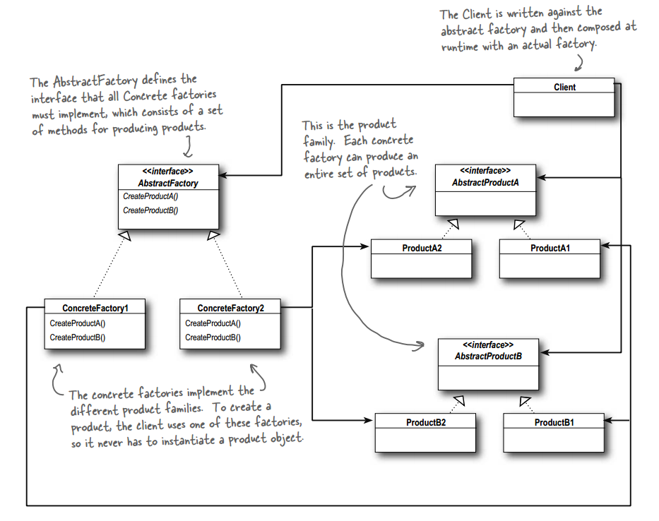
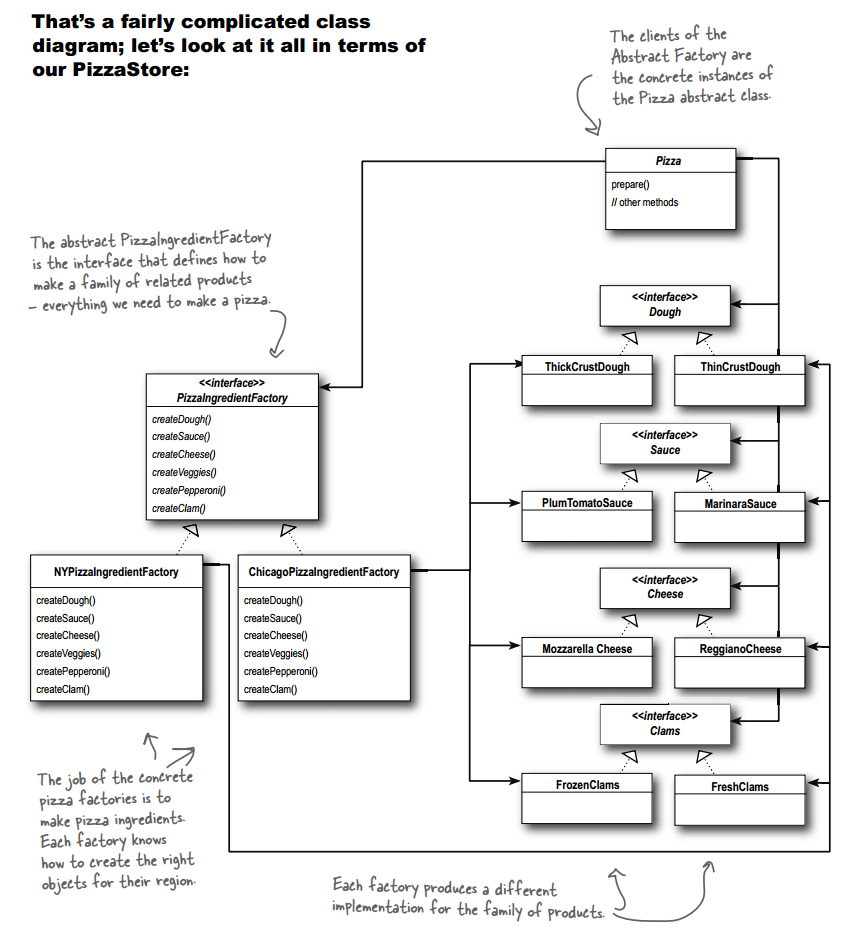

# 设计模式 - 创建型 - 抽象工厂模式 #

### 介绍 ###

**意图**：提供一个创建一系列相关或相互依赖对象的接口，而无需指定它们具体的类。

**主要解决**：主要解决接口选择的问题。

**何时使用**：系统的产品有多于一个的产品族，而系统只消费其中某一族的产品。

**如何解决**：在一个产品族里面，定义多个产品。

**关键代码**：在一个工厂里聚合多个同类产品。

### 实现 ###

	public abstract class Pizza {
		String name;
	
		Dough dough;
		Sauce sauce;
		Veggies veggies[];
		Cheese cheese;
		Pepperoni pepperoni;
		Clams clam;
	
		abstract void prepare();
	
		void bake() {
			System.out.println("Bake for 25 minutes at 350");
		}
	
		void cut() {
			System.out.println("Cutting the pizza into diagonal slices");
		}
	
		void box() {
			System.out.println("Place pizza in official PizzaStore box");
		}
	
		void setName(String name) {
			this.name = name;
		}
	
		String getName() {
			return name;
		}
	
		public String toString() {
			StringBuffer result = new StringBuffer();
			result.append("---- " + name + " ----\n");
			if (dough != null) {
				result.append(dough);
				result.append("\n");
			}
			if (sauce != null) {
				result.append(sauce);
				result.append("\n");
			}
			if (cheese != null) {
				result.append(cheese);
				result.append("\n");
			}
			if (veggies != null) {
				for (int i = 0; i < veggies.length; i++) {
					result.append(veggies[i]);
					if (i < veggies.length-1) {
						result.append(", ");
					}
				}
				result.append("\n");
			}
			if (clam != null) {
				result.append(clam);
				result.append("\n");
			}
			if (pepperoni != null) {
				result.append(pepperoni);
				result.append("\n");
			}
			return result.toString();
		}
	}

---

这是抽象工厂（提供一个接口，用于创建相关或依赖对象家族，而不需要明确指定具体类）

	public interface PizzaIngredientFactory {
	 
		public Dough createDough();
		public Sauce createSauce();
		public Cheese createCheese();
		public Veggies[] createVeggies();
		public Pepperoni createPepperoni();
		public Clams createClam();
	 
	}

---

	public class NYPizzaIngredientFactory implements PizzaIngredientFactory {
	 
		public Dough createDough() {
			return new ThinCrustDough();
		}
	 
		public Sauce createSauce() {
			return new MarinaraSauce();
		}
	 
		public Cheese createCheese() {
			return new ReggianoCheese();
		}
	 
		public Veggies[] createVeggies() {
			Veggies veggies[] = { new Garlic(), new Onion(), new Mushroom(), new RedPepper() };
			return veggies;
		}
	 
		public Pepperoni createPepperoni() {
			return new SlicedPepperoni();
		}
	
		public Clams createClam() {
			return new FreshClams();
		}
	}

---

	public class NYPizzaStore extends PizzaStore {
	 
		protected Pizza createPizza(String item) {
			Pizza pizza = null;
			PizzaIngredientFactory ingredientFactory = 
				new NYPizzaIngredientFactory();
	 
			if (item.equals("cheese")) {
	  
				pizza = new CheesePizza(ingredientFactory);
				pizza.setName("New York Style Cheese Pizza");
	  
			} else if (item.equals("veggie")) {
	 
				pizza = new VeggiePizza(ingredientFactory);
				pizza.setName("New York Style Veggie Pizza");
	 
			} else if (item.equals("clam")) {
	 
				pizza = new ClamPizza(ingredientFactory);
				pizza.setName("New York Style Clam Pizza");
	 
			} else if (item.equals("pepperoni")) {
	
				pizza = new PepperoniPizza(ingredientFactory);
				pizza.setName("New York Style Pepperoni Pizza");
	 
			} 
			return pizza;
		}
	}

---

	public class CheesePizza extends Pizza {
		PizzaIngredientFactory ingredientFactory;
	 
		public CheesePizza(PizzaIngredientFactory ingredientFactory) {
			this.ingredientFactory = ingredientFactory;
		}
	 
		void prepare() {
			System.out.println("Preparing " + name);
			dough = ingredientFactory.createDough();
			sauce = ingredientFactory.createSauce();
			cheese = ingredientFactory.createCheese();
		}
	}

---

[其他源码]()

---

	public class PizzaTestDrive {
	 
		public static void main(String[] args) {
			PizzaStore nyStore = new NYPizzaStore();
			PizzaStore chicagoStore = new ChicagoPizzaStore();
	 
			Pizza pizza = nyStore.orderPizza("cheese");
			System.out.println("Ethan ordered a " + pizza + "\n");
	 
			pizza = chicagoStore.orderPizza("cheese");
			System.out.println("Joel ordered a " + pizza + "\n");
	
			pizza = nyStore.orderPizza("clam");
			System.out.println("Ethan ordered a " + pizza + "\n");
	 
			pizza = chicagoStore.orderPizza("clam");
			System.out.println("Joel ordered a " + pizza + "\n");
	
			pizza = nyStore.orderPizza("pepperoni");
			System.out.println("Ethan ordered a " + pizza + "\n");
	 
			pizza = chicagoStore.orderPizza("pepperoni");
			System.out.println("Joel ordered a " + pizza + "\n");
	
			pizza = nyStore.orderPizza("veggie");
			System.out.println("Ethan ordered a " + pizza + "\n");
	 
			pizza = chicagoStore.orderPizza("veggie");
			System.out.println("Joel ordered a " + pizza + "\n");
		}
	}

运行结果：

	--- Making a New York Style Cheese Pizza ---
	Preparing New York Style Cheese Pizza
	Bake for 25 minutes at 350
	Cutting the pizza into diagonal slices
	Place pizza in official PizzaStore box
	Ethan ordered a ---- New York Style Cheese Pizza ----
	Thin Crust Dough
	Marinara Sauce
	Reggiano Cheese
	
	
	--- Making a Chicago Style Cheese Pizza ---
	Preparing Chicago Style Cheese Pizza
	Bake for 25 minutes at 350
	Cutting the pizza into diagonal slices
	Place pizza in official PizzaStore box
	Joel ordered a ---- Chicago Style Cheese Pizza ----
	ThickCrust style extra thick crust dough
	Tomato sauce with plum tomatoes
	Shredded Mozzarella
	
	
	--- Making a New York Style Clam Pizza ---
	Preparing New York Style Clam Pizza
	Bake for 25 minutes at 350
	Cutting the pizza into diagonal slices
	Place pizza in official PizzaStore box
	Ethan ordered a ---- New York Style Clam Pizza ----
	Thin Crust Dough
	Marinara Sauce
	Reggiano Cheese
	Fresh Clams from Long Island Sound
	
	
	--- Making a Chicago Style Clam Pizza ---
	Preparing Chicago Style Clam Pizza
	Bake for 25 minutes at 350
	Cutting the pizza into diagonal slices
	Place pizza in official PizzaStore box
	Joel ordered a ---- Chicago Style Clam Pizza ----
	ThickCrust style extra thick crust dough
	Tomato sauce with plum tomatoes
	Shredded Mozzarella
	Frozen Clams from Chesapeake Bay
	
	
	--- Making a New York Style Pepperoni Pizza ---
	Preparing New York Style Pepperoni Pizza
	Bake for 25 minutes at 350
	Cutting the pizza into diagonal slices
	Place pizza in official PizzaStore box
	Ethan ordered a ---- New York Style Pepperoni Pizza ----
	Thin Crust Dough
	Marinara Sauce
	Reggiano Cheese
	Garlic, Onion, Mushrooms, Red Pepper
	Sliced Pepperoni
	
	
	--- Making a Chicago Style Pepperoni Pizza ---
	Preparing Chicago Style Pepperoni Pizza
	Bake for 25 minutes at 350
	Cutting the pizza into diagonal slices
	Place pizza in official PizzaStore box
	Joel ordered a ---- Chicago Style Pepperoni Pizza ----
	ThickCrust style extra thick crust dough
	Tomato sauce with plum tomatoes
	Shredded Mozzarella
	Black Olives, Spinach, Eggplant
	Sliced Pepperoni
	
	
	--- Making a New York Style Veggie Pizza ---
	Preparing New York Style Veggie Pizza
	Bake for 25 minutes at 350
	Cutting the pizza into diagonal slices
	Place pizza in official PizzaStore box
	Ethan ordered a ---- New York Style Veggie Pizza ----
	Thin Crust Dough
	Marinara Sauce
	Reggiano Cheese
	Garlic, Onion, Mushrooms, Red Pepper
	
	
	--- Making a Chicago Style Veggie Pizza ---
	Preparing Chicago Style Veggie Pizza
	Bake for 25 minutes at 350
	Cutting the pizza into diagonal slices
	Place pizza in official PizzaStore box
	Joel ordered a ---- Chicago Style Veggie Pizza ----
	ThickCrust style extra thick crust dough
	Tomato sauce with plum tomatoes
	Shredded Mozzarella
	Black Olives, Spinach, Eggplant

### 参考及引用 ###

1.《Head First 设计模式》Eric Freeman 等 著

[2.抽象工厂模式 | 菜鸟教程](http://www.runoob.com/design-pattern/abstract-factory-pattern.html)

