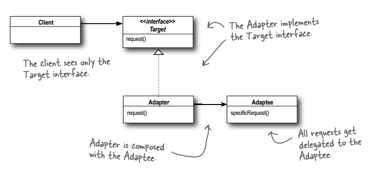
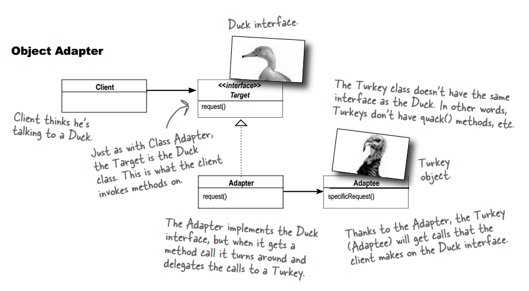
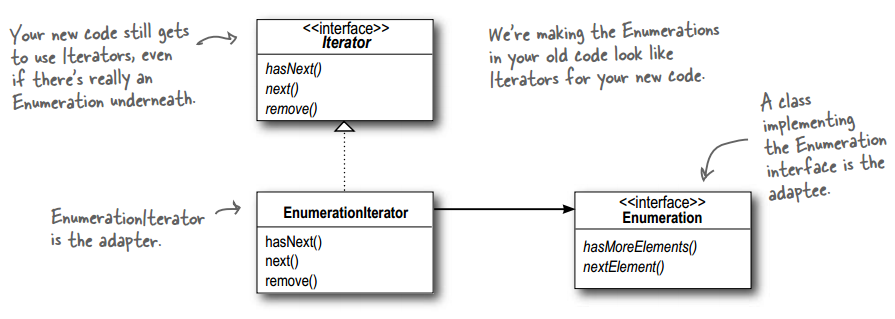

# 设计模式 - 结构型 - 适配器模式 #

### 介绍 ###

**意图**：将一个类的接口转换成客户希望的另外一个接口。适配器模式使得原本由于接口不兼容的类合作无间。

**主要解决**：主要解决在软件系统中，常常要将一些"现存的对象"放到新的环境中，而新环境要求的接口是现对象不能满足的。

**何时使用**： 

1、系统需要使用现有的类，而此类的接口不符合系统的需要。 

2、想要建立一个可以重复使用的类，用于与一些彼此之间没有太大关联的一些类，包括一些可能在将来引进的类一起工作，这些源类不一定有一致的接口。 

3、通过接口转换，将一个类插入另一个类系中。

**应用实例**： 

1、美国电器 110V，中国 220V，就要有一个适配器将 110V 转化为 220V。 

2、JAVA JDK 1.1 提供了 Enumeration 接口，而在 1.2 中提供了 Iterator 接口，想要使用 1.2 的 JDK，则要将以前系统的 Enumeration 接口转化为 Iterator 接口，这时就需要适配器模式。

### 实现 ###

#### 实现一 ####

	public interface Duck {
		public void quack();
		public void fly();
	}

---

	public class MallardDuck implements Duck {
		public void quack() {
			System.out.println("Quack");
		}
	 
		public void fly() {
			System.out.println("I'm flying");
		}
	}

---

	public interface Turkey {
		public void gobble();
		public void fly();
	}

---

	public class WildTurkey implements Turkey {
		public void gobble() {
			System.out.println("Gobble gobble");
		}
	 
		public void fly() {
			System.out.println("I'm flying a short distance");
		}
	}

---

适配器

	public class TurkeyAdapter implements Duck {
		Turkey turkey;
	 
		public TurkeyAdapter(Turkey turkey) {
			this.turkey = turkey;
		}
	    
		public void quack() {
			turkey.gobble();
		}
	  
		public void fly() {
			for(int i=0; i < 5; i++) {
				turkey.fly();
			}
		}
	}

**Target**:Duck

**Adapter**:TurkeyAdapter 一只披着鸭皮的火鸡

**Adaptee**:Turkey

---

运行类

	public class DuckTestDrive {
		public static void main(String[] args) {
			MallardDuck duck = new MallardDuck();
	
			WildTurkey turkey = new WildTurkey();
			Duck turkeyAdapter = new TurkeyAdapter(turkey);
	
			System.out.println("The Turkey says...");
			turkey.gobble();
			turkey.fly();
	
			System.out.println("\nThe Duck says...");
			testDuck(duck);
	
			System.out.println("\nThe TurkeyAdapter says...");
			testDuck(turkeyAdapter);
		}
	
		static void testDuck(Duck duck) {
			duck.quack();
			duck.fly();
		}
	}

运行结果

	The Turkey says...
	Gobble gobble
	I'm flying a short distance
	
	The Duck says...
	Quack
	I'm flying
	
	The TurkeyAdapter says...
	Gobble gobble
	I'm flying a short distance
	I'm flying a short distance
	I'm flying a short distance
	I'm flying a short distance
	I'm flying a short distance

#### 实现二 ####

Enumeration 接口转化为 Iterator 接口

	public class EnumerationIterator implements Iterator<Object> {
		Enumeration<?> enumeration;
	 
		public EnumerationIterator(Enumeration<?> enumeration) {
			this.enumeration = enumeration;
		}
	 
		public boolean hasNext() {
			return enumeration.hasMoreElements();
		}
	 
		public Object next() {
			return enumeration.nextElement();
		}
	 
		public void remove() {
			throw new UnsupportedOperationException();
		}
	}

---

运行类

	public class EnumerationIteratorTestDrive {
		public static void main (String args[]) {
			Vector<String> v = new Vector<String>(Arrays.asList(args));
			Iterator<?> iterator = new EnumerationIterator(v.elements());
			while (iterator.hasNext()) {
				System.out.println(iterator.next());
			}
		}
	}

### 参考及引用 ###

1.《Head First 设计模式》Eric Freeman 等 著

[2.适配器模式 | 菜鸟教程](http://www.runoob.com/design-pattern/adapter-pattern.html)