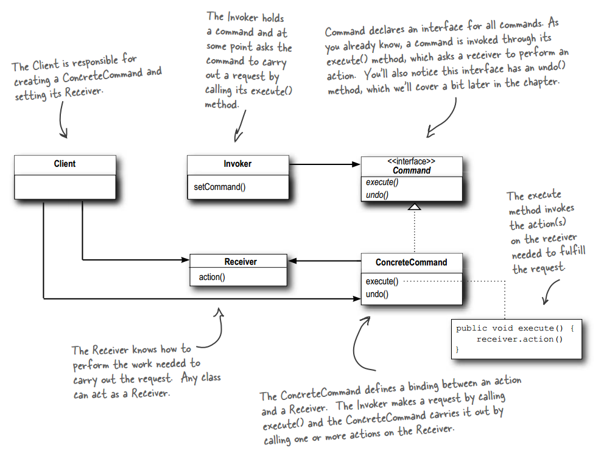
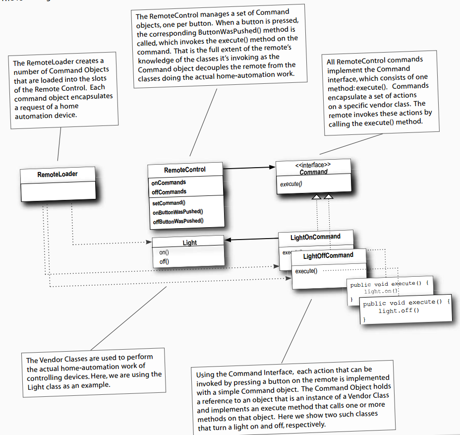

# 设计模式 - 行为型 - 命令模式 #

### 介绍 ###

**意图**：将一个请求封装成一个对象，从而让您可以用不同的请求,队列，日志对客户进行参数化（将请求对象变成参数），且支持撤销操作。

**主要解决**：在软件系统中，行为请求者与行为实现者通常是一种紧耦合的关系，但某些场合，比如需要对行为进行记录、撤销或重做、事务等处理时，这种无法抵御变化的紧耦合的设计就不太合适。

**何时使用**：在某些场合，比如要对行为进行"记录、撤销/重做、事务"等处理，这种无法抵御变化的紧耦合是不合适的。在这种情况下，如何将"行为请求者"与"行为实现者"解耦？将一组行为抽象为对象，可以实现二者之间的松耦合。

**如何解决**：通过调用者调用接受者执行命令，顺序：调用者→接受者→命令。

**关键代码**：定义三个角色：

1、Received 真正的命令执行对象 

2、Command 

3、Invoker 使用命令对象的入口

**使用场景**:1.遥控器 2.队列请求（线程） 3.日志请求（事务）

### 实现 ###

#### 简单的实现 ####

	public interface Command {
		public void execute();
	}

---

	public class LightOnCommand implements Command {
		Light light;
	  
		public LightOnCommand(Light light) {
			this.light = light;
		}
	 
		public void execute() {
			light.on();
		}
	}

---

	public class SimpleRemoteControl {
		Command slot;
	
		public SimpleRemoteControl() {}
	
		public void setCommand(Command command) {
			slot = command;
		}
	
		public void buttonWasPressed() {
			slot.execute();
		}
	}

---

运行类

	public class RemoteControlTest {
		public static void main(String[] args) {
			//Invoker
			SimpleRemoteControl remote = new SimpleRemoteControl()；

			//Receiver
			Light light = new Light();

			//Command
			LightOnCommand lightOn = new LightOnCommand(light);

			//发出命令
			remote.setCommand(lightOn);
			remote.buttonWasPressed();

		}
		
	}

运行结果

	Light is on

迂回地用控制器 控制 灯，而不是直接把灯打开

#### 更多命令的实现 ####

功能更强大的家居控制器

Invoker

	public class RemoteControl {
		Command[] onCommands;
		Command[] offCommands;
	 
		public RemoteControl() {
			onCommands = new Command[7];
			offCommands = new Command[7];
	 
			Command noCommand = new NoCommand();
			for (int i = 0; i < 7; i++) {
				onCommands[i] = noCommand;
				offCommands[i] = noCommand;
			}
		}
	  
		public void setCommand(int slot, Command onCommand, Command offCommand) {
			onCommands[slot] = onCommand;
			offCommands[slot] = offCommand;
		}
	 
		public void onButtonWasPushed(int slot) {
			onCommands[slot].execute();
		}
	 
		public void offButtonWasPushed(int slot) {
			offCommands[slot].execute();
		}
	  
		public String toString() {
			StringBuffer stringBuff = new StringBuffer();
			stringBuff.append("\n------ Remote Control -------\n");
			for (int i = 0; i < onCommands.length; i++) {
				stringBuff.append("[slot " + i + "] " + onCommands[i].getClass().getName()
					+ "    " + offCommands[i].getClass().getName() + "\n");
			}
			return stringBuff.toString();
		}
	}

---

一些命令Command

	public class LightOffCommand implements Command {
		Light light;
	 
		public LightOffCommand(Light light) {
			this.light = light;
		}
	 
		public void execute() {
			light.off();
		}
	}

---

	public class StereoOnWithCDCommand implements Command {
		Stereo stereo;
	 
		public StereoOnWithCDCommand(Stereo stereo) {
			this.stereo = stereo;
		}
	 
		public void execute() {
			stereo.on();
			stereo.setCD();
			stereo.setVolume(11);
		}
	}

---

这里用到空对象Null Object，来避免恼人的NPE问题

	public class NoCommand implements Command {
		public void execute() { }
	}

---

[更多命令Command类代码](../example3)

---

Client

	public class RemoteLoader {
	 
		public static void main(String[] args) {
			//Invoker
			RemoteControl remoteControl = new RemoteControl();
			
			//Receiver
			Light livingRoomLight = new Light("Living Room");
			Light kitchenLight = new Light("Kitchen");
			CeilingFan ceilingFan= new CeilingFan("Living Room");
			GarageDoor garageDoor = new GarageDoor("");
			Stereo stereo = new Stereo("Living Room");
			
			//Commands 并指定所属的Receiver
			LightOnCommand livingRoomLightOn = 
					new LightOnCommand(livingRoomLight);
			LightOffCommand livingRoomLightOff = 
					new LightOffCommand(livingRoomLight);
			LightOnCommand kitchenLightOn = 
					new LightOnCommand(kitchenLight);
			LightOffCommand kitchenLightOff = 
					new LightOffCommand(kitchenLight);
	  
			CeilingFanOnCommand ceilingFanOn = 
					new CeilingFanOnCommand(ceilingFan);
			CeilingFanOffCommand ceilingFanOff = 
					new CeilingFanOffCommand(ceilingFan);
	 
			GarageDoorUpCommand garageDoorUp =
					new GarageDoorUpCommand(garageDoor);
			GarageDoorDownCommand garageDoorDown =
					new GarageDoorDownCommand(garageDoor);
	 
			StereoOnWithCDCommand stereoOnWithCD =
					new StereoOnWithCDCommand(stereo);
			StereoOffCommand  stereoOff =
					new StereoOffCommand(stereo);
	
			//将Commands注册到Invoker
			remoteControl.setCommand(0, livingRoomLightOn, livingRoomLightOff);
			remoteControl.setCommand(1, kitchenLightOn, kitchenLightOff);
			remoteControl.setCommand(2, ceilingFanOn, ceilingFanOff);
			remoteControl.setCommand(3, stereoOnWithCD, stereoOff);
	  
			System.out.println(remoteControl);
	 		
			//Clients使用Invoker来调用Receiver，而不是Clients直接操控Invoker
			remoteControl.onButtonWasPushed(0);
			remoteControl.offButtonWasPushed(0);
			remoteControl.onButtonWasPushed(1);
			remoteControl.offButtonWasPushed(1);
			remoteControl.onButtonWasPushed(2);
			remoteControl.offButtonWasPushed(2);
			remoteControl.onButtonWasPushed(3);
			remoteControl.offButtonWasPushed(3);
		}
	}

运行结果

	------ Remote Control -------
	[slot 0] LightOnCommand    LightOffCommand
	[slot 1] LightOnCommand    LightOffCommand
	[slot 2] CeilingFanOnCommand    CeilingFanOffCommand
	[slot 3] StereoOnWithCDCommand    StereoOffCommand
	[slot 4] NoCommand    NoCommand
	[slot 5] NoCommand    NoCommand
	[slot 6] NoCommand    NoCommand
	
	Living Room light is on
	Living Room light is off
	Kitchen light is on
	Kitchen light is off
	Living Room ceiling fan is on high
	Living Room ceiling fan is off
	Living Room stereo is on
	Living Room stereo is set for CD input
	Living Room Stereo volume set to 11
	Living Room stereo is off

#### 加上撤销动作（选择了解） ####

加上撤销动作的遥控器

	public interface Command {
		public void execute();
		//关键
		public void undo();
	}

---

	public class LightOnCommand implements Command {
		Light light;
		int level;
		public LightOnCommand(Light light) {
			this.light = light;
		}
	 
		public void execute() {
	        level = light.getLevel();
			light.on();
		}
	 
		public void undo() {
			light.dim(level);
		}
	}

---

	public class LightOffCommand implements Command {
		Light light;
		int level;
		public LightOffCommand(Light light) {
			this.light = light;
		}
	 
		public void execute() {
	        level = light.getLevel();
			light.off();
		}
	 
		public void undo() {
			light.dim(level);
		}
	}

---

	public class CeilingFan {
		public static final int HIGH = 3;
		public static final int MEDIUM = 2;
		public static final int LOW = 1;
		public static final int OFF = 0;
		String location;
		int speed;
	 
		public CeilingFan(String location) {
			this.location = location;
			speed = OFF;
		}
	  
		public void high() {
			speed = HIGH;
			System.out.println(location + " ceiling fan is on high");
		} 
	 
		public void medium() {
			speed = MEDIUM;
			System.out.println(location + " ceiling fan is on medium");
		}
	 
		public void low() {
			speed = LOW;
			System.out.println(location + " ceiling fan is on low");
		}
	  
		public void off() {
			speed = OFF;
			System.out.println(location + " ceiling fan is off");
		}
	  
		public int getSpeed() {
			return speed;
		}
	}

---

	public class CeilingFanHighCommand implements Command {
		CeilingFan ceilingFan;
		int prevSpeed;
	  
		public CeilingFanHighCommand(CeilingFan ceilingFan) {
			this.ceilingFan = ceilingFan;
		}
	 
		public void execute() {
			prevSpeed = ceilingFan.getSpeed();
			ceilingFan.high();
		}
	 
		public void undo() {
			if (prevSpeed == CeilingFan.HIGH) {
				ceilingFan.high();
			} else if (prevSpeed == CeilingFan.MEDIUM) {
				ceilingFan.medium();
			} else if (prevSpeed == CeilingFan.LOW) {
				ceilingFan.low();
			} else if (prevSpeed == CeilingFan.OFF) {
				ceilingFan.off();
			}
		}
	}

---

[更多源码](../example4)

---

	public class RemoteControlWithUndo {
		Command[] onCommands;
		Command[] offCommands;
		Command undoCommand;
	 
		public RemoteControlWithUndo() {
			onCommands = new Command[7];
			offCommands = new Command[7];
	 
			Command noCommand = new NoCommand();
			for(int i=0;i<7;i++) {
				onCommands[i] = noCommand;
				offCommands[i] = noCommand;
			}
			undoCommand = noCommand;
		}
	  
		public void setCommand(int slot, Command onCommand, Command offCommand) {
			onCommands[slot] = onCommand;
			offCommands[slot] = offCommand;
		}
	 
		public void onButtonWasPushed(int slot) {
			onCommands[slot].execute();
			undoCommand = onCommands[slot];
		}
	 
		public void offButtonWasPushed(int slot) {
			offCommands[slot].execute();
			undoCommand = offCommands[slot];
		}
	 
		public void undoButtonWasPushed() {
			undoCommand.undo();
		}
	  
		public String toString() {
			StringBuffer stringBuff = new StringBuffer();
			stringBuff.append("\n------ Remote Control -------\n");
			for (int i = 0; i < onCommands.length; i++) {
				stringBuff.append("[slot " + i + "] " + onCommands[i].getClass().getSimpleName()
					+ "    " + offCommands[i].getClass().getName() + "\n");
			}
			stringBuff.append("[undo] " + undoCommand.getClass().getSimpleName() + "\n");
			return stringBuff.toString();
		}
	}

---

运行类

	public class RemoteLoader {
	 
		public static void main(String[] args) {
			RemoteControlWithUndo remoteControl = new RemoteControlWithUndo();
	 
			Light livingRoomLight = new Light("Living Room");
	 
			LightOnCommand livingRoomLightOn = 
					new LightOnCommand(livingRoomLight);
			LightOffCommand livingRoomLightOff = 
					new LightOffCommand(livingRoomLight);
	 
			remoteControl.setCommand(0, livingRoomLightOn, livingRoomLightOff);
	 
			remoteControl.onButtonWasPushed(0);
			remoteControl.offButtonWasPushed(0);
			System.out.println(remoteControl);
			
			remoteControl.undoButtonWasPushed();
			remoteControl.offButtonWasPushed(0);
			remoteControl.onButtonWasPushed(0);
			
			System.out.println(remoteControl);
			remoteControl.undoButtonWasPushed();
	
			CeilingFan ceilingFan = new CeilingFan("Living Room");
	   
			CeilingFanMediumCommand ceilingFanMedium = 
					new CeilingFanMediumCommand(ceilingFan);
			CeilingFanHighCommand ceilingFanHigh = 
					new CeilingFanHighCommand(ceilingFan);
			CeilingFanOffCommand ceilingFanOff = 
					new CeilingFanOffCommand(ceilingFan);
	  
			remoteControl.setCommand(0, ceilingFanMedium, ceilingFanOff);
			remoteControl.setCommand(1, ceilingFanHigh, ceilingFanOff);
	   
			remoteControl.onButtonWasPushed(0);
			remoteControl.offButtonWasPushed(0);
			System.out.println(remoteControl);
			remoteControl.undoButtonWasPushed();
	  
			remoteControl.onButtonWasPushed(1);
			System.out.println(remoteControl);
			remoteControl.undoButtonWasPushed();
		}
	}

#### 一键多命令（选择了解） ####

	public class MacroCommand implements Command {
		Command[] commands;
	 
		public MacroCommand(Command[] commands) {
			this.commands = commands;
		}
	 
		public void execute() {
			for (int i = 0; i < commands.length; i++) {
				commands[i].execute();
			}
		}
	 
	    /**
	     * NOTE:  these commands have to be done backwards to ensure 
	     * proper undo functionality
	     */
		public void undo() {
			for (int i = commands.length -1; i >= 0; i--) {
				commands[i].undo();
			}
		}
	}

---

[更多源码](../example5)

---

运行类

	public class RemoteLoader {
	
		public static void main(String[] args) {
	
			RemoteControl remoteControl = new RemoteControl();
	
			Light light = new Light("Living Room");
			TV tv = new TV("Living Room");
			Stereo stereo = new Stereo("Living Room");
			Hottub hottub = new Hottub();
	 
			LightOnCommand lightOn = new LightOnCommand(light);
			StereoOnCommand stereoOn = new StereoOnCommand(stereo);
			TVOnCommand tvOn = new TVOnCommand(tv);
			HottubOnCommand hottubOn = new HottubOnCommand(hottub);
			LightOffCommand lightOff = new LightOffCommand(light);
			StereoOffCommand stereoOff = new StereoOffCommand(stereo);
			TVOffCommand tvOff = new TVOffCommand(tv);
			HottubOffCommand hottubOff = new HottubOffCommand(hottub);
	
			//关键
			Command[] partyOn = { lightOn, stereoOn, tvOn, hottubOn};
			Command[] partyOff = { lightOff, stereoOff, tvOff, hottubOff};
	  
			MacroCommand partyOnMacro = new MacroCommand(partyOn);
			MacroCommand partyOffMacro = new MacroCommand(partyOff);
	 
			remoteControl.setCommand(0, partyOnMacro, partyOffMacro);
	  
			System.out.println(remoteControl);
			System.out.println("--- Pushing Macro On---");
			remoteControl.onButtonWasPushed(0);
			System.out.println("--- Pushing Macro Off---");
			remoteControl.offButtonWasPushed(0);
		}
	}

---

运行结果

	------ Remote Control -------
	[slot 0] MacroCommand    MacroCommand
	[slot 1] NoCommand    NoCommand
	[slot 2] NoCommand    NoCommand
	[slot 3] NoCommand    NoCommand
	[slot 4] NoCommand    NoCommand
	[slot 5] NoCommand    NoCommand
	[slot 6] NoCommand    NoCommand
	[undo] NoCommand
	
	--- Pushing Macro On---
	Light is on
	Living Room stereo is on
	Living Room TV is on
	Living Room TV channel is set for DVD
	Hottub is heating to a steaming 104 degrees
	Hottub is bubbling!
	--- Pushing Macro Off---
	Light is off
	Living Room stereo is off
	Living Room TV is off
	Hottub is cooling to 98 degrees

### 参考及引用 ###

1.《Head First 设计模式》Eric Freeman 等 著

[2.命令模式 | 菜鸟教程](http://www.runoob.com/design-pattern/command-pattern.html)
