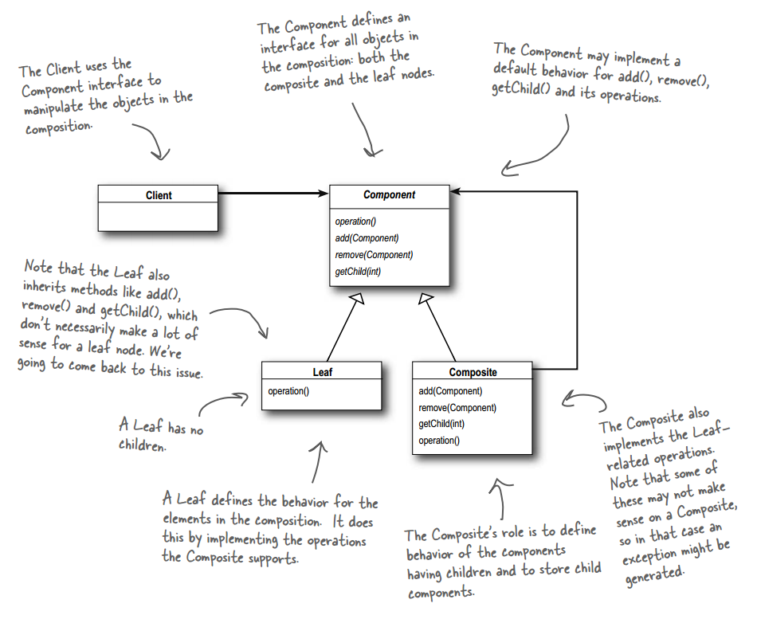
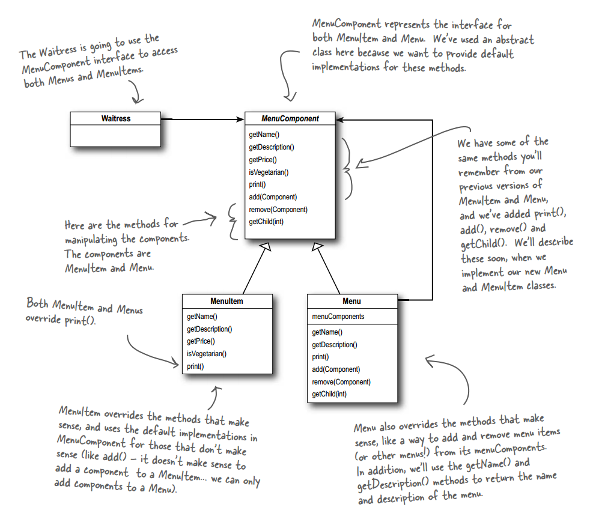

# 设计模式 - 行为型 - 组合模式 #

### 介绍 ###

**意图**：将对象组合成树形结构以表示"部分-整体"的层次结构。组合模式使得用户对单个对象和组合对象的使用具有一致性。

**主要解决**：它在我们树型结构的问题中，模糊了简单元素和复杂元素的概念，客户程序可以向处理简单元素一样来处理复杂元素，从而使得客户程序与复杂元素的内部结构解耦。

**何时使用**： 1、您想表示对象的部分-整体层次结构（树形结构）。 2、您希望用户忽略组合对象与单个对象的不同，用户将统一地使用组合结构中的所有对象。

**如何解决**：树枝和叶子实现统一接口，树枝内部组合该接口。

**关键代码**：树枝内部组合该接口，并且含有内部属性 List，里面放 Component。

### 实现 ###

	public abstract class MenuComponent {
	
		public void add(MenuComponent menuComponent) {
			throw new UnsupportedOperationException();
		}
		public void remove(MenuComponent menuComponent) {
			throw new UnsupportedOperationException();
		}
		public MenuComponent getChild(int i) {
			throw new UnsupportedOperationException();
		}
	  
		public String getName() {
			throw new UnsupportedOperationException();
		}
		public String getDescription() {
			throw new UnsupportedOperationException();
		}
		public double getPrice() {
			throw new UnsupportedOperationException();
		}
		public boolean isVegetarian() {
			throw new UnsupportedOperationException();
		}
	  
		public void print() {
			throw new UnsupportedOperationException();
		}
	}

---

	public class MenuItem extends MenuComponent {
		String name;
		String description;
		boolean vegetarian;
		double price;
	    
		public MenuItem(String name, 
		                String description, 
		                boolean vegetarian, 
		                double price) 
		{ 
			this.name = name;
			this.description = description;
			this.vegetarian = vegetarian;
			this.price = price;
		}
	  
		public String getName() {
			return name;
		}
	  
		public String getDescription() {
			return description;
		}
	  
		public double getPrice() {
			return price;
		}
	  
		public boolean isVegetarian() {
			return vegetarian;
		}
	  
		public void print() {
			System.out.print("  " + getName());
			if (isVegetarian()) {
				System.out.print("(v)");
			}
			System.out.println(", " + getPrice());
			System.out.println("     -- " + getDescription());
		}
	}

---

	public class Menu extends MenuComponent {
		ArrayList<MenuComponent> menuComponents = new ArrayList<MenuComponent>();
		String name;
		String description;
	  
		public Menu(String name, String description) {
			this.name = name;
			this.description = description;
		}
	 
		public void add(MenuComponent menuComponent) {
			menuComponents.add(menuComponent);
		}
	 
		public void remove(MenuComponent menuComponent) {
			menuComponents.remove(menuComponent);
		}
	 
		public MenuComponent getChild(int i) {
			return (MenuComponent)menuComponents.get(i);
		}
	 
		public String getName() {
			return name;
		}
	 
		public String getDescription() {
			return description;
		}
	 
		public void print() {
			System.out.print("\n" + getName());
			System.out.println(", " + getDescription());
			System.out.println("---------------------");
	  
			Iterator<MenuComponent> iterator = menuComponents.iterator();
			while (iterator.hasNext()) {
				MenuComponent menuComponent = 
					(MenuComponent)iterator.next();
				menuComponent.print();
			}
		}
	}

---

	public class Waitress {
		MenuComponent allMenus;
	 
		public Waitress(MenuComponent allMenus) {
			this.allMenus = allMenus;
		}
	 
		public void printMenu() {
			allMenus.print();
		}
	}

---

	public class MenuTestDrive {
		public static void main(String args[]) {
			MenuComponent pancakeHouseMenu = 
				new Menu("PANCAKE HOUSE MENU", "Breakfast");
			MenuComponent dinerMenu = 
				new Menu("DINER MENU", "Lunch");
			MenuComponent cafeMenu = 
				new Menu("CAFE MENU", "Dinner");
			MenuComponent dessertMenu = 
				new Menu("DESSERT MENU", "Dessert of course!");
			MenuComponent coffeeMenu = new Menu("COFFEE MENU", "Stuff to go with your afternoon coffee");
	  
			MenuComponent allMenus = new Menu("ALL MENUS", "All menus combined");
	  
			allMenus.add(pancakeHouseMenu);
			allMenus.add(dinerMenu);
			allMenus.add(cafeMenu);
	  
			pancakeHouseMenu.add(new MenuItem(
				"K&B's Pancake Breakfast", 
				"Pancakes with scrambled eggs, and toast", 
				true,
				2.99));
			pancakeHouseMenu.add(new MenuItem(
				"Regular Pancake Breakfast", 
				"Pancakes with fried eggs, sausage", 
				false,
				2.99));
			pancakeHouseMenu.add(new MenuItem(
				"Blueberry Pancakes",
				"Pancakes made with fresh blueberries, and blueberry syrup",
				true,
				3.49));
			pancakeHouseMenu.add(new MenuItem(
				"Waffles",
				"Waffles, with your choice of blueberries or strawberries",
				true,
				3.59));
	
			dinerMenu.add(new MenuItem(
				"Vegetarian BLT",
				"(Fakin') Bacon with lettuce & tomato on whole wheat", 
				true, 
				2.99));
			dinerMenu.add(new MenuItem(
				"BLT",
				"Bacon with lettuce & tomato on whole wheat", 
				false, 
				2.99));
			dinerMenu.add(new MenuItem(
				"Soup of the day",
				"A bowl of the soup of the day, with a side of potato salad", 
				false, 
				3.29));
			dinerMenu.add(new MenuItem(
				"Hotdog",
				"A hot dog, with saurkraut, relish, onions, topped with cheese",
				false, 
				3.05));
			dinerMenu.add(new MenuItem(
				"Steamed Veggies and Brown Rice",
				"Steamed vegetables over brown rice", 
				true, 
				3.99));
	 
			dinerMenu.add(new MenuItem(
				"Pasta",
				"Spaghetti with Marinara Sauce, and a slice of sourdough bread",
				true, 
				3.89));
	   
			dinerMenu.add(dessertMenu);
	  
			dessertMenu.add(new MenuItem(
				"Apple Pie",
				"Apple pie with a flakey crust, topped with vanilla icecream",
				true,
				1.59));
	  
			dessertMenu.add(new MenuItem(
				"Cheesecake",
				"Creamy New York cheesecake, with a chocolate graham crust",
				true,
				1.99));
			dessertMenu.add(new MenuItem(
				"Sorbet",
				"A scoop of raspberry and a scoop of lime",
				true,
				1.89));
	
			cafeMenu.add(new MenuItem(
				"Veggie Burger and Air Fries",
				"Veggie burger on a whole wheat bun, lettuce, tomato, and fries",
				true, 
				3.99));
			cafeMenu.add(new MenuItem(
				"Soup of the day",
				"A cup of the soup of the day, with a side salad",
				false, 
				3.69));
			cafeMenu.add(new MenuItem(
				"Burrito",
				"A large burrito, with whole pinto beans, salsa, guacamole",
				true, 
				4.29));
	
			cafeMenu.add(coffeeMenu);
	
			coffeeMenu.add(new MenuItem(
				"Coffee Cake",
				"Crumbly cake topped with cinnamon and walnuts",
				true,
				1.59));
			coffeeMenu.add(new MenuItem(
				"Bagel",
				"Flavors include sesame, poppyseed, cinnamon raisin, pumpkin",
				false,
				0.69));
			coffeeMenu.add(new MenuItem(
				"Biscotti",
				"Three almond or hazelnut biscotti cookies",
				true,
				0.89));
	 
			Waitress waitress = new Waitress(allMenus);
	   
			waitress.printMenu();
		}
	}

运行结果

	ALL MENUS, All menus combined
	---------------------
	
	PANCAKE HOUSE MENU, Breakfast
	---------------------
	  K&B's Pancake Breakfast(v), 2.99
	     -- Pancakes with scrambled eggs, and toast
	  Regular Pancake Breakfast, 2.99
	     -- Pancakes with fried eggs, sausage
	  Blueberry Pancakes(v), 3.49
	     -- Pancakes made with fresh blueberries, and blueberry syrup
	  Waffles(v), 3.59
	     -- Waffles, with your choice of blueberries or strawberries
	
	DINER MENU, Lunch
	---------------------
	  Vegetarian BLT(v), 2.99
	     -- (Fakin') Bacon with lettuce & tomato on whole wheat
	  BLT, 2.99
	     -- Bacon with lettuce & tomato on whole wheat
	  Soup of the day, 3.29
	     -- A bowl of the soup of the day, with a side of potato salad
	  Hotdog, 3.05
	     -- A hot dog, with saurkraut, relish, onions, topped with cheese
	  Steamed Veggies and Brown Rice(v), 3.99
	     -- Steamed vegetables over brown rice
	  Pasta(v), 3.89
	     -- Spaghetti with Marinara Sauce, and a slice of sourdough bread
	
	DESSERT MENU, Dessert of course!
	---------------------
	  Apple Pie(v), 1.59
	     -- Apple pie with a flakey crust, topped with vanilla icecream
	  Cheesecake(v), 1.99
	     -- Creamy New York cheesecake, with a chocolate graham crust
	  Sorbet(v), 1.89
	     -- A scoop of raspberry and a scoop of lime
	
	CAFE MENU, Dinner
	---------------------
	  Veggie Burger and Air Fries(v), 3.99
	     -- Veggie burger on a whole wheat bun, lettuce, tomato, and fries
	  Soup of the day, 3.69
	     -- A cup of the soup of the day, with a side salad
	  Burrito(v), 4.29
	     -- A large burrito, with whole pinto beans, salsa, guacamole
	
	COFFEE MENU, Stuff to go with your afternoon coffee
	---------------------
	  Coffee Cake(v), 1.59
	     -- Crumbly cake topped with cinnamon and walnuts
	  Bagel, 0.69
	     -- Flavors include sesame, poppyseed, cinnamon raisin, pumpkin
	  Biscotti(v), 0.89
	     -- Three almond or hazelnut biscotti cookies

### 参考及引用 ###

1.《Head First 设计模式》Eric Freeman 等 著

[2.组合模式 | 菜鸟教程](http://www.runoob.com/design-pattern/composite-pattern.html)