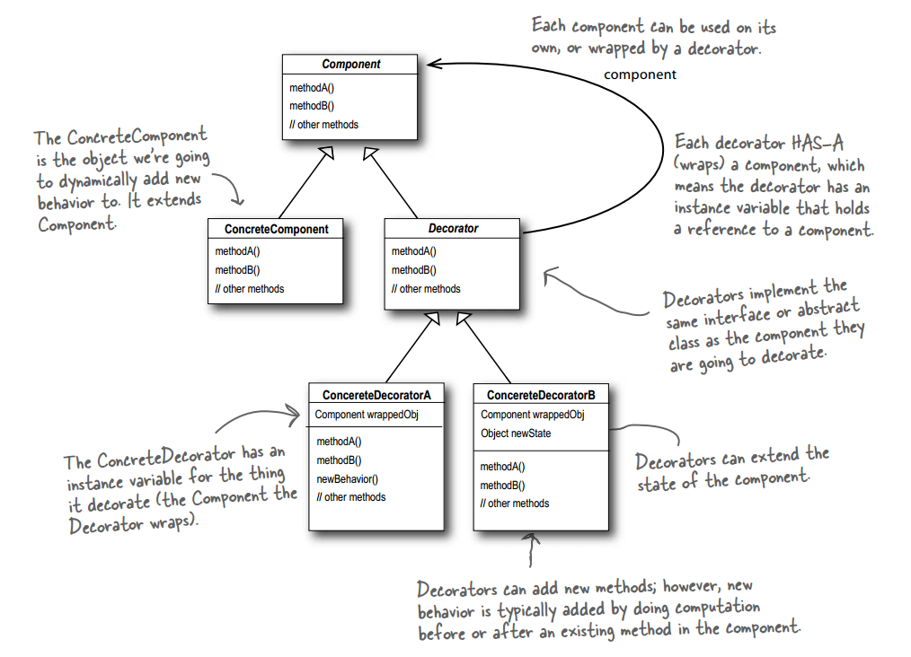
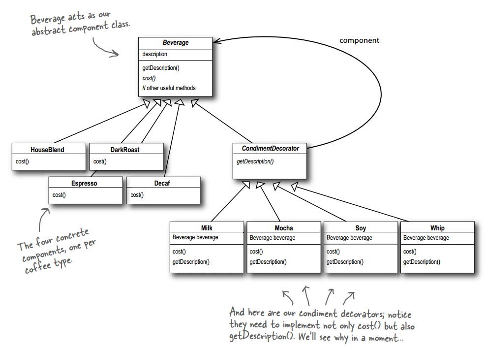
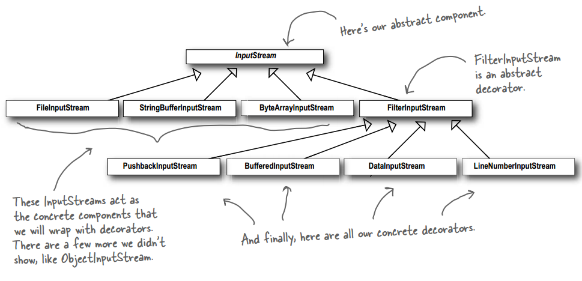

# 设计模式 - 结构型 - 装饰者模式 #

### 介绍 ###

**意图**：动态地给一个对象添加一些额外的职责。就增加功能来说，装饰器模式相比继承更为灵活。

**主要解决**：一般的，我们为了扩展一个类经常使用继承方式实现，由于继承为类引入静态特征，并且随着扩展功能的增多，子类会很膨胀。

**何时使用**：在不想增加很多子类的情况下扩展类。

**如何解决**：将具体功能职责划分，同时继承装饰者模式。

**关键代码**： 1、Component 类充当抽象角色，不应该具体实现。 2、修饰类引用和继承 Component 类，具体扩展类重写父类方法。

### 实现 ###

#### 饮料与调料 ####

**饮料**

	public abstract class Beverage {
		String description = "Unknown Beverage";
	  
		public String getDescription() {
			return description;
		}
	 
		public abstract double cost();
	}

---

	public class Espresso extends Beverage {
	  
		public Espresso() {
			description = "Espresso";
		}
	  
		public double cost() {
			return 1.99;
		}
	}

---

	public class HouseBlend extends Beverage {
		public HouseBlend() {
			description = "House Blend Coffee";
		}
	 
		public double cost() {
			return .89;
		}
	}

---

	public class DarkRoast extends Beverage {
		public DarkRoast() {
			description = "Dark Roast Coffee";
		}
	 
		public double cost() {
			return .99;
		}
	}

---

	public class Decaf extends Beverage {
		public Decaf() {
			description = "Decaf Coffee";
		}
	 
		public double cost() {
			return 1.05;
		}
	}

---

**调料（装饰者，用来装饰饮料）**

	public abstract class CondimentDecorator extends Beverage {
		public abstract String getDescription();
	}

---

	public class Mocha extends CondimentDecorator {
		Beverage beverage;
	 
		public Mocha(Beverage beverage) {
			this.beverage = beverage;
		}
	 
		public String getDescription() {
			return beverage.getDescription() + ", Mocha";
		}
	 
		public double cost() {
			return .20 + beverage.cost();
		}
	}

---

	public class Milk extends CondimentDecorator {
		Beverage beverage;
	
		public Milk(Beverage beverage) {
			this.beverage = beverage;
		}
	
		public String getDescription() {
			return beverage.getDescription() + ", Milk";
		}
	
		public double cost() {
			return .10 + beverage.cost();
		}
	}

---

	public class Soy extends CondimentDecorator {
		Beverage beverage;
	
		public Soy(Beverage beverage) {
			this.beverage = beverage;
		}
	
		public String getDescription() {
			return beverage.getDescription() + ", Soy";
		}
	
		public double cost() {
			return .15 + beverage.cost();
		}
	}

---

	public class Whip extends CondimentDecorator {
		Beverage beverage;
	 
		public Whip(Beverage beverage) {
			this.beverage = beverage;
		}
	 
		public String getDescription() {
			return beverage.getDescription() + ", Whip";
		}
	 
		public double cost() {
			return .10 + beverage.cost();
		}
	}

---

**运行类**

	public class StarbuzzCoffee {
	 
		public static void main(String args[]) {
			Beverage beverage = new Espresso();
			System.out.println(beverage.getDescription() 
					+ " $" + beverage.cost());
	 
			Beverage beverage2 = new DarkRoast();
			beverage2 = new Mocha(beverage2);
			beverage2 = new Mocha(beverage2);
			beverage2 = new Whip(beverage2);
			System.out.println(beverage2.getDescription() 
					+ " $" + beverage2.cost());
	 
			Beverage beverage3 = new HouseBlend();
			beverage3 = new Soy(beverage3);
			beverage3 = new Mocha(beverage3);
			beverage3 = new Whip(beverage3);
			System.out.println(beverage3.getDescription() 
					+ " $" + beverage3.cost());
		}
	}

---

**运行结果**

	Espresso $1.99
	Dark Roast Coffee, Mocha, Mocha, Whip $1.49
	House Blend Coffee, Soy, Mocha, Whip $1.34

#### JDK里的例子 —— IO ####

**自建一个转换成小写的装饰者**

	public class LowerCaseInputStream extends FilterInputStream {
	
		public LowerCaseInputStream(InputStream in) {
			super(in);
		}
	 
		public int read() throws IOException {
			int c = in.read();
			return (c == -1 ? c : Character.toLowerCase((char)c));
		}
			
		public int read(byte[] b, int offset, int len) throws IOException {
			int result = in.read(b, offset, len);
			for (int i = offset; i < offset+result; i++) {
				b[i] = (byte)Character.toLowerCase((char)b[i]);
			}
			return result;
		}
	}

---

**运行类**

	public class InputTest {
		public static void main(String[] args) throws IOException {
			int c;
	
			try {
				InputStream in = 
					new LowerCaseInputStream(
						new BufferedInputStream(
							new FileInputStream("D:\\eclipse-workspace\\common\\src\\designpattern\\decorator\\example3\\test.txt")));
	
				while((c = in.read()) >= 0) {
					System.out.print((char)c);
				}
	
				in.close();
			} catch (IOException e) {
				e.printStackTrace();
			}
		}
	}

### 参考及引用 ###

1.《Head First 设计模式》Eric Freeman 等 著

[2.装饰者模式 | 菜鸟教程](http://www.runoob.com/design-pattern/decorator-pattern.html)