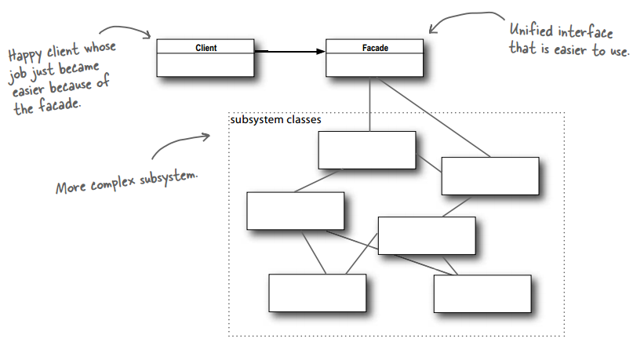

# 设计模式 - 结构型 - 外观模式 #

### 介绍 ###

**意图**：为子系统中的一组接口提供一个一致的界面，外观模式定义了一个高层接口，这个接口使得这一子系统更加容易使用。

**主要解决**：降低访问复杂系统的内部子系统时的复杂度，简化客户端与之的接口。

**何时使用**： 1、客户端不需要知道系统内部的复杂联系，整个系统只需提供一个"接待员"即可。 2、定义系统的入口。

**如何解决**：客户端不与系统耦合，外观类与系统耦合。

**关键代码**：在客户端和复杂系统之间再加一层，这一层将调用顺序、依赖关系等处理好。

### 实现 ###

	public class HomeTheaterFacade {
		Amplifier amp;
		Tuner tuner;
		DvdPlayer dvd;
		CdPlayer cd;
		Projector projector;
		TheaterLights lights;
		Screen screen;
		PopcornPopper popper;
	 
		public HomeTheaterFacade(Amplifier amp, 
					 Tuner tuner, 
					 DvdPlayer dvd, 
					 CdPlayer cd, 
					 Projector projector, 
					 Screen screen,
					 TheaterLights lights,
					 PopcornPopper popper) {
	 
			this.amp = amp;
			this.tuner = tuner;
			this.dvd = dvd;
			this.cd = cd;
			this.projector = projector;
			this.screen = screen;
			this.lights = lights;
			this.popper = popper;
		}
	 
		public void watchMovie(String movie) {
			System.out.println("Get ready to watch a movie...");
			popper.on();
			popper.pop();
			lights.dim(10);
			screen.down();
			projector.on();
			projector.wideScreenMode();
			amp.on();
			amp.setDvd(dvd);
			amp.setSurroundSound();
			amp.setVolume(5);
			dvd.on();
			dvd.play(movie);
		}

		public void endMovie() {
			System.out.println("Shutting movie theater down...");
			popper.off();
			lights.on();
			screen.up();
			projector.off();
			amp.off();
			dvd.stop();
			dvd.eject();
			dvd.off();
		}
	
		public void listenToCd(String cdTitle) {
			System.out.println("Get ready for an audiopile experence...");
			lights.on();
			amp.on();
			amp.setVolume(5);
			amp.setCd(cd);
			amp.setStereoSound();
			cd.on();
			cd.play(cdTitle);
		}
	
		public void endCd() {
			System.out.println("Shutting down CD...");
			amp.off();
			amp.setCd(cd);
			cd.eject();
			cd.off();
		}
	
		public void listenToRadio(double frequency) {
			System.out.println("Tuning in the airwaves...");
			tuner.on();
			tuner.setFrequency(frequency);
			amp.on();
			amp.setVolume(5);
			amp.setTuner(tuner);
		}
	
		public void endRadio() {
			System.out.println("Shutting down the tuner...");
			tuner.off();
			amp.off();
		}
	}

---

	public class Amplifier {
		String description;
		Tuner tuner;
		DvdPlayer dvd;
		CdPlayer cd;
		
		public Amplifier(String description) {
			this.description = description;
		}
	 
		public void on() {
			System.out.println(description + " on");
		}
	 
		public void off() {
			System.out.println(description + " off");
		}
	 
		public void setStereoSound() {
			System.out.println(description + " stereo mode on");
		}
	 
		public void setSurroundSound() {
			System.out.println(description + " surround sound on (5 speakers, 1 subwoofer)");
		}
	 
		public void setVolume(int level) {
			System.out.println(description + " setting volume to " + level);
		}
	
		public void setTuner(Tuner tuner) {
			System.out.println(description + " setting tuner to " + dvd);
			this.tuner = tuner;
		}
	  
		public void setDvd(DvdPlayer dvd) {
			System.out.println(description + " setting DVD player to " + dvd);
			this.dvd = dvd;
		}
	 
		public void setCd(CdPlayer cd) {
			System.out.println(description + " setting CD player to " + cd);
			this.cd = cd;
		}
	 
		public String toString() {
			return description;
		}
	}

---
	//调谐器
	public class Tuner {
		String description;
		Amplifier amplifier;
		double frequency;
	
		public Tuner(String description, Amplifier amplifier) {
			this.description = description;
		}
	
		public void on() {
			System.out.println(description + " on");
		}
	
		public void off() {
			System.out.println(description + " off");
		}
	
		public void setFrequency(double frequency) {
			System.out.println(description + " setting frequency to " + frequency);
			this.frequency = frequency;
		}
	
		public void setAm() {
			System.out.println(description + " setting AM mode");
		}
	
		public void setFm() {
			System.out.println(description + " setting FM mode");
		}
	
		public String toString() {
			return description;
		}
	}

---

	public class DvdPlayer {
		String description;
		int currentTrack;
		Amplifier amplifier;
		String movie;
		
		public DvdPlayer(String description, Amplifier amplifier) {
			this.description = description;
			this.amplifier = amplifier;
		}
	 
		public void on() {
			System.out.println(description + " on");
		}
	 
		public void off() {
			System.out.println(description + " off");
		}
	
	        public void eject() {
			movie = null;
	                System.out.println(description + " eject");
	        }
	 
		public void play(String movie) {
			this.movie = movie;
			currentTrack = 0;
			System.out.println(description + " playing \"" + movie + "\"");
		}
	
		public void play(int track) {
			if (movie == null) {
				System.out.println(description + " can't play track " + track + " no dvd inserted");
			} else {
				currentTrack = track;
				System.out.println(description + " playing track " + currentTrack + " of \"" + movie + "\"");
			}
		}
	
		public void stop() {
			currentTrack = 0;
			System.out.println(description + " stopped \"" + movie + "\"");
		}
	 
		public void pause() {
			System.out.println(description + " paused \"" + movie + "\"");
		}
	
		public void setTwoChannelAudio() {
			System.out.println(description + " set two channel audio");
		}
	 
		public void setSurroundAudio() {
			System.out.println(description + " set surround audio");
		}
	 
		public String toString() {
			return description;
		}
	}

---

	public class CdPlayer {
		String description;
		int currentTrack;
		Amplifier amplifier;
		String title;
		
		public CdPlayer(String description, Amplifier amplifier) {
			this.description = description;
			this.amplifier = amplifier;
		}
	 
		public void on() {
			System.out.println(description + " on");
		}
	 
		public void off() {
			System.out.println(description + " off");
		}
	
		public void eject() {
			title = null;
			System.out.println(description + " eject");
		}
	 
		public void play(String title) {
			this.title = title;
			currentTrack = 0;
			System.out.println(description + " playing \"" + title + "\"");
		}
	
		public void play(int track) {
			if (title == null) {
				System.out.println(description + " can't play track " + currentTrack + 
						", no cd inserted");
			} else {
				currentTrack = track;
				System.out.println(description + " playing track " + currentTrack);
			}
		}
	
		public void stop() {
			currentTrack = 0;
			System.out.println(description + " stopped");
		}
	 
		public void pause() {
			System.out.println(description + " paused \"" + title + "\"");
		}
	 
		public String toString() {
			return description;
		}
	}

---

	//投影仪
	public class Projector {
		String description;
		DvdPlayer dvdPlayer;
		
		public Projector(String description, DvdPlayer dvdPlayer) {
			this.description = description;
			this.dvdPlayer = dvdPlayer;
		}
	 
		public void on() {
			System.out.println(description + " on");
		}
	 
		public void off() {
			System.out.println(description + " off");
		}
	
		public void wideScreenMode() {
			System.out.println(description + " in widescreen mode (16x9 aspect ratio)");
		}
	
		public void tvMode() {
			System.out.println(description + " in tv mode (4x3 aspect ratio)");
		}
	  
		public String toString() {
			return description;
		}
	}

---

	public class TheaterLights {
		String description;
	
		public TheaterLights(String description) {
			this.description = description;
		}
	
		public void on() {
			System.out.println(description + " on");
		}
	
		public void off() {
			System.out.println(description + " off");
		}
	
		public void dim(int level) {
			System.out.println(description + " dimming to " + level  + "%");
		}
	
		public String toString() {
			return description;
		}
	}

---

	public class Screen {
		String description;
	
		public Screen(String description) {
			this.description = description;
		}
	
		public void up() {
			System.out.println(description + " going up");
		}
	
		public void down() {
			System.out.println(description + " going down");
		}
	
	
		public String toString() {
			return description;
		}
	}

---

	public class PopcornPopper {
		String description;
	
		public PopcornPopper(String description) {
			this.description = description;
		}
	
		public void on() {
			System.out.println(description + " on");
		}
	
		public void off() {
			System.out.println(description + " off");
		}
	
		public void pop() {
			System.out.println(description + " popping popcorn!");
		}
	
		public String toString() {
			return description;
		}
	}

---

运行类

	public class HomeTheaterTestDrive {
		public static void main(String[] args) {
			Amplifier amp = new Amplifier("Top-O-Line Amplifier");
			Tuner tuner = new Tuner("Top-O-Line AM/FM Tuner", amp);
			DvdPlayer dvd = new DvdPlayer("Top-O-Line DVD Player", amp);
			CdPlayer cd = new CdPlayer("Top-O-Line CD Player", amp);
			Projector projector = new Projector("Top-O-Line Projector", dvd);
			TheaterLights lights = new TheaterLights("Theater Ceiling Lights");
			Screen screen = new Screen("Theater Screen");
			PopcornPopper popper = new PopcornPopper("Popcorn Popper");
	 
			HomeTheaterFacade homeTheater = 
					new HomeTheaterFacade(amp, tuner, dvd, cd, 
							projector, screen, lights, popper);
	 
			homeTheater.watchMovie("Raiders of the Lost Ark");
			
			System.out.println("------");
			
			homeTheater.endMovie();
		}
	}

运行结果

	Get ready to watch a movie...
	Popcorn Popper on
	Popcorn Popper popping popcorn!
	Theater Ceiling Lights dimming to 10%
	Theater Screen going down
	Top-O-Line Projector on
	Top-O-Line Projector in widescreen mode (16x9 aspect ratio)
	Top-O-Line Amplifier on
	Top-O-Line Amplifier setting DVD player to Top-O-Line DVD Player
	Top-O-Line Amplifier surround sound on (5 speakers, 1 subwoofer)
	Top-O-Line Amplifier setting volume to 5
	Top-O-Line DVD Player on
	Top-O-Line DVD Player playing "Raiders of the Lost Ark"
	------
	Shutting movie theater down...
	Popcorn Popper off
	Theater Ceiling Lights on
	Theater Screen going up
	Top-O-Line Projector off
	Top-O-Line Amplifier off
	Top-O-Line DVD Player stopped "Raiders of the Lost Ark"
	Top-O-Line DVD Player eject
	Top-O-Line DVD Player off

### 参考及引用 ###

1.《Head First 设计模式》Eric Freeman 等 著

[2.外观模式 | 菜鸟教程](http://www.runoob.com/design-pattern/facade-pattern.html)