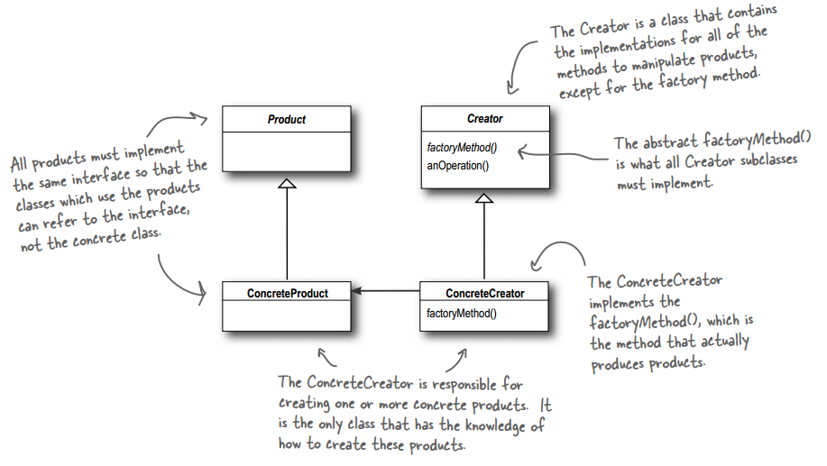
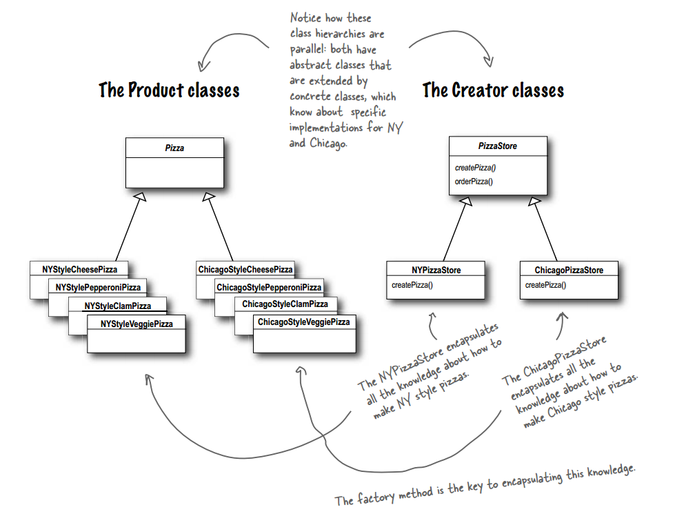

# 设计模式 - 工厂模式 #

### 介绍 ###

**意图**：定义一个创建对象的接口，让其子类自己决定实例化哪一个产品类，工厂模式使其创建过程延迟到子类进行。

**优点**： 

1、一个调用者想创建一个对象，只要知道其名称就可以了。 

2、扩展性高，如果想增加一个产品，只要扩展一个工厂类就可以。 

3、屏蔽产品的具体实现，调用者只关心产品的接口。

**何时使用**：我们明确地计划不同条件下创建不同实例时。

**如何解决**：让其子类实现工厂接口，返回的也是一个抽象的产品。

### 实现 ###

**工厂类**

PizzaStore.java

	public abstract class PizzaStore {
	 
		abstract Pizza createPizza(String item);
	 
		public Pizza orderPizza(String type) {
			Pizza pizza = createPizza(type);
			System.out.println("--- Making a " + pizza.getName() + " ---");
			pizza.prepare();
			pizza.bake();
			pizza.cut();
			pizza.box();
			return pizza;
		}
	}

---

NYPizzaStore.java

	public class NYPizzaStore extends PizzaStore {
	
		Pizza createPizza(String item) {
			if (item.equals("cheese")) {
				return new NYStyleCheesePizza();
			} else if (item.equals("veggie")) {
				return new NYStyleVeggiePizza();
			} else if (item.equals("clam")) {
				return new NYStyleClamPizza();
			} else if (item.equals("pepperoni")) {
				return new NYStylePepperoniPizza();
			} else return null;
		}
	}

---

ChicagoPizzaStore.java

	public class ChicagoPizzaStore extends PizzaStore {
	
		Pizza createPizza(String item) {
			if (item.equals("cheese")) {
				return new ChicagoStyleCheesePizza();
			} else if (item.equals("veggie")) {
				return new ChicagoStyleVeggiePizza();
			} else if (item.equals("clam")) {
				return new ChicagoStyleClamPizza();
			} else if (item.equals("pepperoni")) {
				return new ChicagoStylePepperoniPizza();
			} else
				return null;
		}
	}

**产品类**

Pizza.java

	public abstract class Pizza {
		String name;
		String dough;
		String sauce;
		ArrayList<String> toppings = new ArrayList<String>();
	 
		void prepare() {
			System.out.println("Prepare " + name);
			System.out.println("Tossing dough...");
			System.out.println("Adding sauce...");
			System.out.println("Adding toppings: ");
			for (String topping : toppings) {
				System.out.println("   " + topping);
			}
		}
	  
		void bake() {
			System.out.println("Bake for 25 minutes at 350");
		}
	 
		void cut() {
			System.out.println("Cut the pizza into diagonal slices");
		}
	  
		void box() {
			System.out.println("Place pizza in official PizzaStore box");
		}
	 
		public String getName() {
			return name;
		}
	
		public String toString() {
			StringBuffer display = new StringBuffer();
			display.append("---- " + name + " ----\n");
			display.append(dough + "\n");
			display.append(sauce + "\n");
			for (String topping : toppings) {
				display.append(topping + "\n");
			}
			return display.toString();
		}
	}

---

NYStyleCheesePizza.java

	public class NYStyleCheesePizza extends Pizza {
	
		public NYStyleCheesePizza() { 
			name = "NY Style Sauce and Cheese Pizza";
			dough = "Thin Crust Dough";
			sauce = "Marinara Sauce";
	 
			toppings.add("Grated Reggiano Cheese");
		}
	}

---

NYStyleClamPizza.java

	public class NYStyleClamPizza extends Pizza {
	
		public NYStyleClamPizza() {
			name = "NY Style Clam Pizza";
			dough = "Thin Crust Dough";
			sauce = "Marinara Sauce";
	 
			toppings.add("Grated Reggiano Cheese");
			toppings.add("Fresh Clams from Long Island Sound");
		}
	}

---

NYStylePepperoniPizza.java

	public class NYStylePepperoniPizza extends Pizza {
	
		public NYStylePepperoniPizza() {
			name = "NY Style Pepperoni Pizza";
			dough = "Thin Crust Dough";
			sauce = "Marinara Sauce";
	 
			toppings.add("Grated Reggiano Cheese");
			toppings.add("Sliced Pepperoni");
			toppings.add("Garlic");
			toppings.add("Onion");
			toppings.add("Mushrooms");
			toppings.add("Red Pepper");
		}
	}

---

NYStyleVeggiePizza.java

	public class NYStyleVeggiePizza extends Pizza {
	
		public NYStyleVeggiePizza() {
			name = "NY Style Veggie Pizza";
			dough = "Thin Crust Dough";
			sauce = "Marinara Sauce";
	 
			toppings.add("Grated Reggiano Cheese");
			toppings.add("Garlic");
			toppings.add("Onion");
			toppings.add("Mushrooms");
			toppings.add("Red Pepper");
		}
	}

---

ChicagoStyleCheesePizza.java

	public class ChicagoStyleCheesePizza extends Pizza {
	
		public ChicagoStyleCheesePizza() { 
			name = "Chicago Style Deep Dish Cheese Pizza";
			dough = "Extra Thick Crust Dough";
			sauce = "Plum Tomato Sauce";
	 
			toppings.add("Shredded Mozzarella Cheese");
		}
	 
		void cut() {
			System.out.println("Cutting the pizza into square slices");
		}
	}

---

ChicagoStyleClamPizza.java

	public class ChicagoStyleClamPizza extends Pizza {
		public ChicagoStyleClamPizza() {
			name = "Chicago Style Clam Pizza";
			dough = "Extra Thick Crust Dough";
			sauce = "Plum Tomato Sauce";
	 
			toppings.add("Shredded Mozzarella Cheese");
			toppings.add("Frozen Clams from Chesapeake Bay");
		}
	 
		void cut() {
			System.out.println("Cutting the pizza into square slices");
		}
	}

---

ChicagoStylePepperoniPizza.java

	public class ChicagoStylePepperoniPizza extends Pizza {
		public ChicagoStylePepperoniPizza() {
			name = "Chicago Style Pepperoni Pizza";
			dough = "Extra Thick Crust Dough";
			sauce = "Plum Tomato Sauce";
	 
			toppings.add("Shredded Mozzarella Cheese");
			toppings.add("Black Olives");
			toppings.add("Spinach");
			toppings.add("Eggplant");
			toppings.add("Sliced Pepperoni");
		}
	 
		void cut() {
			System.out.println("Cutting the pizza into square slices");
		}
	}

---

ChicagoStyleVeggiePizza.java

	public class ChicagoStyleVeggiePizza extends Pizza {
		public ChicagoStyleVeggiePizza() {
			name = "Chicago Deep Dish Veggie Pizza";
			dough = "Extra Thick Crust Dough";
			sauce = "Plum Tomato Sauce";
	 
			toppings.add("Shredded Mozzarella Cheese");
			toppings.add("Black Olives");
			toppings.add("Spinach");
			toppings.add("Eggplant");
		}
	 
		void cut() {
			System.out.println("Cutting the pizza into square slices");
		}
	}

---

**运行测试类**

	public class PizzaTestDrive {
	 
		public static void main(String[] args) {
			PizzaStore nyStore = new NYPizzaStore();
			PizzaStore chicagoStore = new ChicagoPizzaStore();
	 
			Pizza pizza = nyStore.orderPizza("cheese");
			System.out.println("Ethan ordered a " + pizza.getName() + "\n");
	 
			pizza = chicagoStore.orderPizza("cheese");
			System.out.println("Joel ordered a " + pizza.getName() + "\n");
	
			pizza = nyStore.orderPizza("clam");
			System.out.println("Ethan ordered a " + pizza.getName() + "\n");
	 
			pizza = chicagoStore.orderPizza("clam");
			System.out.println("Joel ordered a " + pizza.getName() + "\n");
	
			pizza = nyStore.orderPizza("pepperoni");
			System.out.println("Ethan ordered a " + pizza.getName() + "\n");
	 
			pizza = chicagoStore.orderPizza("pepperoni");
			System.out.println("Joel ordered a " + pizza.getName() + "\n");
	
			pizza = nyStore.orderPizza("veggie");
			System.out.println("Ethan ordered a " + pizza.getName() + "\n");
	 
			pizza = chicagoStore.orderPizza("veggie");
			System.out.println("Joel ordered a " + pizza.getName() + "\n");
		}
	}

运行结果

	--- Making a NY Style Sauce and Cheese Pizza ---
	Prepare NY Style Sauce and Cheese Pizza
	Tossing dough...
	Adding sauce...
	Adding toppings: 
	   Grated Reggiano Cheese
	Bake for 25 minutes at 350
	Cut the pizza into diagonal slices
	Place pizza in official PizzaStore box
	Ethan ordered a NY Style Sauce and Cheese Pizza
	
	--- Making a Chicago Style Deep Dish Cheese Pizza ---
	Prepare Chicago Style Deep Dish Cheese Pizza
	Tossing dough...
	Adding sauce...
	Adding toppings: 
	   Shredded Mozzarella Cheese
	Bake for 25 minutes at 350
	Cutting the pizza into square slices
	Place pizza in official PizzaStore box
	Joel ordered a Chicago Style Deep Dish Cheese Pizza
	
	--- Making a NY Style Clam Pizza ---
	Prepare NY Style Clam Pizza
	Tossing dough...
	Adding sauce...
	Adding toppings: 
	   Grated Reggiano Cheese
	   Fresh Clams from Long Island Sound
	Bake for 25 minutes at 350
	Cut the pizza into diagonal slices
	Place pizza in official PizzaStore box
	Ethan ordered a NY Style Clam Pizza
	
	--- Making a Chicago Style Clam Pizza ---
	Prepare Chicago Style Clam Pizza
	Tossing dough...
	Adding sauce...
	Adding toppings: 
	   Shredded Mozzarella Cheese
	   Frozen Clams from Chesapeake Bay
	Bake for 25 minutes at 350
	Cutting the pizza into square slices
	Place pizza in official PizzaStore box
	Joel ordered a Chicago Style Clam Pizza
	
	--- Making a NY Style Pepperoni Pizza ---
	Prepare NY Style Pepperoni Pizza
	Tossing dough...
	Adding sauce...
	Adding toppings: 
	   Grated Reggiano Cheese
	   Sliced Pepperoni
	   Garlic
	   Onion
	   Mushrooms
	   Red Pepper
	Bake for 25 minutes at 350
	Cut the pizza into diagonal slices
	Place pizza in official PizzaStore box
	Ethan ordered a NY Style Pepperoni Pizza
	
	--- Making a Chicago Style Pepperoni Pizza ---
	Prepare Chicago Style Pepperoni Pizza
	Tossing dough...
	Adding sauce...
	Adding toppings: 
	   Shredded Mozzarella Cheese
	   Black Olives
	   Spinach
	   Eggplant
	   Sliced Pepperoni
	Bake for 25 minutes at 350
	Cutting the pizza into square slices
	Place pizza in official PizzaStore box
	Joel ordered a Chicago Style Pepperoni Pizza
	
	--- Making a NY Style Veggie Pizza ---
	Prepare NY Style Veggie Pizza
	Tossing dough...
	Adding sauce...
	Adding toppings: 
	   Grated Reggiano Cheese
	   Garlic
	   Onion
	   Mushrooms
	   Red Pepper
	Bake for 25 minutes at 350
	Cut the pizza into diagonal slices
	Place pizza in official PizzaStore box
	Ethan ordered a NY Style Veggie Pizza
	
	--- Making a Chicago Deep Dish Veggie Pizza ---
	Prepare Chicago Deep Dish Veggie Pizza
	Tossing dough...
	Adding sauce...
	Adding toppings: 
	   Shredded Mozzarella Cheese
	   Black Olives
	   Spinach
	   Eggplant
	Bake for 25 minutes at 350
	Cutting the pizza into square slices
	Place pizza in official PizzaStore box
	Joel ordered a Chicago Deep Dish Veggie Pizza

### 通用工厂类 ###

	@SuppressWarnings("unchecked")
	public static <T> T getObject(Class<T> clazz) {
		if (clazz == null) {
			return null;
		}
		T obj = null;
		try {
			obj = (T)Class.forName(clazz.getName()).newInstance();
		} catch (InstantiationException | IllegalAccessException | ClassNotFoundException e) {
			e.printStackTrace();
		}
		return obj;
	}

### 参考及引用 ###

1.《Head First 设计模式》Eric Freeman 著

[2.工厂模式 | 菜鸟教程](http://www.runoob.com/design-pattern/factory-pattern.html)