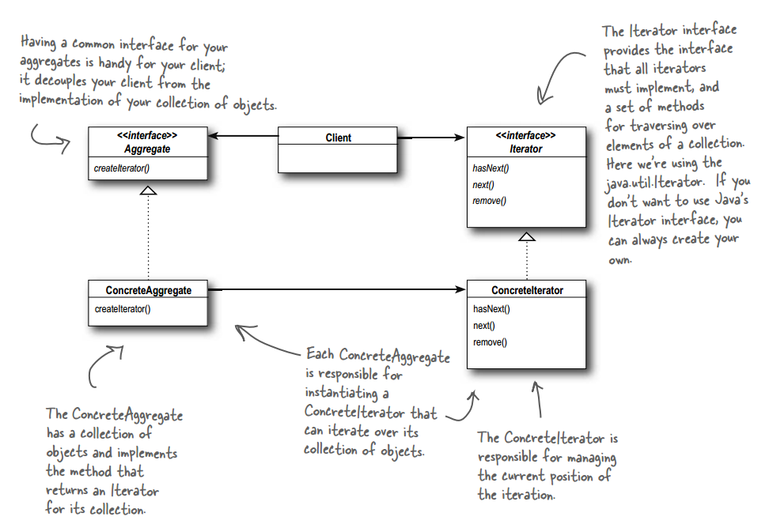
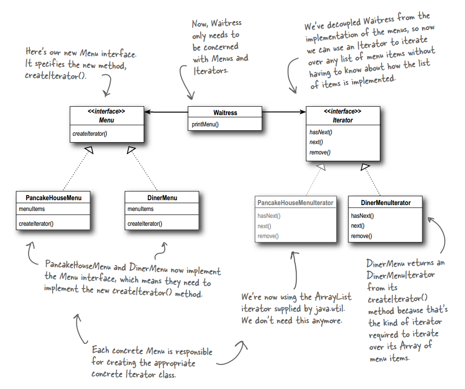

# 设计模式 - 行为型 - 迭代器模式 #

### 介绍 ###

**意图**：提供一种方法顺序访问一个聚合对象中各个元素, 而又无须暴露该对象的内部表示。

**主要解决**：不同的方式来遍历整个整合对象。

**何时使用**：遍历一个聚合对象。

**如何解决**：把在元素之间游走的责任交给迭代器，而不是聚合对象。

**关键代码**：定义接口：hasNext, next。

**应用实例**：JAVA 中的 iterator。

### 实现 ###

	public class MenuItem {
		String name;
		String description;
		boolean vegetarian;
		double price;
	 
		public MenuItem(String name, 
		                String description, 
		                boolean vegetarian, 
		                double price) 
		{
			this.name = name;
			this.description = description;
			this.vegetarian = vegetarian;
			this.price = price;
		}
	  
		public String getName() {
			return name;
		}
	  
		public String getDescription() {
			return description;
		}
	  
		public double getPrice() {
			return price;
		}
	  
		public boolean isVegetarian() {
			return vegetarian;
		}
		public String toString() {
			return (name + ", $" + price + "\n   " + description);
		}
	}

---

	public interface Menu {
		public Iterator<?> createIterator();
	}

---

	public class PancakeHouseMenu implements Menu {
		ArrayList<MenuItem> menuItems;
	 
		public PancakeHouseMenu() {
			menuItems = new ArrayList<MenuItem>();
	    
			addItem("K&B's Pancake Breakfast", 
				"Pancakes with scrambled eggs, and toast", 
				true,
				2.99);
	 
			addItem("Regular Pancake Breakfast", 
				"Pancakes with fried eggs, sausage", 
				false,
				2.99);
	 
			addItem("Blueberry Pancakes",
				"Pancakes made with fresh blueberries, and blueberry syrup",
				true,
				3.49);
	 
			addItem("Waffles",
				"Waffles, with your choice of blueberries or strawberries",
				true,
				3.59);
		}
	
		public void addItem(String name, String description,
		                    boolean vegetarian, double price)
		{
			MenuItem menuItem = new MenuItem(name, description, vegetarian, price);
			menuItems.add(menuItem);
		}
	 
		public ArrayList<MenuItem> getMenuItems() {
			return menuItems;
		}
	
		//返回JDK自带的迭代器
		public Iterator<MenuItem> createIterator() {
			return menuItems.iterator();
		}
	  
		// other menu methods here
	}

---

	public class DinerMenu implements Menu {
		static final int MAX_ITEMS = 6;
		int numberOfItems = 0;
		MenuItem[] menuItems;
	  
		public DinerMenu() {
			menuItems = new MenuItem[MAX_ITEMS];
	 
			addItem("Vegetarian BLT",
				"(Fakin') Bacon with lettuce & tomato on whole wheat", true, 2.99);
			addItem("BLT",
				"Bacon with lettuce & tomato on whole wheat", false, 2.99);
			addItem("Soup of the day",
				"Soup of the day, with a side of potato salad", false, 3.29);
			addItem("Hotdog",
				"A hot dog, with saurkraut, relish, onions, topped with cheese",
				false, 3.05);
			addItem("Steamed Veggies and Brown Rice",
				"Steamed vegetables over brown rice", true, 3.99);
			addItem("Pasta",
				"Spaghetti with Marinara Sauce, and a slice of sourdough bread",
				true, 3.89);
		}
	  
		public void addItem(String name, String description, 
		                     boolean vegetarian, double price) 
		{
			MenuItem menuItem = new MenuItem(name, description, vegetarian, price);
			if (numberOfItems >= MAX_ITEMS) {
				System.err.println("Sorry, menu is full!  Can't add item to menu");
			} else {
				menuItems[numberOfItems] = menuItem;
				numberOfItems = numberOfItems + 1;
			}
		}
	 
		public MenuItem[] getMenuItems() {
			return menuItems;
		}
		
		//创建一个数组的迭代器
		public Iterator<MenuItem> createIterator() {
			return new DinerMenuIterator(menuItems);
			//return new AlternatingDinerMenuIterator(menuItems);
		}
	 
		// other menu methods here
	}

---

迭代器的实现

	//JDK的迭代器接口
	import java.util.Iterator;

	public class DinerMenuIterator implements Iterator<MenuItem> {
		MenuItem[] list;
		int position = 0;
	 
		public DinerMenuIterator(MenuItem[] list) {
			this.list = list;
		}
	 
		public MenuItem next() {
			MenuItem menuItem = list[position];
			position = position + 1;
			return menuItem;
		}
	 
		public boolean hasNext() {
			if (position >= list.length || list[position] == null) {
				return false;
			} else {
				return true;
			}
		}
	 
		public void remove() {
			if (position <= 0) {
				throw new IllegalStateException
					("You can't remove an item until you've done at least one next()");
			}
			if (list[position-1] != null) {
				for (int i = position-1; i < (list.length-1); i++) {
					list[i] = list[i+1];
				}
				list[list.length-1] = null;
			}
		}
	
	}

---

	public class Waitress {
		ArrayList<Menu> menus;
	     
	  
		public Waitress(ArrayList<Menu> menus) {
			this.menus = menus;
		}
		
		//迭代器的使用
		public void printMenu() {
			Iterator<?> menuIterator = menus.iterator();
			while(menuIterator.hasNext()) {
				Menu menu = (Menu)menuIterator.next();
				printMenu(menu.createIterator());
			}
		}
		
		//迭代器的使用
		void printMenu(Iterator<?> iterator) {
			while (iterator.hasNext()) {
				MenuItem menuItem = (MenuItem)iterator.next();
				System.out.print(menuItem.getName() + ", ");
				System.out.print(menuItem.getPrice() + " -- ");
				System.out.println(menuItem.getDescription());
			}
		}
	}  

---

运行类

	public class MenuTestDrive {
		public static void main(String args[]) {
			PancakeHouseMenu pancakeHouseMenu = new PancakeHouseMenu();
			DinerMenu dinerMenu = new DinerMenu();
			ArrayList<Menu> menus = new ArrayList<Menu>();
			menus.add(pancakeHouseMenu);
			menus.add(dinerMenu);
			Waitress waitress = new Waitress(menus);
			waitress.printMenu();
		}
	}

运行结果

	K&B's Pancake Breakfast, 2.99 -- Pancakes with scrambled eggs, and toast
	Regular Pancake Breakfast, 2.99 -- Pancakes with fried eggs, sausage
	Blueberry Pancakes, 3.49 -- Pancakes made with fresh blueberries, and blueberry syrup
	Waffles, 3.59 -- Waffles, with your choice of blueberries or strawberries
	
	Vegetarian BLT, 2.99 -- (Fakin') Bacon with lettuce & tomato on whole wheat
	BLT, 2.99 -- Bacon with lettuce & tomato on whole wheat
	Soup of the day, 3.29 -- Soup of the day, with a side of potato salad
	Hotdog, 3.05 -- A hot dog, with saurkraut, relish, onions, topped with cheese
	Steamed Veggies and Brown Rice, 3.99 -- Steamed vegetables over brown rice
	Pasta, 3.89 -- Spaghetti with Marinara Sauce, and a slice of sourdough bread

---

	JDK 5 for in 语法

	for(Object obj : list){
	}

	改善使用迭代器的用法

### 参考及引用 ###

1.《Head First 设计模式》Eric Freeman 等 著

[2.迭代器模式 | 菜鸟教程](http://www.runoob.com/design-pattern/iterator-pattern.html)