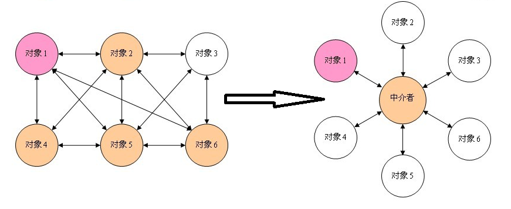

# 中介者模式 #

### 介绍 ###

**意图**：用一个中介对象来封装一系列的对象交互，中介者使各对象不需要显式地相互引用，从而使其耦合松散，而且可以独立地改变它们之间的交互。

**主要解决**：对象与对象之间存在大量的关联关系，这样势必会导致系统的结构变得很复杂，同时若一个对象发生改变，我们也需要跟踪与之相关联的对象，同时做出相应的处理。

**何时使用**：多个类相互耦合，形成了网状结构。

**如何解决**：将上述网状结构分离为星型结构。

### 实现 ###

我们通过聊天室实例来演示中介者模式。实例中，多个用户可以向聊天室发送消息，聊天室向所有的用户显示消息。我们将创建两个类 ChatRoom 和 User。User 对象使用 ChatRoom 方法来分享他们的消息。

MediatorPatternDemo，我们的演示类使用 User 对象来显示他们之间的通信。

	public class ChatRoom {
	   public static void showMessage(User user, String message){
	      System.out.println(new Date().toString()
	         + " [" + user.getName() +"] : " + message);
	   }
	}

---

	public class User {
	   private String name;
	 
	   public String getName() {
	      return name;
	   }
	 
	   public void setName(String name) {
	      this.name = name;
	   }
	 
	   public User(String name){
	      this.name  = name;
	   }
	 
	   public void sendMessage(String message){
	      ChatRoom.showMessage(this,message);
	   }
	}

---

	public class MediatorPatternDemo {
	   public static void main(String[] args) {
	      User robert = new User("Robert");
	      User john = new User("John");
	 
	      robert.sendMessage("Hi! John!");
	      john.sendMessage("Hello! Robert!");
	   }
	}

---

	Thu Jan 31 16:05:46 IST 2013 [Robert] : Hi! John!
	Thu Jan 31 16:05:46 IST 2013 [John] : Hello! Robert!

### 参考及引用 ###

[1.中介者模式](http://www.runoob.com/design-pattern/mediator-pattern.html)

[2.设计模式之中介者模式](https://www.cnblogs.com/snaildev/p/7686908.html)