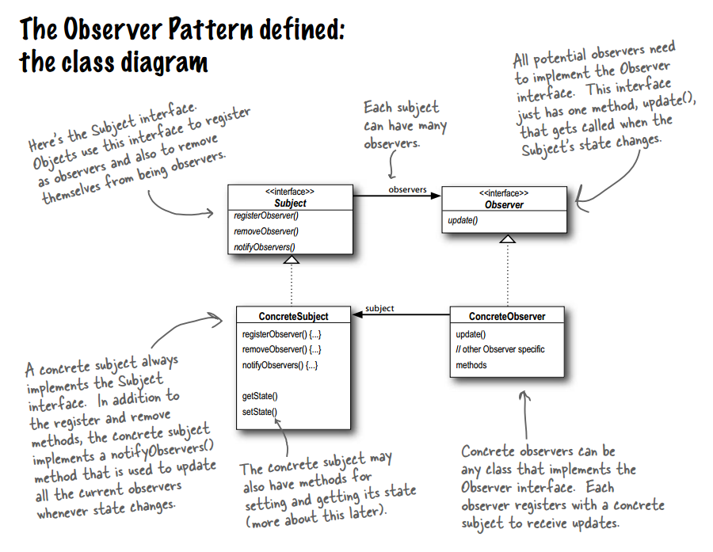
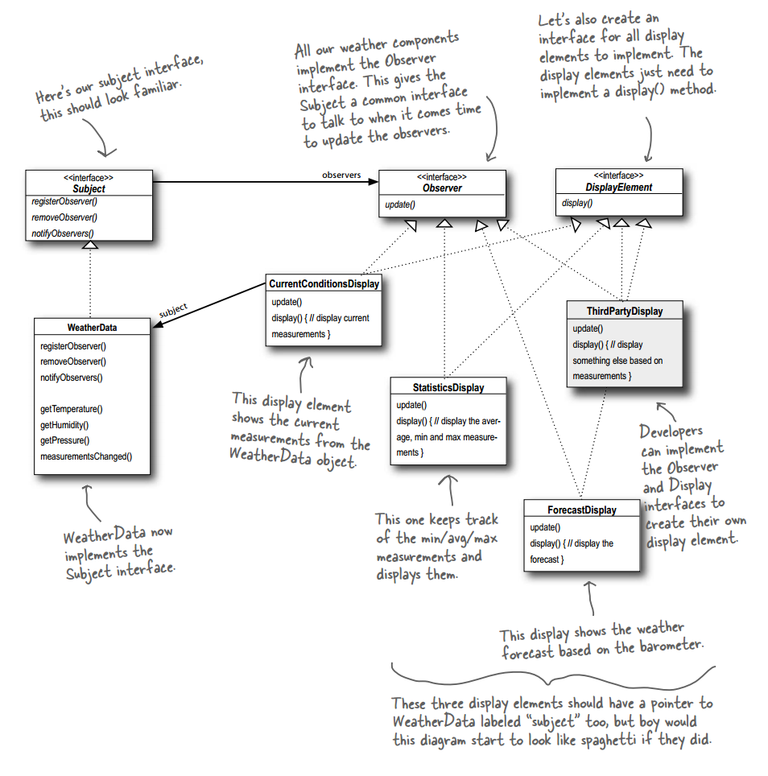
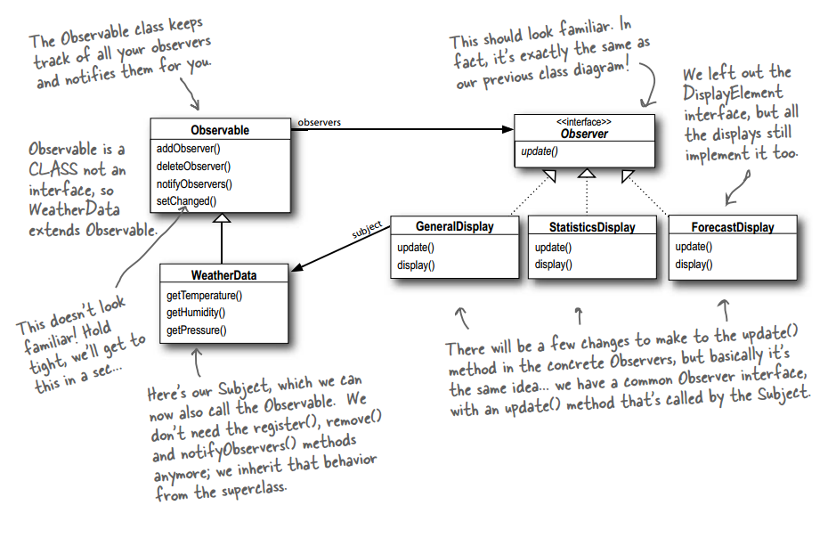

# 设计模式 - 行为型 - 观察者模式 #

### 介绍 ###

**意图**：定义对象间的一种一对多的依赖关系，当一个对象的状态发生改变时，所有依赖于它的对象都得到通知并被自动更新。

**主要解决**：一个对象状态改变给其他对象通知的问题，而且要考虑到易用和低耦合，保证高度的协作。

**何时使用**：一个对象（目标对象）的状态发生改变，所有的依赖对象（观察者对象）都将得到通知，进行广播通知。

**如何解决**：使用面向对象技术，可以将这种依赖关系弱化。

**关键代码**：在抽象类里有一个 ArrayList 存放观察者们。

**应用实例**：订阅报纸

### 实现 ###

	public interface Subject {
		public void registerObserver(Observer o);
		public void removeObserver(Observer o);
		public void notifyObservers();
	}

---

	public class WeatherData implements Subject {
		private ArrayList<Observer> observers;
		private float temperature;
		private float humidity;
		private float pressure;
		
		public WeatherData() {
			observers = new ArrayList<Observer>();
		}
		
		public void registerObserver(Observer o) {
			observers.add(o);
		}
		
		public void removeObserver(Observer o) {
			int i = observers.indexOf(o);
			if (i >= 0) {
				observers.remove(i);
			}
		}
		
		public void notifyObservers() {
			for (Observer observer : observers) {
				observer.update(temperature, humidity, pressure);
			}
		}
		
		public void measurementsChanged() {
			notifyObservers();
		}
		
		public void setMeasurements(float temperature, float humidity, float pressure) {
			this.temperature = temperature;
			this.humidity = humidity;
			this.pressure = pressure;
			measurementsChanged();
		}
	
		public float getTemperature() {
			return temperature;
		}
		
		public float getHumidity() {
			return humidity;
		}
		
		public float getPressure() {
			return pressure;
		}
	}

---

	public interface Observer {
		public void update(float temp, float humidity, float pressure);
	}

---

	public interface DisplayElement {
		public void display();
	}

---

	public class CurrentConditionsDisplay implements Observer, DisplayElement {
		private float temperature;
		private float humidity;
		private Subject weatherData;
		
		public CurrentConditionsDisplay(Subject weatherData) {
			this.weatherData = weatherData;
			weatherData.registerObserver(this);
		}
		
		public void update(float temperature, float humidity, float pressure) {
			this.temperature = temperature;
			this.humidity = humidity;
			display();
		}
		
		public void display() {
			System.out.println("Current conditions: " + temperature 
				+ "F degrees and " + humidity + "% humidity");
		}
	}

---

	public class StatisticsDisplay implements Observer, DisplayElement {
		private float maxTemp = 0.0f;
		private float minTemp = 200;
		private float tempSum= 0.0f;
		private int numReadings;
		private WeatherData weatherData;
	
		public StatisticsDisplay(WeatherData weatherData) {
			this.weatherData = weatherData;
			weatherData.registerObserver(this);
		}
	
		public void update(float temp, float humidity, float pressure) {
			tempSum += temp;
			numReadings++;
	
			if (temp > maxTemp) {
				maxTemp = temp;
			}
	 
			if (temp < minTemp) {
				minTemp = temp;
			}
	
			display();
		}
	
		public void display() {
			System.out.println("Avg/Max/Min temperature = " + (tempSum / numReadings)
				+ "/" + maxTemp + "/" + minTemp);
		}
	}

---

	public class ForecastDisplay implements Observer, DisplayElement {
		private float currentPressure = 29.92f;  
		private float lastPressure;
		private WeatherData weatherData;
	
		public ForecastDisplay(WeatherData weatherData) {
			this.weatherData = weatherData;
			weatherData.registerObserver(this);
		}
	
		public void update(float temp, float humidity, float pressure) {
	        lastPressure = currentPressure;
			currentPressure = pressure;
	
			display();
		}
	
		public void display() {
			System.out.print("Forecast: ");
			if (currentPressure > lastPressure) {
				System.out.println("Improving weather on the way!");
			} else if (currentPressure == lastPressure) {
				System.out.println("More of the same");
			} else if (currentPressure < lastPressure) {
				System.out.println("Watch out for cooler, rainy weather");
			}
		}
	}

---

运行类

	public class WeatherStation {
	
		public static void main(String[] args) {
			WeatherData weatherData = new WeatherData();
		
			CurrentConditionsDisplay currentDisplay = 
				new CurrentConditionsDisplay(weatherData);
			StatisticsDisplay statisticsDisplay = new StatisticsDisplay(weatherData);
			ForecastDisplay forecastDisplay = new ForecastDisplay(weatherData);
	
			weatherData.setMeasurements(80, 65, 30.4f);
			weatherData.setMeasurements(82, 70, 29.2f);
			weatherData.setMeasurements(78, 90, 29.2f);
		}
	}

运行结果

	Current conditions: 80.0F degrees and 65.0% humidity
	Avg/Max/Min temperature = 80.0/80.0/80.0
	Forecast: Improving weather on the way!
	--------
	Current conditions: 82.0F degrees and 70.0% humidity
	Avg/Max/Min temperature = 81.0/82.0/80.0
	Forecast: Watch out for cooler, rainy weather
	--------
	Current conditions: 78.0F degrees and 90.0% humidity
	Avg/Max/Min temperature = 80.0/82.0/78.0
	Forecast: More of the same

#### Java内置的观察者模式 ####

**java.util.Observer**

**java.util.Observable**

	public class WeatherData extends Observable {
		private float temperature;
		private float humidity;
		private float pressure;
		
		public WeatherData() { }
		
		public void measurementsChanged() {
			//关键
			setChanged();
			notifyObservers();
		}
		
		public void setMeasurements(float temperature, float humidity, float pressure) {
			this.temperature = temperature;
			this.humidity = humidity;
			this.pressure = pressure;
			measurementsChanged();
		}
		
		public float getTemperature() {
			return temperature;
		}
		
		public float getHumidity() {
			return humidity;
		}
		
		public float getPressure() {
			return pressure;
		}
	}

---

	public class CurrentConditionsDisplay implements Observer, DisplayElement {
		Observable observable;
		private float temperature;
		private float humidity;
		
		//关键
		public CurrentConditionsDisplay(Observable observable) {
			this.observable = observable;
			observable.addObserver(this);
		}
		
		//关键
		public void update(Observable obs, Object arg) {
			if (obs instanceof WeatherData) {
				WeatherData weatherData = (WeatherData)obs;
				this.temperature = weatherData.getTemperature();
				this.humidity = weatherData.getHumidity();
				display();
			}
		}
		
		public void display() {
			System.out.println("Current conditions: " + temperature 
				+ "F degrees and " + humidity + "% humidity");
		}
	}

---

[更多源码]()

**注意**：java.util.Observer是一个类

### 参考及引用 ###

1.《Head First 设计模式》Eric Freeman 等 著

[2.观察者模式 | 菜鸟教程](http://www.runoob.com/design-pattern/observer-pattern.html)

