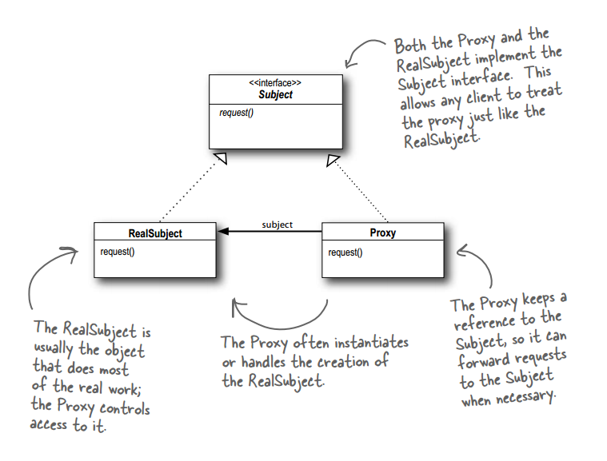
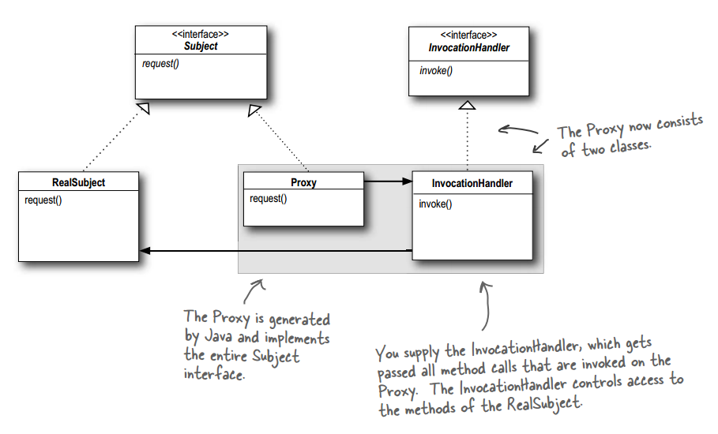

# 设计模式 - 结构型 - 代理模式 #

### 介绍 ###

**意图**：为另一个对象提供一个替身或占位符以控制对这个对象的访问。

**主要解决**：在直接访问对象时带来的问题，比如说：要访问的对象在远程的机器上。在面向对象系统中，有些对象由于某些原因（比如对象创建开销很大，或者某些操作需要安全控制，或者需要进程外的访问），直接访问会给使用者或者系统结构带来很多麻烦，我们可以在访问此对象时加上一个对此对象的访问层。

**何时使用**：想在访问一个类时做一些控制。

**如何解决**：增加中间层。

**关键代码**：实现与被代理类组合。

### 实现 ###

一个模拟加载图片实现类

#### 基本实现 ####

	public interface Image {
		void display();
	}

---

被代理类

	public class RealImage implements Image {
	
		private String fileName;
	
		public RealImage(String fileName) {
			this.fileName = fileName;
		}
	
		@Override
		public void display() {
			System.out.println("Displaying " + fileName);
			
			try {
				Thread.sleep(666);
			} catch (InterruptedException e) {
				e.printStackTrace();
			}
			
		}
	
	}

---

代理类——用来计算diplay()耗费时间

	public class ProxyImage implements Image {
	
		private RealImage realImage;
		private String fileName;
	
		public ProxyImage(String fileName) {
			this.fileName = fileName;
		}
	
		@Override
		public void display() {
			
			long begin = System.currentTimeMillis();
			
			if (realImage == null) {
				realImage = new RealImage(fileName);
			}
			
			realImage.display();
			
			long end = System.currentTimeMillis();
			
			System.out.println("It's spent " + (end - begin)+ "ms");
			
		}
	}

---

运行类

	public class ProxyPatternDemo {
	
		public static void main(String[] args) {
			Image image = new ProxyImage("18stop.jpg");
	
			image.display();
		}
	}

运行结果

	Displaying 18stop.jpg
	It's spent 670ms

#### JDK动态代理 ####

	import java.lang.reflect.InvocationHandler;
	import java.lang.reflect.Method;
	import java.lang.reflect.Proxy;
	
	import designpattern.proxy.example1.Image;
	import designpattern.proxy.example1.RealImage;
	
	public class TimerHandler implements InvocationHandler {
	
		private Object target;
		
		public TimerHandler(Object target) {
			this.target = target;
		}
		
		@Override
		public Object invoke(Object proxy, Method method, Object[] args) throws Throwable {
			
			long begin = System.currentTimeMillis();
			
			Object obj = method.invoke(target, args);
			
			long end = System.currentTimeMillis();
			System.out.println("It's spent " + (end - begin)+ "ms");
			
			return obj;
		}
		
		public static void main(String[] args) {
			RealImage image = new RealImage("18stop.jpg");
			
			TimerHandler timer = new TimerHandler(image);
			
			Image proxyImage = (Image)Proxy.newProxyInstance(
					image.getClass().getClassLoader(), 
					image.getClass().getInterfaces(), 
					timer);
			
			proxyImage.display();
			
		}
	
	}

运行结果

	Displaying 18stop.jpg
	It's spent 675ms

### 参考及引用 ###

1.《Head First 设计模式》Eric Freeman 等 著

[2.代理模式 | 菜鸟教程](http://www.runoob.com/design-pattern/proxy-pattern.html)