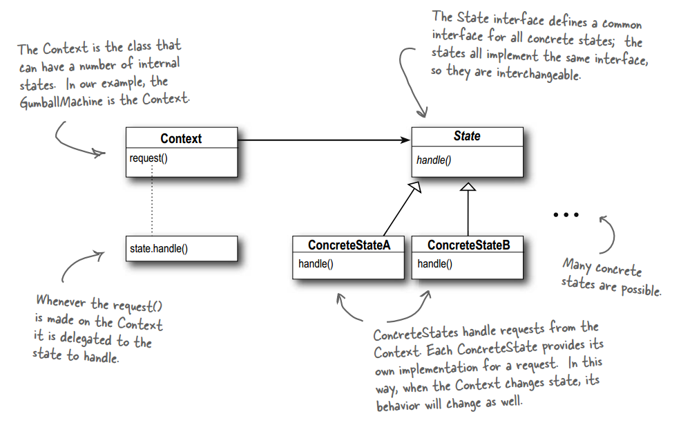
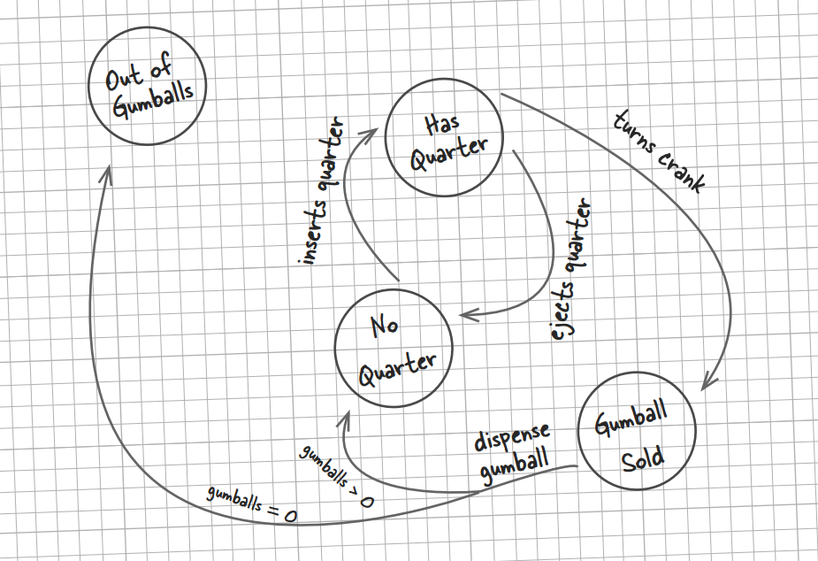
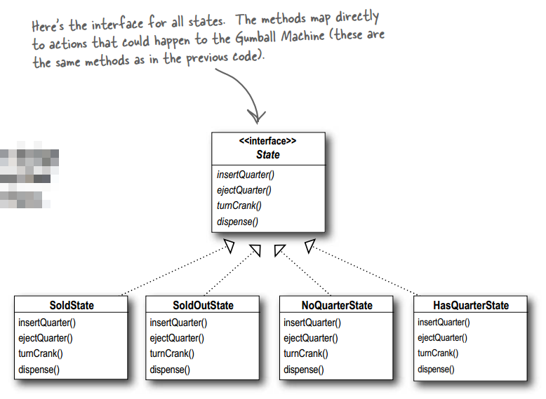

# 设计模式 - 行为型 - 状态模式 #

### 介绍 ###

**意图**：允许对象在内部状态发生改变时改变它的行为，对象看起来好像修改了它的类。

**主要解决**：对象的行为依赖于它的状态（属性），并且可以根据它的状态改变而改变它的相关行为。

**何时使用**：代码中包含大量与对象状态有关的条件语句。

**如何解决**：将各种具体的状态类抽象出来。

**关键代码**：通常命令模式的接口中只有一个方法。而状态模式的接口中有一个或者多个方法。而且，状态模式的实现类的方法，一般返回值，或者是改变实例变量的值。也就是说，状态模式一般和对象的状态有关。实现类的方法有不同的功能，覆盖接口中的方法。

**使用场景**： 1、行为随状态改变而改变的场景。 2、条件、分支语句的代替者。

### 实现 ###

实现糖果机实例

#### 未使用状态模式 ####

	public class GumballMachine {
	 
		//糖果机使用到状态
		final static int SOLD_OUT = 0;
		final static int NO_QUARTER = 1;
		final static int HAS_QUARTER = 2;
		final static int SOLD = 3;
	 
		//糖果机当前的状态
		int state = SOLD_OUT;
		int count = 0;
	  
		public GumballMachine(int count) {
			this.count = count;
			if (count > 0) {
				state = NO_QUARTER;
			}
		}
	  
		public void insertQuarter() {
			if (state == HAS_QUARTER) {
				System.out.println("You can't insert another quarter");
			} else if (state == NO_QUARTER) {
				state = HAS_QUARTER;
				System.out.println("You inserted a quarter");
			} else if (state == SOLD_OUT) {
				System.out.println("You can't insert a quarter, the machine is sold out");
			} else if (state == SOLD) {
	        	System.out.println("Please wait, we're already giving you a gumball");
			}
		}
	
		public void ejectQuarter() {
			if (state == HAS_QUARTER) {
				System.out.println("Quarter returned");
				state = NO_QUARTER;
			} else if (state == NO_QUARTER) {
				System.out.println("You haven't inserted a quarter");
			} else if (state == SOLD) {
				System.out.println("Sorry, you already turned the crank");
			} else if (state == SOLD_OUT) {
	        	System.out.println("You can't eject, you haven't inserted a quarter yet");
			}
		}
	 
		public void turnCrank() {
			if (state == SOLD) {
				System.out.println("Turning twice doesn't get you another gumball!");
			} else if (state == NO_QUARTER) {
				System.out.println("You turned but there's no quarter");
			} else if (state == SOLD_OUT) {
				System.out.println("You turned, but there are no gumballs");
			} else if (state == HAS_QUARTER) {
				System.out.println("You turned...");
				state = SOLD;
				dispense();
			}
		}
	 
		private void dispense() {
			if (state == SOLD) {
				System.out.println("A gumball comes rolling out the slot");
				count = count - 1;
				if (count == 0) {
					System.out.println("Oops, out of gumballs!");
					state = SOLD_OUT;
				} else {
					state = NO_QUARTER;
				}
			} else if (state == NO_QUARTER) {
				System.out.println("You need to pay first");
			} else if (state == SOLD_OUT) {
				System.out.println("No gumball dispensed");
			} else if (state == HAS_QUARTER) {
				System.out.println("No gumball dispensed");
			}
		}
	 
		public void refill(int numGumBalls) {
			this.count = numGumBalls;
			state = NO_QUARTER;
		}
	
		public String toString() {
			StringBuffer result = new StringBuffer();
			result.append("\nMighty Gumball, Inc.");
			result.append("\nJava-enabled Standing Gumball Model #2004\n");
			result.append("Inventory: " + count + " gumball");
			if (count != 1) {
				result.append("s");
			}
			result.append("\nMachine is ");
			if (state == SOLD_OUT) {
				result.append("sold out");
			} else if (state == NO_QUARTER) {
				result.append("waiting for quarter");
			} else if (state == HAS_QUARTER) {
				result.append("waiting for turn of crank");
			} else if (state == SOLD) {
				result.append("delivering a gumball");
			}
			result.append("\n");
			return result.toString();
		}
	}

---

运行类

	public class GumballMachineTestDrive {
	
		public static void main(String[] args) {
			GumballMachine gumballMachine = new GumballMachine(5);
	
			System.out.println(gumballMachine);
	
			gumballMachine.insertQuarter();
			gumballMachine.turnCrank();
	
			System.out.println(gumballMachine);
	
			gumballMachine.insertQuarter();
			gumballMachine.ejectQuarter();
			gumballMachine.turnCrank();
	
			System.out.println(gumballMachine);
	
			gumballMachine.insertQuarter();
			gumballMachine.turnCrank();
			gumballMachine.insertQuarter();
			gumballMachine.turnCrank();
			gumballMachine.ejectQuarter();
	
			System.out.println(gumballMachine);
	
			gumballMachine.insertQuarter();
			gumballMachine.insertQuarter();
			gumballMachine.turnCrank();
			gumballMachine.insertQuarter();
			gumballMachine.turnCrank();
			gumballMachine.insertQuarter();
			gumballMachine.turnCrank();
	
			System.out.println(gumballMachine);
		}
	}

运行结果

	Mighty Gumball, Inc.
	Java-enabled Standing Gumball Model #2004
	Inventory: 5 gumballs
	Machine is waiting for quarter
	
	You inserted a quarter
	You turned...
	A gumball comes rolling out the slot
	
	Mighty Gumball, Inc.
	Java-enabled Standing Gumball Model #2004
	Inventory: 4 gumballs
	Machine is waiting for quarter
	
	You inserted a quarter
	Quarter returned
	You turned but there's no quarter
	
	Mighty Gumball, Inc.
	Java-enabled Standing Gumball Model #2004
	Inventory: 4 gumballs
	Machine is waiting for quarter
	
	You inserted a quarter
	You turned...
	A gumball comes rolling out the slot
	You inserted a quarter
	You turned...
	A gumball comes rolling out the slot
	You haven't inserted a quarter
	
	Mighty Gumball, Inc.
	Java-enabled Standing Gumball Model #2004
	Inventory: 2 gumballs
	Machine is waiting for quarter
	
	You inserted a quarter
	You can't insert another quarter
	You turned...
	A gumball comes rolling out the slot
	You inserted a quarter
	You turned...
	A gumball comes rolling out the slot
	Oops, out of gumballs!
	You can't insert a quarter, the machine is sold out
	You turned, but there are no gumballs
	
	Mighty Gumball, Inc.
	Java-enabled Standing Gumball Model #2004
	Inventory: 0 gumballs
	Machine is sold out

#### 使用了状态模式 ####

上述代码不易维护与扩展，所以需要用到状态模式。（封装变化；多用组合，少用继承）

	public interface State {
	 
		public void insertQuarter();
		public void ejectQuarter();
		public void turnCrank();
		public void dispense();
		
		public void refill();
	}

---

	public class SoldState implements State {
	 
	    GumballMachine gumballMachine;
	 
	    public SoldState(GumballMachine gumballMachine) {
	        this.gumballMachine = gumballMachine;
	    }
	       
		public void insertQuarter() {
			System.out.println("Please wait, we're already giving you a gumball");
		}
	 
		public void ejectQuarter() {
			System.out.println("Sorry, you already turned the crank");
		}
	 
		public void turnCrank() {
			System.out.println("Turning twice doesn't get you another gumball!");
		}
	 
		public void dispense() {
			gumballMachine.releaseBall();
			if (gumballMachine.getCount() > 0) {
				gumballMachine.setState(gumballMachine.getNoQuarterState());
			} else {
				System.out.println("Oops, out of gumballs!");
				gumballMachine.setState(gumballMachine.getSoldOutState());
			}
		}
		
		public void refill() { }
	 
		public String toString() {
			return "dispensing a gumball";
		}
	}

---

	public class SoldOutState implements State {
	    GumballMachine gumballMachine;
	 
	    public SoldOutState(GumballMachine gumballMachine) {
	        this.gumballMachine = gumballMachine;
	    }
	 
		public void insertQuarter() {
			System.out.println("You can't insert a quarter, the machine is sold out");
		}
	 
		public void ejectQuarter() {
			System.out.println("You can't eject, you haven't inserted a quarter yet");
		}
	 
		public void turnCrank() {
			System.out.println("You turned, but there are no gumballs");
		}
	 
		public void dispense() {
			System.out.println("No gumball dispensed");
		}
		
		public void refill() { 
			gumballMachine.setState(gumballMachine.getNoQuarterState());
		}
	 
		public String toString() {
			return "sold out";
		}
	}

---

	public class NoQuarterState implements State {
	    GumballMachine gumballMachine;
	 
	    public NoQuarterState(GumballMachine gumballMachine) {
	        this.gumballMachine = gumballMachine;
	    }
	 
		public void insertQuarter() {
			System.out.println("You inserted a quarter");
			gumballMachine.setState(gumballMachine.getHasQuarterState());
		}
	 
		public void ejectQuarter() {
			System.out.println("You haven't inserted a quarter");
		}
	 
		public void turnCrank() {
			System.out.println("You turned, but there's no quarter");
		 }
	 
		public void dispense() {
			System.out.println("You need to pay first");
		} 
		
		public void refill() { }
	 
		public String toString() {
			return "waiting for quarter";
		}
	}

---

	public class HasQuarterState implements State {
		GumballMachine gumballMachine;
	 
		public HasQuarterState(GumballMachine gumballMachine) {
			this.gumballMachine = gumballMachine;
		}
	  
		public void insertQuarter() {
			System.out.println("You can't insert another quarter");
		}
	 
		public void ejectQuarter() {
			System.out.println("Quarter returned");
			gumballMachine.setState(gumballMachine.getNoQuarterState());
		}
	 
		public void turnCrank() {
			System.out.println("You turned...");
			gumballMachine.setState(gumballMachine.getSoldState());
		}
	
	    public void dispense() {
	        System.out.println("No gumball dispensed");
	    }
	    
	    public void refill() { }
	 
		public String toString() {
			return "waiting for turn of crank";
		}
	}

---

	public class GumballMachine {
	
		//与上面的不同之处
		State soldOutState;
		State noQuarterState;
		State hasQuarterState;
		State soldState;
	 
		State state;
		int count = 0;
	 
		public GumballMachine(int numberGumballs) {
			soldOutState = new SoldOutState(this);
			noQuarterState = new NoQuarterState(this);
			hasQuarterState = new HasQuarterState(this);
			soldState = new SoldState(this);
	
			this.count = numberGumballs;
	 		if (numberGumballs > 0) {
				state = noQuarterState;
			} else {
				state = soldOutState;
			}
		}
	 
		public void insertQuarter() {
			state.insertQuarter();
		}
	 
		public void ejectQuarter() {
			state.ejectQuarter();
		}
	 
		public void turnCrank() {
			state.turnCrank();
			state.dispense();
		}
	 
		void releaseBall() {
			System.out.println("A gumball comes rolling out the slot...");
			if (count != 0) {
				count = count - 1;
			}
		}
	 
		int getCount() {
			return count;
		}
	 
		void refill(int count) {
			this.count += count;
			System.out.println("The gumball machine was just refilled; it's new count is: " + this.count);
			state.refill();
		}
	
		void setState(State state) {
			this.state = state;
		}
	    public State getState() {
	        return state;
	    }
	
	    public State getSoldOutState() {
	        return soldOutState;
	    }
	
	    public State getNoQuarterState() {
	        return noQuarterState;
	    }
	
	    public State getHasQuarterState() {
	        return hasQuarterState;
	    }
	
	    public State getSoldState() {
	        return soldState;
	    }
	 
		public String toString() {
			StringBuffer result = new StringBuffer();
			result.append("\nMighty Gumball, Inc.");
			result.append("\nJava-enabled Standing Gumball Model #2004");
			result.append("\nInventory: " + count + " gumball");
			if (count != 1) {
				result.append("s");
			}
			result.append("\n");
			result.append("Machine is " + state + "\n");
			return result.toString();
		}
	}

---

运行类

	public class GumballMachineTestDrive {
	
		public static void main(String[] args) {
			GumballMachine gumballMachine = new GumballMachine(2);
	
			System.out.println(gumballMachine);
	
			gumballMachine.insertQuarter();
			gumballMachine.turnCrank();
	
			System.out.println(gumballMachine);
	
			gumballMachine.insertQuarter();
			gumballMachine.turnCrank();
			gumballMachine.insertQuarter();
			gumballMachine.turnCrank();
			
			gumballMachine.refill(5);
			gumballMachine.insertQuarter();
			gumballMachine.turnCrank();
	
			System.out.println(gumballMachine);
		}
	}

运行结果

	Mighty Gumball, Inc.
	Java-enabled Standing Gumball Model #2004
	Inventory: 2 gumballs
	Machine is waiting for quarter
	
	You inserted a quarter
	You turned...
	A gumball comes rolling out the slot...
	
	Mighty Gumball, Inc.
	Java-enabled Standing Gumball Model #2004
	Inventory: 1 gumball
	Machine is waiting for quarter
	
	You inserted a quarter
	You turned...
	A gumball comes rolling out the slot...
	Oops, out of gumballs!
	You can't insert a quarter, the machine is sold out
	You turned, but there are no gumballs
	No gumball dispensed
	The gumball machine was just refilled; it's new count is: 5
	You inserted a quarter
	You turned...
	A gumball comes rolling out the slot...
	
	Mighty Gumball, Inc.
	Java-enabled Standing Gumball Model #2004
	Inventory: 4 gumballs
	Machine is waiting for quarter

### 参考及引用 ###

1.《Head First 设计模式》Eric Freeman 等 著

[2.状态模式 | 菜鸟教程](http://www.runoob.com/design-pattern/state-pattern.html)