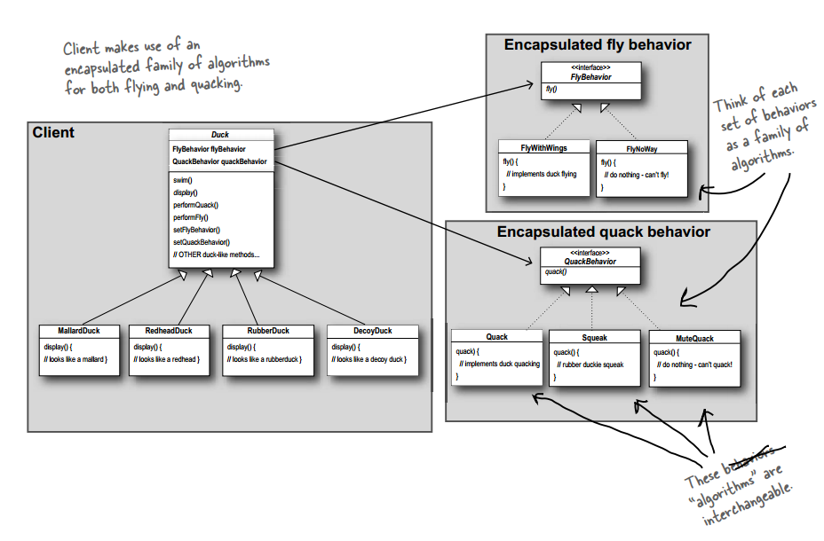

# 设计模式 - 行为型 - 策略模式 #

### 介绍 ###

**意图**：定义一系列的算法,把它们一个个封装起来, 并且使它们可相互替换。

**主要解决**：在有多种算法相似的情况下，使用 if...else 所带来的复杂和难以维护。

**何时使用**：一个系统有许多许多类，而区分它们的只是他们直接的行为。

**如何解决**：将这些算法封装成一个一个的类，任意地替换。

**应用实例**： 

1、诸葛亮的锦囊妙计，每一个锦囊就是一个策略。 

2、旅行的出游方式，选择骑自行车、坐汽车，每一种旅行方式都是一个策略。

### 实现 ###

	public abstract class Duck {
		FlyBehavior flyBehavior;
		QuackBehavior quackBehavior;
	
		public Duck() {
		}
	
		public void setFlyBehavior(FlyBehavior fb) {
			flyBehavior = fb;
		}
	
		public void setQuackBehavior(QuackBehavior qb) {
			quackBehavior = qb;
		}
	
		abstract void display();
	
		public void performFly() {
			flyBehavior.fly();
		}
	
		public void performQuack() {
			quackBehavior.quack();
		}
	
		public void swim() {
			System.out.println("All ducks float, even decoys!");
		}
	}

---

	public class MallardDuck extends Duck {
	
		public MallardDuck() {
	
			quackBehavior = new Quack();
			flyBehavior = new FlyWithWings();
	
		}
	
		public void display() {
			System.out.println("I'm a real Mallard duck");
		}
	}

---

	public class RedHeadDuck extends Duck {
	 
		public RedHeadDuck() {
			flyBehavior = new FlyWithWings();
			quackBehavior = new Quack();
		}
	 
		public void display() {
			System.out.println("I'm a real Red Headed duck");
		}
	}

---

	public class RubberDuck extends Duck {
	 
		public RubberDuck() {
			flyBehavior = new FlyNoWay();
			quackBehavior = new Squeak();
		}
	 
		public void display() {
			System.out.println("I'm a rubber duckie");
		}
	}

---

	public class DecoyDuck extends Duck {
		public DecoyDuck() {
			setFlyBehavior(new FlyNoWay());
			setQuackBehavior(new MuteQuack());
		}
		public void display() {
			System.out.println("I'm a duck Decoy");
		}
	}

---

	public interface FlyBehavior {
		public void fly();
	}

---

	public class FlyWithWings implements FlyBehavior {
		public void fly() {
			System.out.println("I'm flying!!");
		}
	}

---

	public class FlyNoWay implements FlyBehavior {
		public void fly() {
			System.out.println("I can't fly");
		}
	}

---

	public interface QuackBehavior {
		public void quack();
	}

---

	public class Quack implements QuackBehavior {
		public void quack() {
			System.out.println("Quack");
		}
	}

---

	public class Squeak implements QuackBehavior {
		public void quack() {
			System.out.println("Squeak");
		}
	}

---

	public class MuteQuack implements QuackBehavior {
		public void quack() {
			System.out.println("<< Silence >>");
		}
	}

---

运行类

	public class MiniDuckSimulator {
	 
		public static void main(String[] args) {
	 
			MallardDuck	mallard = new MallardDuck();
			RubberDuck	rubberDuckie = new RubberDuck();
			DecoyDuck	decoy = new DecoyDuck();
	 
			Duck	 model = new ModelDuck();
	
			mallard.performQuack();
			rubberDuckie.performQuack();
			decoy.performQuack();
	   
			System.out.println("--------");
			
			model.performFly();	
			model.setFlyBehavior(new FlyRocketPowered());
			model.performFly();
		}
	}

运行结果

	Quack
	Squeak
	<< Silence >>
	--------
	I can't fly
	I'm flying with a rocket

### 参考及引用 ###

1.《Head First 设计模式》Eric Freeman 等 著

[2.策略模式 | 菜鸟教程](http://www.runoob.com/design-pattern/strategy-pattern.html)