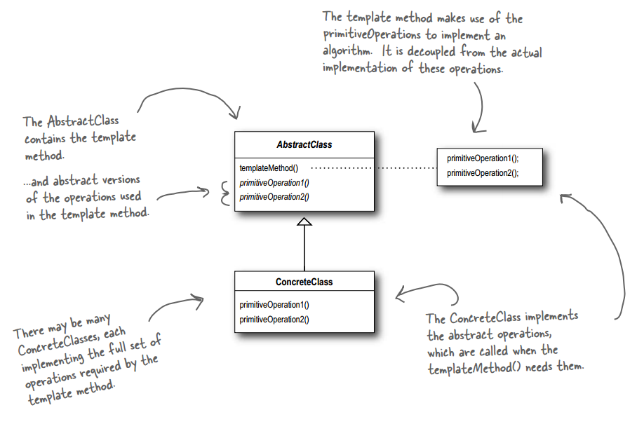
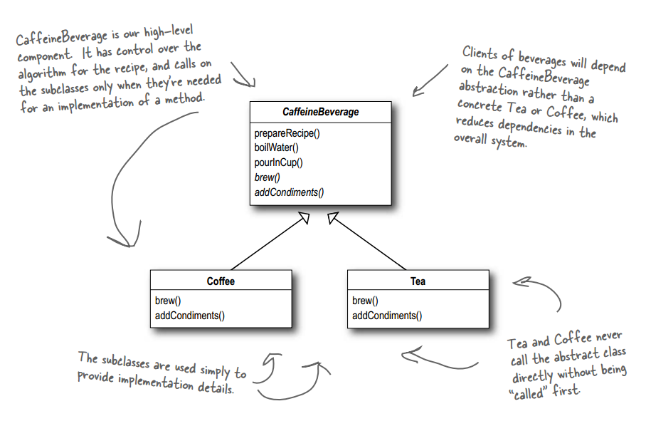

# 设计模式 - 行为型 - 模板方法模式 #

### 介绍 ###

**意图**：定义一个操作中的算法的骨架，而将一些步骤延迟到子类中。模板方法使得子类可以不改变一个算法的结构即可重定义该算法的某些特定步骤。

**主要解决**：一些方法通用，却在每一个子类都重新写了这一方法。

**何时使用**：有一些通用的方法。

**如何解决**：将这些通用算法抽象出来。

**关键代码**：在抽象类实现，其他步骤在子类实现。

### 实现 ###

#### 基本实现 ####

	public abstract class CaffeineBeverage {
	
		final void prepareRecipe() {
			boilWater();
			brew();
			pourInCup();
			addCondiments();
		}
	 
		abstract void brew();
	  
		abstract void addCondiments();
	 
		void boilWater() {
			System.out.println("Boiling water");
		}
	  
		void pourInCup() {
			System.out.println("Pouring into cup");
		}
	}

---

	public class Coffee extends CaffeineBeverage {
		public void brew() {
			System.out.println("Dripping Coffee through filter");
		}
		public void addCondiments() {
			System.out.println("Adding Sugar and Milk");
		}
	}

---

	public class Tea extends CaffeineBeverage {
		public void brew() {
			System.out.println("Steeping the tea");
		}
		public void addCondiments() {
			System.out.println("Adding Lemon");
		}
	}

---

运行类

	public class BeverageTestDrive {
		public static void main(String[] args) {
	 
			Tea tea = new Tea();
			Coffee coffee = new Coffee();
	 
			System.out.println("\nMaking tea...");
			tea.prepareRecipe();
	 
			System.out.println("\nMaking coffee...");
			coffee.prepareRecipe();
		}
	}

---

运行结果

	Making tea...
	Boiling water
	Steeping the tea
	Pouring into cup
	Adding Lemon
	
	Making coffee...
	Boiling water
	Dripping Coffee through filter
	Pouring into cup
	Adding Sugar and Milk

#### 对模板方法进行挂钩 ####

**钩子**是一种被声明在抽象类中的方法，但只有空的或者默认的实现。钩子的存在，可以让子类有能力对算法不同点进行挂钩（为了让模板方法实现）。要不要挂钩，由子类自行决定。

	public abstract class CaffeineBeverageWithHook {
	 
		final void prepareRecipe() {
			boilWater();
			brew();
			pourInCup();
			if (customerWantsCondiments()) {
				addCondiments();
			}
		}
	 
		abstract void brew();
	 
		abstract void addCondiments();
	 
		void boilWater() {
			System.out.println("Boiling water");
		}
	 
		void pourInCup() {
			System.out.println("Pouring into cup");
		}
	 
		//钩子
		boolean customerWantsCondiments() {
			return true;
		}
	}

---

	public class CoffeeWithHook extends CaffeineBeverageWithHook {
	 
		public void brew() {
			System.out.println("Dripping Coffee through filter");
		}
	 
		public void addCondiments() {
			System.out.println("Adding Sugar and Milk");
		}
	
		//钩子
		public boolean customerWantsCondiments() {
	
			String answer = getUserInput();
	
			if (answer.toLowerCase().startsWith("y")) {
				return true;
			} else {
				return false;
			}
		}
	 
		private String getUserInput() {
			String answer = null;
	
			System.out.print("Would you like milk and sugar with your coffee (y/n)? ");
	
			BufferedReader in = new BufferedReader(new InputStreamReader(System.in));
			try {
				answer = in.readLine();
			} catch (IOException ioe) {
				System.err.println("IO error trying to read your answer");
			}
			if (answer == null) {
				return "no";
			}
			return answer;
		}
	}

---

	public class CoffeeWithHook extends CaffeineBeverageWithHook {
	 
		public void brew() {
			System.out.println("Dripping Coffee through filter");
		}
	 
		public void addCondiments() {
			System.out.println("Adding Sugar and Milk");
		}
	 
		//钩子
		public boolean customerWantsCondiments() {
	
			String answer = getUserInput();
	
			if (answer.toLowerCase().startsWith("y")) {
				return true;
			} else {
				return false;
			}
		}
	 
		private String getUserInput() {
			String answer = null;
	
			System.out.print("Would you like milk and sugar with your coffee (y/n)? ");
	
			BufferedReader in = new BufferedReader(new InputStreamReader(System.in));
			try {
				answer = in.readLine();
			} catch (IOException ioe) {
				System.err.println("IO error trying to read your answer");
			}
			if (answer == null) {
				return "no";
			}
			return answer;
		}
	}

---

运行类

	public class BeverageTestDrive {
		public static void main(String[] args) {

			TeaWithHook teaHook = new TeaWithHook();
			CoffeeWithHook coffeeHook = new CoffeeWithHook();
	 
			System.out.println("\nMaking tea...");
			teaHook.prepareRecipe();
	 
			System.out.println("\nMaking coffee...");
			coffeeHook.prepareRecipe();
		}
	}

---

运行结果

	Making tea...
	Boiling water
	Steeping the tea
	Pouring into cup
	Would you like lemon with your tea (y/n)? y
	Adding Lemon
	
	Making coffee...
	Boiling water
	Dripping Coffee through filter
	Pouring into cup
	Would you like milk and sugar with your coffee (y/n)? y
	Adding Sugar and Milk

#### 用模板方法排序 ####

	public class Duck implements Comparable<Duck> {
		String name;
		int weight;
	  
		public Duck(String name, int weight) {
			this.name = name;
			this.weight = weight;
		}
	 
		public String toString() {
			return name + " weighs " + weight;
		}
	
		//模板方法
		public int compareTo(Duck object) {
	 
			Duck otherDuck = object;
	  
			if (this.weight < otherDuck.weight) {
				return -1;
			} else if (this.weight == otherDuck.weight) {
				return 0;
			} else { // this.weight > otherDuck.weight
				return 1;
			}
		}
	}

---

运行类

	public class DuckSortTestDrive {
	
		public static void main(String[] args) {
			Duck[] ducks = { 
							new Duck("Daffy", 8), 
							new Duck("Dewey", 2),
							new Duck("Howard", 7),
							new Duck("Louie", 2),
							new Duck("Donald", 10), 
							new Duck("Huey", 2)
			 };
	
			System.out.println("Before sorting:");
			display(ducks);
	
			Arrays.sort(ducks);
	 
			System.out.println("\nAfter sorting:");
			display(ducks);
		}
	
		public static void display(Duck[] ducks) {
			for (Duck d : ducks) {
				System.out.println(d);
			}
		}
	}

---

运行结果

	Before sorting:
	Daffy weighs 8
	Dewey weighs 2
	Howard weighs 7
	Louie weighs 2
	Donald weighs 10
	Huey weighs 2
	
	After sorting:
	Dewey weighs 2
	Louie weighs 2
	Huey weighs 2
	Howard weighs 7
	Daffy weighs 8
	Donald weighs 10

### 参考及引用 ###

1.《Head First 设计模式》Eric Freeman 等 著

[2.模板模式 | 菜鸟教程](http://www.runoob.com/design-pattern/template-pattern.html)